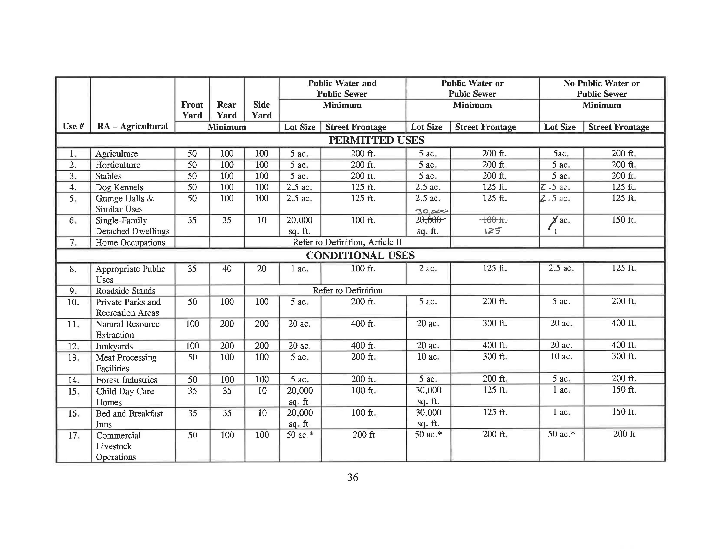
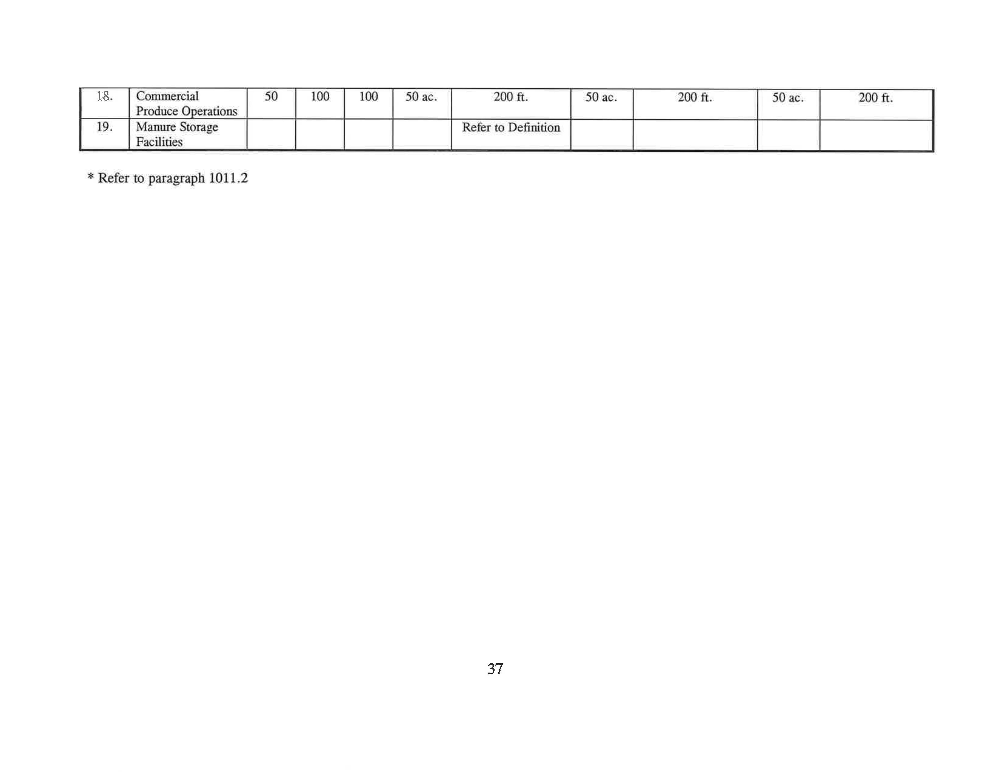
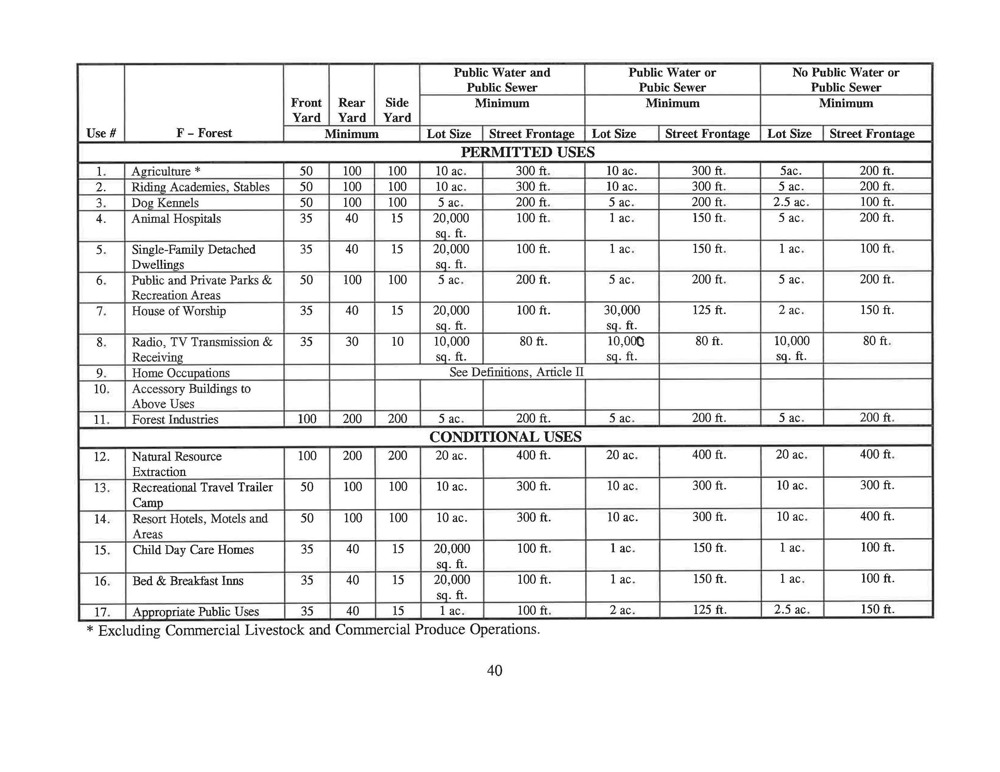
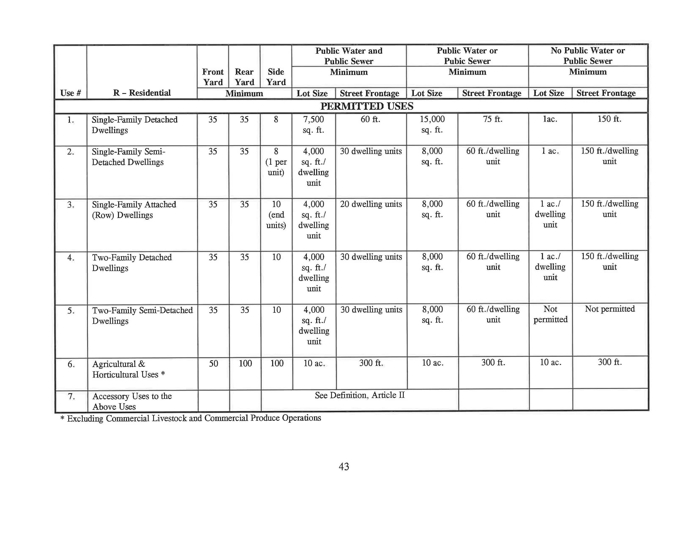
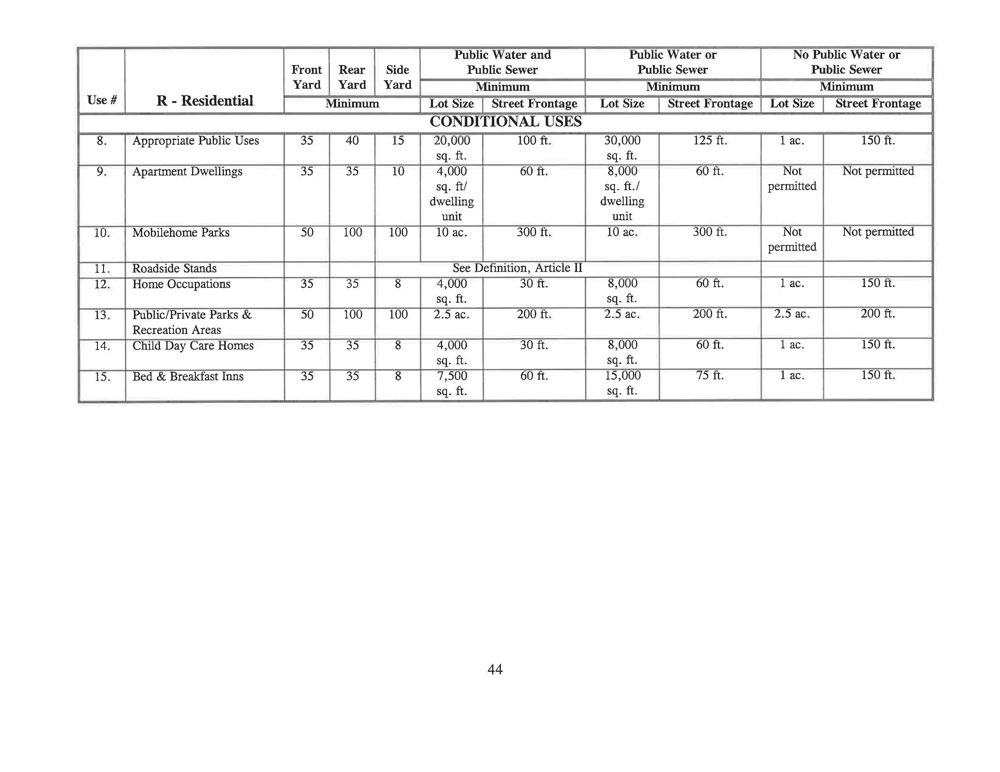
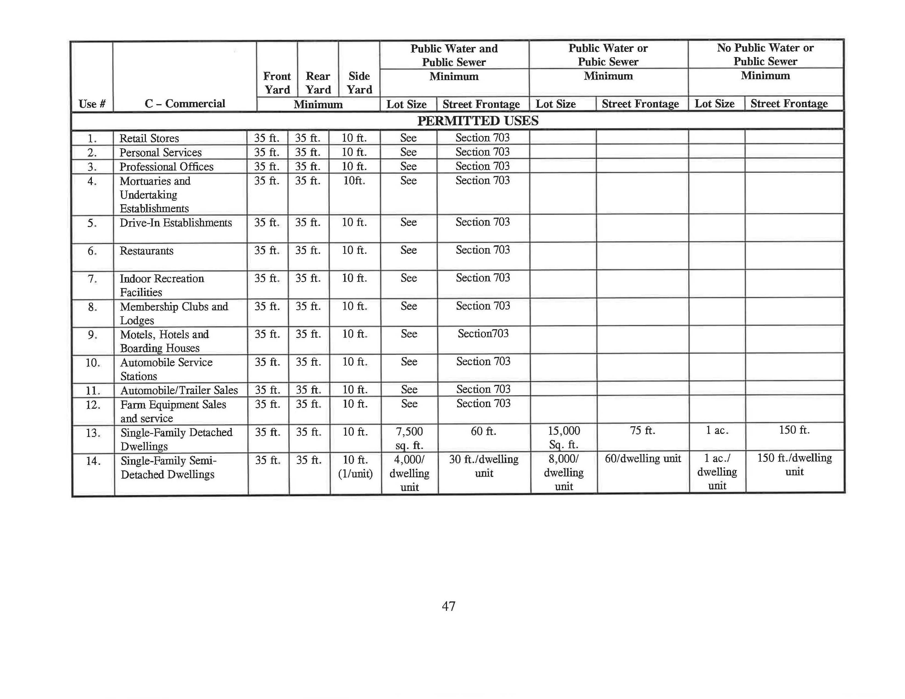
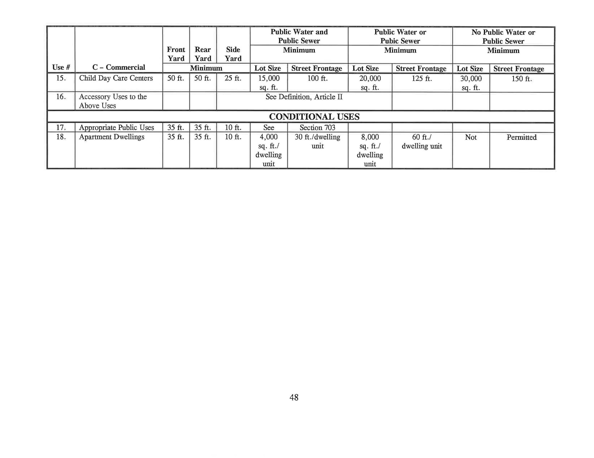
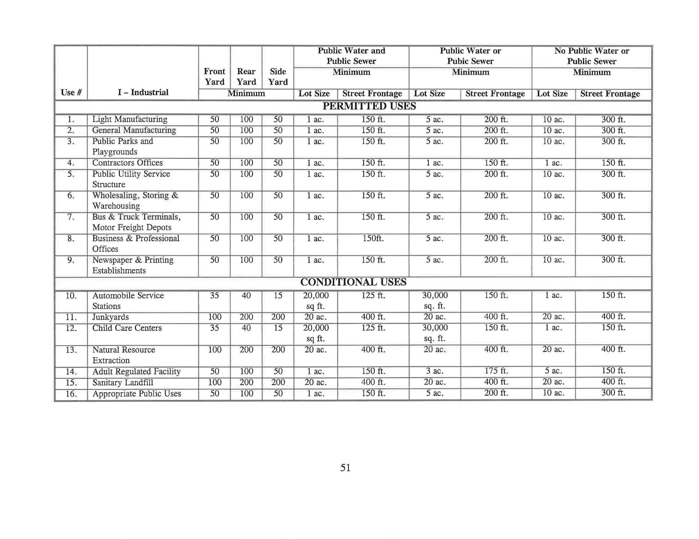

# Fayette Township Zoning Ordinance of 2000 (Ordinance No. 2000-1) — Full Text

Source: user-uploaded scan (`Fayette_Zoning_Ordinance.pdf`), OCR'd page-by-page (Tesseract, 125 pages).

Original document: Canon scanner copy, created 2014; adopted as Ordinance 2000-1, 'Fayette Township Zoning Ordinance of 2000.'

**Important:** This is OCR output from a scanned document. It has not been proofread line-by-line against the original. For anything you plan to rely on for compliance (setbacks, permitted uses, procedures), cross-check against the original PDF or with the township. This file has been reformatted from the original page-by-page scan into a continuous markdown document: page-break markers and page-footer numbers have been removed, headings are real markdown headings, in-text references to other Articles/Sections are clickable links, and the district dimensional/use tables that were originally split across two scanned pages have been combined into single tables. Eight of those tables were rotated in the original scan and unreadable by OCR; they were manually transcribed into markdown tables in place below, with the upright source image(s) embedded alongside each one for verification. Two cells on the RA District table (Use #6, under [Article IV](#article-iv)) have handwritten corrections in the original document — see the footnotes on that table.

## Table of Contents

- [Article I — General Provisions](#article-i)
- [Article II — Glossary of Zoning Terms](#article-ii)
- [Article III — Designation of Districts](#article-iii)
- [Article IV — RA - Rural Agricultural District](#article-iv)
- [Article V — F - Forest District](#article-v)
- [Article VI — R-1 - Residential District](#article-vi)
- [Article VII — C - Commercial District](#article-vii)
- [Article VIII — I - Industrial District](#article-viii)
- [Article IX — FP - Floodplain District](#article-ix)
- [Article X — Supplemental Regulations](#article-x)
- [Article XI — Conditional Uses](#article-xi)
- [Article XII — Signs](#article-xii)
- [Article XIII — Off-Street Parking, Loading and Unloading](#article-xiii)
- [Article XIV — Administration and Enforcement](#article-xiv)

---

FAYETTE TOWNSHIP

ZONING ORDINANCE

OF 2000

Fayette Township, Juniata County

ORDINANCE NO. 2000-1

THE FAYETTE TOWNSHIP ZONING ORDINANCE
OF 2000

## Article I — General Provisions

### Section 101 - Title

AN AMENDED ORDINANCE PERMITTING, PROHIBITING, REGULATING,
RESTRICTING, AND DETERMINING THE USES OF LAND, WATERCOURSES,
AND OTHER BODIES OF WATER; THE SIZE, HEIGHT, BULK, LOCATION,
ERECTION, CONSTRUCTION, REPAIR, MAINTENANCE, ALTERATION,
RAZING, REMOVAL AND USE OF STRUCTURES; THE AREAS AND
DIMENSIONS OF LAND AND BODIES OF WATER TO BE OCCUPIED BY USES
AND STRUCTURES AS WELL AS COURTS, YARDS, AND OTHER OPEN
SPACES AND DISTANCES TO BE LEFT UNOCCUPIED BY USES AND
STRUCTURES; THE DENSITY OF POPULATION AND INTENSITY OF USE;
THE LOCATION AND SIZE OF SIGNS; CREATING ZONING DISTRICTS AND
ESTABLISHING THE BOUNDARIES THEREOF; CREATING THE OFFICE OF
ZONING OFFICERS; CREATING A ZONING HEARING BOARD; AND
PROVIDING FOR THE ADMINISTRATION, AMENDMENT, AND
ENFORCEMENT OF THE ORDINANCE, INCLUDING THE IMPOSITION OF
PENALTIES.

ORDAINING CLAUSE

BE IT HEREBY ORDAINED AND ENACTED by the Board of Supervisors of the Township
of Fayette, County of Juniata, by authority of an pursuant to the provisions of Article VI
through X of Act No. 170 of the General Assembly of the Commonwealth of Pennsylvania,
approved December 21, 1988, known and cited as the “Pennsylvania Municipalities Planning
Code,” and any amendments and supplements thereto, as follows:

### Section 102 - Short Title

This Ordinance shall be known and may be cited as the “Fayette Township Zoning
Ordinance of 2000.”

### Section 103 - Purpose

This revised Zoning Ordinance has been prepared and amended in accordance with the
Fayette Township Comprehensive Development Plan of 1993, with consideration for the
character of the municipality, its various parts, and the suitability of the various parts for the
particular uses and structures, and is enacted for the following purposes:

1. To promote, protect, and facilitate one or more of the following: The public health,
safety, morals, general welfare, coordinated and practical community development,
proper density of population, civil defense, disaster evacuation, airports, and
national defense facilities, the provisions of adequate light and air, police
protection, vehicle parking and loading space, transportation, water sewerage,
schools, public grounds and other public requirements, as well as

2. To prevent one or more of the following: Overcrowding of land, blight, danger and
congestion in travel and transportation, loss of health, life of property from fire,
flood, panic or other dangers.

### Section 104 - Zoning Hearing Board

In accordance with Article IX of the Act of December 21, 1988, P.L. 1329, No. 170,
as amended, known as the Pennsylvania Municipalities Planning Code of the Commonwealth
of Pennsylvania, a Zoning Hearing Board is hereby created and shall have the number of
members and such powers and authority as set forth in said Act and this Ordinance. The duly
established Zoning Hearing Board may, from time to time, be herein referred to as the Board
and unless otherwise clearly indicated, the term “Board” shall refer to such Zoning Hearing
Board.

### Section 105 - Interpretation and Conflict

In interpreting and applying the provisions of this Ordinance, they shall be held to be
the minimum requirements for the promotion of health, safety, morals, and the general welfare
of the Township and its citizens. It is not intended by this Ordinance to interfere with or
abrogate or annul any rules or regulations previously adopted or permits previously issued by
the Township which are not in conflict with any provisions of this Ordinance, nor is it intended
by this Ordinance to interfere with or abrogate or annul easements, covenants, building
restrictions, or other agreements between parties; provided, however, that where this
Ordinance imposes a greater restriction upon the use of the buildings or premises or upon the
height of the building, or requires a larger open space than is imposed or required by such
ordinance, rules, regulations or permits, or by easements, covenants, building restrictions or

agreements, the provisions of this Ordinance shall control. Furthermore, if a discrepancy
exists between any regulations contained within this ordinance, that regulation which imposes
the greater restriction shall apply.

### Section 106 - Uses Not Provided For

Whenever, in any District established under this Ordinance, a use is neither specifically
permitted or denied and an application is made by a property owner to the Zoning Officer for
such use, the Zoning Officer shall refer the application to the Board of Supervisors or the
Zoning Hearing Board, which ever has jurisdiction, which shall have the authority to permit
the use or deny the use. The use may be permitted if it is similar to and compatible with
permitted uses in the district and in no way is in conflict with the general purpose and intent of
this Ordinance. The burden of proof shall be upon the applicant to demonstrate that the
proposed use meets the foregoing criteria and would not be detrimental to the public health,
safety and welfare of the neighborhood.

### Section 107 - Community Goals and Objectives

This amended Zoning Ordinance is enacted as part of the overall plan for the orderly
growth and development of Fayette Township. As such, this Ordinance is based upon the
expressed or implied community development goals and objectives as contained in the Fayette
Township Comprehensive Plan of 1993, as amended.

### Section 108 - Validity

Should any section or provision of this ordinance be declared by a court of competent
jurisdiction to be invalid, such decision shall not affect the validity of this ordinance as a whole
or of any other part thereof.

### Section 109 - Establishment of Zones

For the purpose of this amended Ordinance, Fayette Township is still divided into
previously established zones, which are designated as follows:

Rural Agricultural District (RA)
Forest District (F)

Residential Low Density District (R-1)
Commercial District (C)

Industrial District ()

Floodplain District (FP)

### Section 110 - Zoning Map

The areas within Fayette Township, as assigned to each zone and the location of the
zones established by this Ordinance, are shown upon the Zoning Map, which together with all
explanatory matter thereon, is attached to and is declared to be a part of this Ordinance.

### Section 111 - Zone Boundary Lines

The zone boundary lines shall be as shown on the Zoning Map. Zone boundary lines
are intended to coincide with lot lines; centerlines of streets, alleys, railroad rights-of-way, and
streams at time of passage of this Ordinance; the corporate boundary of the Township; or as
dimensioned on the map. In the event of dispute about the location of the boundary of any
zone, the Zoning Officer shall investigate and render a decision on the location of the line.
Appeals from this decision shall be made to the Zoning Hearing Board.

## Article II — Glossary of Zoning Terms

### Section 201 - Application and Interpretation

It is not intended that this Glossary include only words used or referred to in this
Ordinance. The words are included in order to facilitate the interpretation of the Ordinance for
administrative purposes and in the carrying out of duties by appropriate Township officers and
by the Zoning Hearing Board.

Unless otherwise expressly stated, the following shall, for the purpose of this
Ordinance, have the meaning herein indicated:

1.

2.

3.

Words used in the past tense include the future tense.
The singular includes the plural.

The word “person” includes a profit or non-profit corporation, company,
partnership, or individual.

The male gender includes the female gender.

The words “used” or “occupied” as applied to any land or building include the
words “intended”, “arranged”, or “designed” to be used or occupied.

The word “building” includes structure.
The word “lot” includes plot or parcel.
The word “shall” or “must” is always mandatory.

The word “erected” shall be construed to include the words “constructed, altered or
moved”.

### Section 202 - Definition of Terms

For the purpose of this Ordinance, the following words, terms, and phrases have the
meaning herein indicated:

Access Drive: An improved cartway designed and constructed to provide for vehicular
movement between a street and more than four (4) dwelling units, or any other use or
uses.

Accessory Building: A detached, subordinate building, not used for habitation, which
is customarily incidental and subordinate to that of the principal building, and is located
on the same lot as the occupied by the principal building. Farm buildings not intended
for human or animal habitation are considered to be accessory buildings.

Accessory Use: A use customarily incidental, subordinate to the principal use or
building, and located on the same lot with such principal use of building.

ACT: The latest version of the Pennsylvania Municipalities Planning Code, as
amended.

Agribusiness: Activities including agriculture, distribution of farm equipment and
supplies and the process, storage and distribution of farm commodities.

Agriculture: The tilling of the soil, the raising of corps, forestry, horticultural and
gardening, including the keeping or raising of livestock such as cattle, cows, hogs,
horses, sheep, goats, poultry, rabbits, birds, fish, bees, and other similar animals. This
definition also includes non-commercial greenhouses and mushroom houses.

Alley: A strip of land over which there is an existing right-of-way intended to provide
vehicular access to the side and/or rear of those properties whose frontage is on a
street. An alley is not intended for general traffic circulation.

Alterations: As applied to a building or structure, any change or rearrangement in the
structural parts or an enlargement, whether by extending on a side or by increasing in
height, or the moving from one location or position to another. An alteration does not
include maintenance and repair.

Alterations, Structural: Any change in the supporting members of a building such as
bearing walls, columns, beams, or girders.

Amendment: A change in use in any district which includes revisions to the zoning text
and/or the official zoning map; and the authority for any amendment lies solely with the
Township Board of Supervisors.

Animal Hospital: A building or any establishment offering veterinary services used for
the treatment, housing, or overnight boarding of small domestic animals such as dogs,
cats, rabbits, and birds or fowls by a veterinarian.

Applicant: A landowner or developer, as hereinafter defined, who has filed an
application for development, including his heirs, personal representatives, successors
and assigns.

Application for Development: Every application, whether preliminary or final,
required to be filed and approved prior to the start of construction or development
including, but not limited to, an application for a building permit, for the approval of a
subdivision plot or plan, or for the approval of a development plan filed under the
provisions of this Ordinance.

Appropriate Public Uses: Uses not considered as cited permitted or conditional uses,
but to be reviewed as conditional uses for the specific zoning district based on data
submitted by an applicant.

Area, Building: The total of areas taken on a horizontal plane at the main grade level
of the principal building and all accessory buildings, exclusive of uncovered porches,
terraces, and steps.

Area, Lot: The total area within the lot lines, excluding any portion, which may be
used or dedicated as a public or private street or alley.

Automobile: A self-propelled motor vehicle designed for the conveyance of persons or
property requiring a registration plate by the Commonwealth of Pennsylvania for
operation upon public highways; including a truck, motor home, motorcycle.

Automobile Body Shop: A building on a lot that is used for the repair or painting of
bodies, chassis, wheels, fenders, bumpers and/or accessories of automobiles and other
vehicles for conveyance.

Automobile Garage, Minor: An accessory building for the storage of one or more
automobiles and/or other vehicles accessory and incidental to the primary use of the
premise, provided that no business, occupation or service is conducted for profit therein
nor space therein for more than one automobile is leased to a non-occupant of the
premises.

Automobile Garage, Major: A building on a lot designed and/or used primarily for
mechanical and/or body repairs, storage, rental servicing or supplying of gasoline or oil
to automobiles, trucks, and similar motor vehicles.

Automobile and/or Trailer Sales Garage: A building on a lot designed and used for the
display, sale or rental of new and used cars, trucks, campers, tractors, trailers, and
snowmobiles where mechanical repairs and body work may be conducted as an
accessory use incidental to the primary use.

Automobile, or Gasoline Services Station: A building on a lot or part thereof, that is
used primarily for the retail sale of gasoline, oil or fuel and which may include facilities
used for polishing, greasing, washing, dry cleaning or otherwise cleaning or servicing
automobiles and other vehicles.

Automobile and/or Trailer Sales Lot: An open lot, used for the outdoor display or
sales of new or used automobiles or trailers, and where minor and incidental repair
work (other than body and fender) may be done.

Automobile Washing (Car Wash): A building on a lot, designed and used primarily for
the washing and polishing of automobiles and which may provide accessory services as
set forth herein for Automobile Service Stations.

Automobile Wrecking: The dismantling or wrecking of used automobiles or trailers, or
the storage, sale or dumping of dismantled, partially dismantled, obsolete or wrecked
vehicles or their parts.

Base Flood: The flood having a one percent (1%) chance of being equaled or exceeded
in any given year (100-year flood).

Base Flood Elevation: The projected flood height of the base flood.

Basement: A story partly underground but having at least one-half of its height above
the average level of the adjoining ground. A basement shall be counted as a story for
the purpose of height measurement if the vertical distance between the ceiling and the
average level of the adjoining ground is more than five (5) feet or if used for business
or dwelling purposes, other than a game or recreation room.

Bed_and Breakfast Inns: An owner-occupied single-family detached dwelling, or
portions thereof, containing not more than five (5) guest rooms which are to be
occupied by not more than fifteen (15) guests where rent is paid in money, goods, labor
or otherwise. Meals may be offered only to registered overnight guests.

Billboard: A sign upon which advertising matter of any character is printed, posted, or
lettered; and it may be either freestanding or attached to a surface of a building or other
structure. A billboard is used to advertise products, services or businesses at a location
other than the premises on which the sign is placed, or to disseminate other messages-

Boarding House: Any dwelling in which more than three persons, but not more than
ten (10) persons, either individually or as families, are housed or lodged for hire with
or without meals. A rooming house or a furnished room house shall be deemed a
boarding house.

Building: Any structure, either temporary or permanent, having walls and a roof or
other covering, and designed or used for the shelter or enclosure of any person, animal
or property of any kind, including tents, awnings, or vehicles situated on private
property and used for purposes stated above. For the purposes of this section, the word
building shall include gas or liquid storage tanks.

Detached: A building which has no party wall.
Semi-detached: A building which has only one party wall in common.
Attached: A building which has two or more party walls in common.

Building Detached: A building surrounded by open space on the same lot.
Building, Front Line Of: The line of that face of the building nearest the front line of

the lot. This face includes sun parlors and covered porches, whether enclosed or
unenclosed, but does not include steps.

Building, Height Of: The vertical distance measured from the average elevation of the
proposed finished grade at the front of the building to the highest point of the roof for
flat roofs, to the deck line of mansard roofs, and to the mean height between eaves and
ridge for gable, hip, and gambrel roofs.

Building Line: The line(s) created by the setback, (front, side or rear) of a building
from a property or street line.

Building, Principal: A building which is enclosed within exterior walls or fire walls,
which is built, erected, and framed of component structural parts, which is designed for
housing, shelter, enclosure, and support of individuals, or property of any kind, and
which is a main structure on a given lot.

Business Services: Business services shall include and be limited to banks, credit
unions, loan companies, real estate and insurance agencies, utility offices,
governmental offices, business and professional offices.

Camp: Any one or more of the following, other than a hospital, place or detention,
school offering general instructions or a mobilehome park:

Type 1 - Any area of land or water of a design or character used for seasonal,
recreational or similar temporary living purposes which may include any
building or group of buildings or a movable, temporary or seasonal nature, such
as cabins, tents, or shelters.

Type 2 - Any land and buildings thereon, used for any assembly of persons for
which is commonly known as “day camp” purposes, whether or not conducted

for profit or whether occupied by adults or children, either as individuals,
families, or groups.

Campground: A parcel of land upon which two or more campsites are located to be
used by campers for seasonal, recreational or other similar temporary living purposes,
in buildings of a movable, temporary or seasonal nature, such as cabins, tents,
recreational vehicles or shelters, but not including a mobilehome camp, court or park.

Campsites: A plot of ground within a campground intended for occupation by a
recreational vehicle or tent.

Carport: An unenclosed structure for the storage of one (1) or more vehicles in the
same manner as a private garage, which may be covered by a roof supported by
columns or posts except that one or more walls may be the walls of the main building to
which the carport is accessory.

Cartway: That portion of a street or alley right-of-way that is intended for vehicular
movement:

Cellar: A story partly underground and having more than one-half of its clear height
below the average level of the adjoining ground. A cellar shall not be considered in
determining the permissible number of stories.

Cemetery: Land used or intended to be used for the burial of the deceased, including
columbariums, mausoleums, and mortuaries when operated in conjunction with the
cemetery and within the boundaries thereof. This definition shall not include
crematoria, which shall be considered as funeral homes.

Certificate of Use and Occupancy: A statement signed by a duly authorized Township
officer, setting forth that a building, structure or use legally complies with the Zoning
Ordinance and other applicable codes and regulations and that the same may be used for
the purposes stated therein.

Channel: A natural or artificial watercourse with a definite bed and banks which
confine and conduct continuously or periodically flowing water.

Child Day Care Center: A Pennsylvania licensed and/or registered facility which care
is provided or is intended to be provided for seven (7) or more children at any age of at
any time.

Child Day Care Home: A State licensed and/or registered single-family dwelling in
which child day care is provided at any time for not more than seven (7) children under
the age of twelve (12), including any children under the age of twelve (12) who are
residents of the dwelling.

Church and Related Uses: A building, structure, or group of buildings or structures,
including accessory uses, designed or intended for public worship. This definition shall
include rectories, convents, and church-related educational and/or day care facilities.

Commercial Keeping and Handling: Producing and/or maintaining with the express
purpose and intent of selling the product for a livelihood, excluding farming.

Commercial Livestock Operation: A concentrated animal operation, as defined by the
Pennsylvania Nutrient Management Act (Act 6) or the agricultural use involving more
than 125 animal equivalent units (AEU) as defined by federal regulations.

Commercial Produce Operation: An agricultural use whereby plant materials are
principally grown within enclosed buildings, and where such use exceeds a lot coverage
of ten percent (10%).

Commercial Recreation Facility: An activity operated as a business, open to the public,
for the purpose of public recreation or entertainment, including, but not limited to,
bowling alleys, drive-in motion picture facilities, swimming pools, health clubs,
miniature golf courses, museums, etc. This does not include adult-related uses or
amusement arcades, as defined herein.

Common Open Space: Any area of land or water, or a combination of land and water,
within a development site designed and intended for use by all residents of the
development or the general public. Land included within the right-of-way lines of
streets shall not be classified as common open space. Common open spaces shall not
include required open areas nor setbacks between buildings and between buildings and
street rights-of-way, driveways, access drives, parking areas, and property lines of the
development. No dwelling unit, residential accessory buildings, or parking or loading
areas may be located within common open spaces.

Comprehensive Plan: The official Fayette Township Comprehensive Plan, Juniata
County, PA adopted February 10, 1993.

Comprehensive Plan: The official public document prepared in accordance with
Pennsylvania Municipalities Planning Code, Act 170 of 1988, as amended, consisting
of maps, charts, and textual material, that constitutes a policy guide to decisions about
the physical and social development of Fayette Township, as amended from the time to
time.

Conditional Use: A use which may not be appropriate to a particular zoning district as
a whole, but which may be suitable in certain localities within the district only when
specific conditions and criteria prescribed for such uses have been complied with.
Conditional uses are reviewed by the Board of Supervisors.

Condominium: A form of property ownership providing for individual ownership of a
specific dwelling unit, or other space not necessarily on ground level, together with an
undivided interest in the land or other parts of the structure in common with other
owners.

Conservation Plan: A plan including a map(s) and narrative that, at the very least,
outlines an erosion and sedimentation control plan for an identified parcel of land-

Contractor’s Office or Shop: Offices and shops for tradesmen, such as building,
cement, electrical, masonry, painting and roofing contractors.

Convenience Store: A retail sales business which specializes in providing household
products and foods. Convenience stores may also provide for any or all of the
following as an accessory use:

Ls The rental of video tapes provided that an adult bookstore is specifically
prohibited;
2. The preparation and sales of delicatessen sandwiches and foods provided that no

patron seating is provided; and,

35 The use of no more than two amusement devices (e.g. pinball machines, video
games, and other similar devices).

Convenience stores shall not include the dispensing of gasoline or other vehicle fuels,
unless the appropriate approvals for an automobile filling station (as defined herein)
have been obtained.

Courts: An unoccupied open space, other than a yard, on the lot with a building, which
is bounded on two or more sides by the walls of such building.

Court, Inner: A court enclosed on all sides by exterior walls of a building or by
exterior walls and lot lines on which walls are allowable.

Court, Outer: A court enclosed on not more than three sides by exterior walls and lot

lines on which walls are allowable, with one side or end open to a street, driveway,
alley or yard.

Coverage: That portion or percentage of the plot or lot area covered by the building
area.

Curb Level: The officially established grade of the curb in front of the midpoint of the
lot.

Dairy: A commercial establishment for the manufacture or processing of dairy
products.

Density: A measure of the number of dwelling units, which occupy, or may occupy,
an area of land.

Density, Net Residential: The number of dwelling units in relation to the land area
actually in use or proposed to be used for residential purposes, exclusive of public
rights-of-way, streets, sidewalks, parks, playgrounds, common open spaces, etc.

Density, Gross Residential: The number of dwelling units in relation to an area of land
actually in use or proposed to be used for residential purposes, excluding public rights-
of-way whether exterior or interior, but including interior parking areas and access
lanes, sidewalks, parks, playgrounds, common open spaces, etc.

Development: Any man-made change to improved or unimproved real estate, including
but not limited to building or other structures, mining, dredging, filling grading,
paving, excavating, or drilling operations.

Development Disability: A disability of a person which has continued or can be
expected to continue indefinitely; a disability which is:

As Attributable to mental retardation, cerebral palsy, epilepsy or autism;

2. Found to be attributable to any other conditions found to be closely related to
mental retardation because such condition results in similar impairment of
general intellectual functioning or adaptive behavior to that of mentally retarded

persons or requires treatment and services similar to those required for such
persons; and,

3. Attributable to dyslexia resulting from a disability described in Subsections (1)
and (2) of this definition.

Developmentally Disabled Person: A person with a developmental disability.

Dog Kennel: An establishment for the sheltering of four (4) or more dogs that are
more than six (6) months old.

Domiciliary Care Unit: An existing building or structure designed for a dwelling unit
for one family which provides 24-hour supervised living arrangements by the family
residing therein for not more than two (2) unrelated persons eighteen (18) years of age
and above who are disabled physically, mentally, emotionally or who are aged persons.

Drive-In Business: A commercial establishment, including an eating establishment,
offering refreshments, entertainment, or services to patrons, who purchase and/or
consume such refreshments, entertainment or services on the premises and/or outside of
the building, including patrons who may be served in their automobile.

Driveway: An improved cartway designed and constructed to provide vehicular
movement between a public street and a tract of land serving one single-family dwelling
unit or a farm, or up to four (4) dwelling units.

Dump: A lot of land or part thereof used primarily for the disposal by abandonment,
dumping, burial, burning, or other means and for whatever purpose, of garbage,
sewage, trash, refuse, junk, discarded machinery, vehicles or parts thereof, or waste
material of any kind.

Dwelling: A building or structure designed for living quarters for one or more
families, including trailers (mobile homes) which are supported either by a foundation
or by blocks or jacks covered by skirts or are otherwise permanently attached to the
land and anchored against wind and water movement, but not including room houses,
convalescent homes, motels, hotels, tourist homes or other accommodations used for
transient occupancy.

Dwelling Types:

1. Residential Conversion Unit - To be considered a conversion, any proposed
alteration must be confined to the interior of an already existing structural shell.
Any proposal to extend the sides or increase the height of an existing structure shall
not be considered a conversion and shall be required to meet the appropriate
provisions established in that District for that particular use.

2. Single-Family Detached - A dwelling unit accommodating a single-family and
separated from any other building or structure by space on all sides.

3. Single-Family Semi-Detached - Two dwelling units accommodating two families
which are attached side by side through the use of a party wall, and having one side
yard adjacent to each dwelling unit.

4. Two-family Detached - Two dwelling units accommodating two families which are
located one over the other and having two (2) side yards.

5. Two-Family Semi-Detached - Four dwelling units accommodating four families,
two units of which are located directly over the other two units.

6. Townhouse (Row Dwelling) - Three or more dwelling units accommodating three
or more families which are attached side by side through the use of common party
walls and which shall have side yards adjacent to each end unit. Each dwelling unit
is generally two (2) stories in height, but may conceivably be either one (1) or three
(3) stories in height.

7. Garden Apartment - Three or more dwelling units accommodating three or more
families which are located one over the other and which, when more than three unit
are utilized, are attached side-by-side through the use of common party walls, and
which shall have side yards adjacent to each first story end unit. Single-family
dwelling units are generally built to a height of three (3) stories, but may
conceivably be built to a height of only two (2) stories. Each dwelling unit is
accessible by a common stairwell.

8. Apartment House - A structure consisting of a series of single-story dwelling units
(two-story units may conceivably by used in certain instances) clustered on a floor
about a central elevator shaft or central corridor, each series, consisting of one
story, being stacked one upon the other to a specified maximum height.

Dwelling Unit: A building or portion thereof providing complete cooking and sanitary
facilities for not more than one (1) family.

Dwelling Unit Area: The minimum or average square footage necessary to constitute a
dwelling unit.

Earthmoving Activity: Any construction or other activity which disturbs the surface of
the land including, but not limited to, excavations, embankments, land development,
subdivision development, mineral extraction and the moving, depositing or storing of
soil, rock or earth.

Electric Substation: An assemblage of equipment for purposes other than generation or
utilization, through which electric energy in bulk is passed for the purpose of switching
or modifying its characteristics to meet the needs of the general public.

Facade: The front of a building; part of a building facing a street, courtyard, etc.

Family: One (1) or more persons related by blood, adoption or marriage, living and
cooking together as a single housekeeping unit, exclusive of household servants. A
number of persons not exceeding two (2) living and cooking together as a single
housekeeping unit though not related by blood, adoption, or marriage shall be deemed
to constitute a family for purposes of this Ordinance.

Farm: Any parcel of land containing ten (10) or more acres, which is used for gain in
the raising of agricultural products, livestock, poultry, and dairy products. It includes
necessary farm structures within the prescribed limits and the storage of equipment
used. For the purposes of this Ordinance, a farm shall not include the raising of fur-
bearing animals, riding academies, livery or boarding stables and dog kennels.

Farm Occupation: An accessory use to the primary agricultural use of a property in
which residents engage in a secondary occupation conducted on the active farm.

Farm Pond: An artificial body of water used for irrigation, fire protection or other
farm use as approved by the U.S. Department of Agriculture Soil Conservation
Service.

Fence: A structure designed as a barrier to restrict the movement or view of persons,
animals, property and/or vehicles. This definition shall not include ornamental fence
treatments that are located in the front yard and extend less than one-half (2) the width
and/or depth of the front yard.

Fill: Material placed or deposited so as to form an embankment or raise the surface
elevation of the land, including, but not limited to, levees, bulkheads, dikes, jetties,
embankments, and causeways.

Floodplain: A floodplain is defined and established to be the low area adjoining and
including any water or drainage course or body of water subject to periodic flooding or
overflow as further defined in [Article IX](#article-ix) of this Ordinance.

Floor Area of a Building: The sum of the gross horizontal areas of the several floors of
a building and its accessory building on the same lot, excluding cellar and basement
floor areas not devoted to residential use, but including the area of roofed porches and
roofed terraces. All dimensions shall be measured between exterior faces of walls.

Floor Area, Habitable: The aggregate of the horizontal areas of all rooms used for
habitation, such as living room, dining room, kitchen, bedroom, but not including
hallways, stairways, cellars, attics, service rooms or utility rooms, bathroom, closets,
nor unheated areas such as enclosed porches, no rooms without at least one window or
skylight opening onto an outside yard or court. A least one-half of the floor area of
every habitable room shall have a ceiling height of not less than seven (7) feet and the
floor area of that part of any room where the ceiling height is less than five (5) feet
shall not be considered as part of the habitable floor area. The minimum total window
area, measured between stops shall be ten (10) percent of the habitable floor area of
such room.

Floor Area Retail, Net: All that space relegated to use by the customer and the retail
employee to consummate retail sales; and to include display area used to indicate the
variety of goods available for the customer; but not to include office space, storage
space, and other general administrative areas.

Forest Industries: Are those industries that remove tree or forest products from the
land, which may include timbering ad tree harvesting operations.

Garage, Private: An enclosed or covered space for the storage of one or more motor
vehicles, provided that no business, occupation or service is conducted for profit
therein nor space therein for more than one car is leased to a non-resident of the
premises.

Garage, Public: Any garage not a private garage and which is used for storage, repair,
rental, servicing or supplying of gasoline or oil to motor vehicles.

Gardening: See Home Gardening for definition.

Grade, Establishing: The elevation of the centerline of the streets as officially
established by the municipal authorities.

Grade, Finished: The completed surfaces of lawns, walks, and roads brought to grades
as shown on official plans or designs relating thereto.

Greenhouse: A glass, plastic or other clear, or opaque substance-enclosed room or
building for growing plants for commercial sale that need an even, usually warm
temperature.

Group Home: A dwelling designed for a group of mentally and/or physically disabled
persons living and cooking together in a single dwelling unit. The maximum number of
occupants, including resident staff personnel, shall not exceed five (5). A group home
shall be directly affiliated with a parent institution, which provides for the
administration of the residents through the direction of a professional staff.

Group Quarters: Any dwelling or portion thereof which is designed or used for five or
more persons unrelated to each other or to any family occupying the dwelling unit and
having common eating facilities. Group quarters include, but are not limited to,
lodging or boarding houses, fraternity and sorority houses and dormitories and other
quarters of an institutional nature. Such quarters must be associated with a parent
religious, educational, charitable or philanthropic institution.

Hazardous Material: Materials which have the potential to damage health, endanger
human life or impair safety.

Hazardous Waste: Any garbage, refuse, sludge from an industrial or other waste-water
treatment plant, sludge from a water supply treatment plant, or air pollution facility and
other discarded material including solid, liquid, semi-solid, or contained gaseous
material resulting from municipal, commercial, industrial, institutional, mining, or
agricultural operations, and from community activities, or any combination of the
above, which because of its quantity, concentration, or physical, chemical, or infectious
characteristics may:

1. Cause or significantly contribute to an increase in mortality or an increase in
morbidity in either an individual or the total population; or

2 Pose a substantial present or potential hazard to human health or the
environment when improperly treated, stored, transported, exposed of, or
otherwise managed.

Hazardous Waste Facility: Any structure, group of structures, aboveground or
underground storage tanks, or any other area or buildings used for the purpose of
permanently housing or temporarily holding hazardous waste for the storage or
treatment for any time span other than the normal transportation time through the
Township.

Home Gardening: The cultivation of herbs, fruits, flowers or vegetables on a piece of
ground adjoining the dwelling, excluding the keeping of livestock, and permitting the
sale of produce raised thereon.

Home Occupation: Any use customarily conducted entirely within a dwelling or in a
building accessory thereto and carried on by the inhabitants residing therein, providing
that the use is clearly incidental and secondary to the use of the dwelling for dwelling
purposes, the exterior appearance of the structure or premises is constructed and
maintained as a residential dwelling.

1. Non-Professional - An occupation for gain or support conducted only by immediate
members of a family residing on the premises and conducted entirely within the
dwelling or accessory building; provided no article is sold or offered for sale except
such as may be produced on the premises by members of the family, and further
provided that such occupation shall in no case occupy more than twenty-five (25)
percent of the floor area of the dwelling.

2. Professional - An occupation for gain or support conducted by a member of a
recognized profession, entirely within the dwelling or accessory building, provided
that not more than three (3) persons not in residence in the dwelling are employed
and, further provided that such occupation shall in no case occupy more than
twenty-five (25) percent of the floor area of the dwelling.

Hospital: Unless otherwise specified, the term “hospital” shall be deemed to include
sanitarium, sanatorium, preventorium, clinic, rest home, nursing home, convalescent
home, and any other place for the diagnosis, treatment or other care of ailments, and
shall be deemed to be limited to places for the diagnosis, treatment or other care of
human ailments.

Hotel: A building containing rooms intended or designed to be used or which are used,
rented, or hired out to be occupied or which are occupied for sleeping purposes by
guests and where only a general kitchen and dining room are provided within the
building or in any accessory building.

Junk: Used materials, discarded materials, or both, including, but not limited to, waste
paper, rags, metal, building materials, house furnishings, machinery, vehicles, or parts
thereof, which are being stored awaiting potential reuse or ultimate disposal. In
addition, junk shall include one or more unlicensed, wrecked, or disabled vehicles, or
the major part thereof. (A disabled vehicle is a vehicle intended to be self-propelled
that shall not be operable under its own power for any reason, or a vehicle that does not
have a valid current registration plate or that has a certificate of inspection which is
more than sixty (60) days beyond the expiration date). This will except farm equipment
utilized in farming operations.

Junk Yard: An area of land, with or without buildings, used for the storage, outside a
completely enclosed building, of used and discarded materials, including, but not
limited to, waste paper, rags, metal, building materials, house furnishings, machinery,
vehicles, or parts thereof, with or without the dismantling, processing, salvage, sale or
other use or disposition of the same. The deposit or storage on a lot of one or more
unlicensed, wrecked or disabled vehicles, or the major part thereof, shall be deemed to
constitute a “junkyard”. (A disabled vehicle is a vehicle intended to be self-propelled
that shall not be operable under its own power for any reason, or a vehicle that does not
have a valid current registration plate or that has a certificate of inspection which is
more than sixty (60) days beyond the expiration date).

Land Development: The improvement of one lot or two or more contiguous lots, tracts
or parcels of land for any purpose involving:

A group of two or more residential or non-residential buildings, whether
proposed initially or cumulatively, or a single non-residential building on a lot
or lots regardless of the number of occupants or tenure; or

The division or allocation of land or space, whether initially or cumulatively,
between or among two or more existing or prospective occupants by means of,
or for the purpose of streets, common areas, leaseholds, condominiums,
building groups or other features.

Landscape Area: The minimum square footage of lot area that is available for the use
of the residents of a dwelling unit complex in which it is located or a part of the
required area of a commercial or industrial development. This area must be both
unsurfaced and water absorbent, and no more than one-third of this total space footage
requirement may be made up of the area located within the setback requirements for the
front, side, or rear yards of the complex.

Landowner: The legal, beneficial, equitable owner or owners of land, including the
holder of an option or contract to purchase (whether or not such option or contract is
subject to any condition), a lessee (if he is authorized under the lease to exercise the
rights of the landowner), or another person having a proprietary interest in land, shall
be deemed to be a landowner for the purpose of this Ordinance.

Laundromat: A business premise equipped with individual clothes washing machines
for the use of retail customers, exclusive of laundry facilities provided as an accessory
use in an apartment house or an apartment hotel.

Lighting:

1. Diffused - That form of lighting wherein the light passes from the source through a
translucent cover or shade.

2. Direct or Flood - That form of lighting wherein the source is visible and the light is
distributed directly from it to the object to be illuminated.

3. Indirect - That form of lighting wherein the light source is entirely hidden, the light
being projected to a suitable reflector from which it is reflected to the object to be
illuminated.

Line, Street: The dividing line between the street and the lot.

Lodging House: A building in which three (3) or more, but not more than fifteen (15)
rooms, are rented and in which no table board is furnished.

Lot: Land occupied or to be occupied by a building and its accessory buildings, or by a
dwelling group and its accessory buildings, together with such open spaces as are
required under the provisions of this Ordinance, having not less than the minimum area
and width required by this Ordinance for a lot in the district which such land is situated,
and having its principal frontage on a street or on such other means of access as may be
determined in accordance with the provisions of law to be adequate as a condition of
the issuance of a zoning permit for a building on such land.

Lot, Corner: A parcel of land at the junction of and abutting on two or more
intersecting streets.

Lot, Flag: A lot whose frontage does not satisfy the minimum width requirements for
the respective zone, but that does have sufficient lot width away from the lot’s frontage.

Lot, Interior: A lot other than a comer lot.
Lot Lines: The lines bounding a lot as defined herein.

Manure: The fecal and urinary excrement of livestock and poultry, often containing
some spilled feed, bedding or litter.

Manure Storage Facilities: A detached structure or other improvement built to store
manure for future use, or disposal. Types of storage facilities are as follows:
underground storage, in-ground storage, earthen bank, stacking area, and above-ground
storage.

Mobilehome: Any structure intended for, or capable of, permanent human habitation,
with or without wheels, and capable of being transported or towed from one place to
the next, in one or more pieces, by whatsoever name or title it is colloquially or
commercially known, but travel trailers. Mobile homes placed in parks shall meet the
requirements for mobile home parks listed in [Section 1115](#section-1115) of this Ordinance. Mobile
homes placed on individual lots shall be considered “dwellings,” and be bound by the
requirements there-imposed. For the purposes of this Ordinance, any travel trailer, as

defined herein, that is contained on the same parcel for more than one hundred eighty
(180) days in any calendar year shall be considered a mobile home.

Mobilehome Lot: A parcel of land in a mobilehome park, improved with the necessary
utility connections and other appurtenances necessary for the erection thereon of a
single mobilehome.

Mobilehome Park: A parcel, or contiguous parcels that are under the same ownership,
which have been so designated and improved to contain two or more mobile home lots
for the placement thereon of mobilehome.

Municipality: The Township of Fayette, Juniata County, Pennsylvania.

Natural Resource Extraction: Activities include, but are not limited to excavation,
quarrying, mining, the production of forest products and forest industries.

New Construction: Structures for which the start of construction commenced on or
after the effective date of this section.

Non-conforming Lot: A lot, the area or dimension of which was lawful prior to the
adoption or amendment of a zoning ordinance, but which fails to conform to the
requirements of the zoning district in which it is located by reasons of such adoption or
amendment.

Non-conforming Structure: A structure or part of a structure manifestly not designed to
comply with the applicable use or extent of use provisions in a zoning ordinance or
amendment heretofore or hereafter enacted, where such structure lawfully existed prior
to the enactment of such ordinance or amendment or prior to the application of such
ordinance or amendment to its location by reason of annexation. Such non-conforming
structures include, but are not limited to, non-conforming signs.

Non-conforming Use: A use, whether of land or of structure, which does not comply
with the applicable use provisions in a zoning ordinance or amendment heretofore or
hereafter enacted, where such use was lawfully in existence prior to the enactment of
such ordinance or amendment, or prior to the application of such ordinance or
amendment to its location by reason of annexation.

Non-conformity, Dimensional: Any aspect of a land use that does not comply with any
size, height, bulk, setback, distance, landscaping, coverage, screening, or any other
design or performance standard specified by this Ordinance, where such dimensional
non-conformity lawfully existed prior to the adoption of this Ordinance or amendment
thereto.

Nursing or Convalescent Home: Any dwelling with less than fifteen (15) sleeping
rooms where persons are housed or lodged and furnished with meals and nursing care
for hire.

Off-site Sewer Service: A sanitary sewage collection system in which sewage is carried
from individual lot or dwelling units by a system of pipes to a central treatment and
disposal plant which may be publicly or privately owned and operated.

On-Site Sewer Service: A single system of piping, tanks or other facilities serving only
a single lot and disposing of sewage in whole or in part into the soil.

Open Pit Mining: Open pit mining shall include all activity which removes from the
surface or beneath the surface, of the land some material mineral resource, natural
resource, or other element of economic value, by means of mechanical excavation
necessary to separate the desired material from an undesirable one: or to remove the
strata or material which overlies or is above the desired material in its natural condition
and position. Open pit mining includes, but is not limited to, the excavation necessary
to the extraction of: sand, gravel, topsoil, limestone, sandstone, coal, clay, shale, and
iron ore.

Open Space: An unoccupied space open to the sky on the same lot with the building.

Open Space Option: A conditional use in a residential use district that may be granted
to a landowner or developer which would enable said landowner or developer to
subdivide a parcel of land into lots for building purposes which do not conform to the
minimum requirements of the district, provided open space is included in the plan
designed for passive or active recreational purposes for dedication to the Township.

PA DEP: Pennsylvania Department of Environmental Protection.

Parking Lot: An accessory use in which required, and possibly additional, parking
spaces are provided subject to the requirements listed in this Ordinance.

Parking Space: An off-street space available for the parking of one (1) motor vehicle
and having usable access to a street or alley.

Parks, Private: A recreational facility owned or operated by a nonpublic agency and/or
conducted as a private gainful business.

Parks, Public and/or Non-Profit: Those facilities designed and used for recreation
purposes by the general public that are (1) owned and operated by a government or
governmental agency/authority, or (2) are operated on a nonprofit basis. This

definition is meant to include the widest range of recreational activities, excluding adult
entertainment uses, and amusement arcades.

PennDOT: Pennsylvania Department of Transportation-

Plat: A map, plan or layout of a subdivision indicating the location and boundaries of
individual properties.

Porch: A covered area in excess of four (4) feet by five (5) feet or twenty (20) square
feet in area at a front, side, or rear door.

Premises: Any lot, parcel or tract of land and any building constructed thereon.

Profession: Includes any occupation or vocation in which a professed knowledge of
some department of science or learning is used by its practical application to the affairs
others, either advising, guiding, or teaching them and in serving their interest or
welfare in the practice of an art founded on it. The work implies attainments in
professional knowledge as distinguished from mere skill and the application of such
knowledge to uses for others as a vocation. It requires knowledge of an advanced type
in a given field of science or instruction and study.

Property Line: A recorded boundary of a lot, however, any property line which abuts
a “street” or other public or quasi-public way shall be measured from the full right-of-
way.

Public Uses, Appropriate: Includes public and semi-public uses of a welfare and
educational nature, such as hospitals, nursing homes, schools, parks, churches,
cemeteries, civic centers, historical restorations, fire stations, municipal buildings;
essential public utilities that require enclosure within a building; airports; fraternal
clubs and homes; non-profit recreational facilities; and easements of alleys, streets, and
public utility rights-of-way.

Residence: A place in which a person lives.

Restaurant: A building designed for the preparation and serving of food to the general
public within the same structure; wrapping, covering or packaging food for take-out
and consumption of food off premises is incidental to providing table service to
customers for the purpose of facilitating consumption of food on the premises, as
distinguished from Drive-In Restaurants.

Restaurant, Drive-In: A building designed for the preparation of food to be consumed
by and served to the general public within the structure or outside of the structure.
Differentiated from a restaurant in that no table service is offered, and wrapping,

covering and/or packaging food is specialized to facilities off-premises consumption of
food.

Riding Academy: Any establishment where horses are kept for riding, driving, or
stabling for compensation or incidental to the operation of any club, association, ranch
or similar establishment.

Right-of-Way: A corridor of publicity owned or eased land for purposes of maintaining
primary vehicular and pedestrian access to abutting properties, including but not limited
to, roads, streets, highways and sidewalks. Abutting property owners are prohibited
from encroaching across the right-of-way line. (See also “Street”).

Road Classification: Setback distance in this Ordinance may vary in accordance with
the type of roadway abutting the properties. For the purpose of this Ordinance,
classifications shall be consistent with those contained in the Subdivision and Land
Development Ordinance and the Comprehensive Plan.

Roadside Stands: Roadside stands are considered to be temporary stands for the sale of
garden products and/or garden commodities produced on the same property where
offered for sale.

Sanitarium, Sanatorium: An institution for the car of invalids or convalescents
consisting of sixteen (16) or more sleeping rooms.

Sanitary Landfill: A lot or land or part thereof used primarily for the disposal of
garbage, refuse, and other discarded materials including, but not limited to, solid and
liquid waste materials resulting from industrial, commercial, agricultural, and
residential activities. The operation of a sanitary landfill normally consists of: (1)
Depositing the discarded material in a planned controlled manner, (2) Compacting the
discarded material in thin layers to reduce its volume, (3) Covering the discarded
material with a layer of earth, and (4) Compacting the earth cover.

Screen Planting: A vegetative material of sufficient height and density to conceal from
the view of property owners in adjoining residential districts the structures and uses on
the premises on which the screen planting is located.

Seasonal Residence: A dwelling, cabin, lodge or summer house which is intended for
occupancy less than one hundred and eight-two (182) days of the year.

Services, Essential: Uses, not enclosed within a building, necessary for the
preservation of the public health and safety including, but not limited to, the erection,
construction, alteration or maintenance of, by public utilities or governmental agencies,

underground or overhead transmission systems, poles, wires, pipes, cables, fire alarms
boxes, hydrants, or other similar equipment.

Service Station: Any area of land, including structures thereon, that is used or
designed to be used for the supply of gasoline or oil or other fuel for the propulsion of
motor vehicles and which may include facilities used or designated to be used for
polishing, greasing, washing, spraying, dry cleaning or otherwise cleaning or servicing
such motor vehicles.

Setback Line: The line within a property defining the required minimum distance
between any building to be erected and the adjacent right-of-way. Such line shall be
measured at right angles from the front street right-of-way line which abuts the property
upon which said building is located and shall be parallel to said right-of-way line.

Sign: Any device for visual communication that is used for the purpose of bringing the
subject thereof the attention of the public, but not including any flag, badge, or insignia
of any government or government agency, or of any civic, charitable, religious,
patriotic, or similar organization.

Soil Survey: The latest published version of the United States Department of
Agriculture’s Soil Survey for Cumberland County, Pennsylvania.

Solid Waste: Garbage, refuse and other discarded materials including, but not limited
to, solid and liquid waste materials resulting from municipal, industrial, commercial,
agricultural and residential activities. Such wastes shall not include biological
excrement nor hazardous waste materials as defined in the Code of Federal
Regulations, Title 40, Chapter 1, Part 261, dated July 1, 1984, or as amended.

Special Exception: The granting of a modification of the provisions of this Ordinance
as authorized in specific instances listed, and under the terms, procedures, and
conditions prescribed herein. Special exceptions are administered by the Zoning
Hearing Board.

Stable, Private: An accessory building in which horses are kept for private use and not
for hire, remuneration or sale.

Stable, Public: A building in which any horses are kept for private use and not for
hire, remuneration or sale.

Stoop: A covered or uncovered area at a front, side or rear door not exceeding four (4)
feet by five (5) feet or twenty (20) square feet in area.

Story: That portion of a building included between the surface of any floor and the
surface of the floor next above it, or if there be no floor above it, then the space
between any floor and the ceiling next above it.

Story, Half: A story under a gable, hip or gambrel roof, the wall plates of which on at
least two (2) opposite exterior walls are not more than two (2) feet above the floor of
such story.

Street: Includes street, avenue, boulevard, road, highway, freeway, lane, viaduct and
any other dedicated and adopted public or private right-of-way used or intended to be
used by vehicular traffic and/or pedestrians.

Street-Center Line: The center of the surveyed street right-of-way, or where not
surveyed, the center of the traveled cartway.

Street Grade: The officially established grade of the street upon which a lot fronts or in
its absence the established grade of other streets upon which the lot abuts, at the
midpoint of the frontage of the lot thereon, if there is no officially established grade,
the existing grade of the street at such midpoint shall be taken as the street grade.

Street Right-of-Way Line: The line dividing a lot from the full street right-of-way, not
just the cartway. The word “street” shall include, but not be limited to, the words

m6

“road”, “highway”, “alley”, and “thoroughfare” .

Structure: Any assembly of materials constructed or erected with a fixed location on
the ground, or attached to something having a fixed location on the ground, any portion
of which is above the natural surface grade, including, but not limited to, buildings,
sheds cabins, mobile homes and trailers, fences, dams, culverts, roads, railroads,
bridges, storage tanks, and signs.

Structure Accessory: A structure associated with an accessory use, (e.g.
swimming pools, patios, antennas, tennis courts, garages, utility sheds, etc.).

Structure, Principal: A structure associated with a primary use.

Structures shall not include such things as fences, sandboxes, decorative fountains,
swing sets, birdhouses, birdfeeders, mailboxes, and any other similar nonpermanent
improvements.

Subdivision: An area of land divided by the owners or agent, either by lots or by metes
and bounds into lots or parcels two or more in number, for the purpose of conveyance,
transfer, improvement or sale. The appurtenant roads, streets, lanes, alleys, and ways
dedicated or intended to be dedicated to public uses, or the use of purchasers or owners

of lots fronting thereon are included. The word “subdivision” includes the word

ancs

“resubdivision” , “plot”, “plan”, or “re-plan”.

Swimming Pool:

1. Private ~ Any reasonably permanent pool or open tank, not located within a
completely enclosed building, and containing or normally capable of containing,
water to a depth at any point greater than one and one-half (1 2) feet. Farm ponds
and/or lakes are not included, provided that swimming was not the primary purpose
for their construction.

2. Public - A public bathing place shall mean any open or enclosed place, open to the
public for amateur and professional swimming or recreative bathing, whether or not
a fee is charged for admission or for the use thereof.

Telephone Central Office: A building and its equipment erected and used for the
purpose of facilitating transmission and exchange of telephone or radio telephone
messages between subscribers and other business of the Telephone Company; but in a
residential district not to include public business facilities, storage or materials, trucks
or repair facilities, or housing or repair crews.

Theater: A building or part of a building devoted to the showing of moving pictures or
theatrical productions on a paid admission basis.

Theater, Outdoor Drive-In: An open lot or part thereof, with its appurtenant facilities,
devoted primarily to the showing of moving pictures or theatrical productions, on a
paid admission basis, to patrons seated in automobiles, or on outdoor seats.

Tourist Cabins: A group of buildings, including either separate cabins or a row of
cabins, which:

1. Contain living and sleeping accommodations for transient occupancy; and

2. Have individual entrances.

Travel Trailer: A vehicular, portable structure built on a chassis, designed to be used
as a temporary dwelling for travel, recreational, and vacation uses, permanently

identified “Travel Trailer” by the manufacturer on the trailer. Unoccupied travel
trailers do not constitute mobilehomes, as used in this Ordinance.

Use: The specific purpose for which land or a building is designed, arranged,
intended, or for which it is or may be occupied or maintained. The term “permitted
use” or its equivalent shall not be deemed to include any non-conforming use.

Use, Accessory: A use customarily incidental and subordinate to the principal use or
building and located on the same lot with this principal use or building.

Use, Principal: The main or primary use of property or structures.

Use and Occupancy Permit: A permit issued by the Zoning Officer certifying a use’s
compliance with information reflected on the Zoning Permit and the Zoning Ordinance.

Utility Shed: A small building accessory to a dwelling unit designed primarily for the
storage of yard and garden equipment, bicycles, and other miscellaneous household
items incidental to a dwelling and of the type customarily made of prefabricated
materials, purchased assembled, and erected by the property owner but not including
truck trailers without wheels that have been permanently or temporarily parked for
storage purposes.

Variance: The permission, granted by the Zoning Hearing Board, following a public
hearing that has been properly advertised, for an adjustment to some regulation or
provision of the Zoning Ordinance which, if strictly adhered to, would result in an
unnecessary hardship, and where the permission granted would not be contrary to the
public interest, and would maintain the spirit and intent of the Ordinance.

Watercourse: A permanent or intermittent stream, river, brook, run, creek, channel,
swale, pond, lake or other body of surface water carrying or holding surface water,
whether natural or artificial.

Watershed: All the land from which water drains into a particular watercourse.

Wetland: Area with the characteristics of wetland, as defined by the U.S.
Environmental Protection Agency, U.S. Army Corps of Engineers, Pennsylvania
Department of Environmental Protection, and the U.S. Soil Conservation Service.
Wetland areas are not limited to the locations delineated on wetland maps prepared by
the U.S. Fish and Wildlife Service.

Window: An opening to the outside other than a door which provides all or part of the
required natural light, natural ventilation or both to an interior space, the glazed portion
of a door in an exterior wall may be construed to be a window in regard to provision of
natural light.

Yard: An unoccupied space open to the sky, on the same lot with a building or
structure.

Yard, Front: An open unoccupied space on the same lot with a main building,
extending the full width of the building projected to the side lines of the lot. The depth
of the front yard shall be measured between the front line of the building and the street
right-of-way line. Covered porches, whether enclosed or unenclosed, shall be
considered as part of the main building and shall not project into a required front yard.

Yard, Rear: An open unoccupied space on the same lot with a main building,
extending the full-width of the lot, and situated between the side lines of the lot and the
rear line of the building projected to the side lines of the lot. The depth of the rear yard
shall be measured between the rear line of the lot and the rear line of the building. In
the case of “pre-shaped” lots, the rear yard shall be drawn as an arc with the specified
radius measured from the rear corner of the lot. A building shall not extend into the
required rear yard.

Yard, Side: An open unoccupied space on the same lot with the building situated
between the building and the side line of the lot and extending from the front yard to
the rear yard. Any lot line not a rear line or a front line shall be deemed a side line. A
building shall not extend into the required side yards.

Zoning: The designation of specified districts within a community or township,
reserving them for certain uses together with limitations on lot size, heights or
structures, and other stipulated requirements.

Zoning Map: The Zoning Map of Fayette Township, Juniata County, Pennsylvania.

Zoning Officer: The duly constituted municipal official designated to administer and
enforce this Ordinance in accordance with its literal terms.

Zoning Ordinance: The “Fayette Township Zoning Ordinance.”

## Article III — Designation of Districts

*(OCR misread as "ARTICLE II" in the scan — confirmed by Section 301 numbering)*

### Section 301 - General Districts

For the purposes of this Ordinance, the Township of Fayette is hereby divided
into six (6) types of Districts, which shall be designed as follows:

RA - Rural Agricultural District

F - Forest District

R-1 - Residential Low-density District
Cc - Commercial District

I - Industrial District

FP - Floodplain District

### Section 302 - Zoning Map

The boundaries of said Districts should be shown upon the map made a part of
this Ordinance, which shall be designated as the Official Zoning Map. The map and all
notations, are referenced into this Ordinance as if they were fully described herein.

### Section 303 - District Boundaries

Where uncertainly exists as to boundaries of any District as shown on said map,
the following rules shall apply:

1. District boundary lines are intended to follow or parallel to the center line of
streets, streams, and railroads and lot or property lines as they exist on a
recorded deed or plan or record in the County Recorded of Deed’s office at
the time of the adoption of this Ordinance, unless such District boundary
lines are fixed by dimensions as shown on the Zoning Map.

2. Where a District boundary is not fixed by dimensions and where it
approximately follows lot lines, and where it does not scale more than ten
(10) feet therefrom, such lot lines shall be construed to be such boundaries
unless specifically shown otherwise.

3. Where a District boundary divides a lot held in a single separate ownership
prior to the effective date of this Ordinance spacing seventy-five (75) percent
or more of the lot area in a particular district, the location of such District
boundary may be construed to include the remaining twenty-five (25)
percent or less of the lot so divided.

### Section 304 - Interpretation of Boundaries

In case of any uncertainty, the Zoning Hearing Board shall interpret the intent of the
map as to location of District boundaries.

## Article IV — RA - Rural Agricultural District

### Section 401 - Purpose

The purpose of the Rural Agricultural District (RA) is to (1) identify those areas where
agricultural activities should be encouraged or preserved, and (2) provide for the preservation
of natural, unpolluted drainageways, protection from flooding and high-water tables,
preservations of open space, and conservation of the natural environment and natural resources
while providing for such uses and development as are compatible with these objectives.

### Section 402 - Permitted Uses

The chart on the following page refers to the uses permitted in a Rural Agricultural
(RA) District. Uses not specifically mentioned shall be considered as special exceptions,
requiring the approval of a Zoning Hearing Board.

### Section 403 - Area Regulations

The chart on the following page refers to the minimum area and bulk requirements.

1. The height of a building shall not be greater than thirty-five (35) feet.

2. The height of a dwelling shall not be less than one (1) story.

3. Building devoted to agricultural use shall be exempt from height regulations.

4. Accessory buildings shall be a minimum of twelve (12) feet from side or rear lot
lines.

5. On each corner lot there shall be two front yards, such abutting a street.

6. On each pie shaped lot (front property line is an arc) the rear yard shall be
measured as an arc with a 50-foot radius originating at the rear property corner.

7. Buildings housing livestock (including dog kennels) poultry, or mushroom culture,
shall be no closer than one hundred (100) feet to any public right-of-way nor five
hundred (500) feet to a residential district, except as noted under provisions of
Commercial Livestock Operations.

8. Buildings housing livestock (including dog kennels) poultry, or mushroom culture,
shall be no closer than one hundred (100) feet to any public right-of-way nor five
hundred (500) feet of a building of like use owned by a different party, except as
noted under provisions of Commercial Livestock Operations.

### Section 404 - Off-Street Parking

See [Article XII](#article-xii).

### Section 405 - Sign Regulations

See [Article XII](#article-xii).

### Section 406 - Required Conservation Plan

Any agricultural, horticultural or forestry related uses which involve earthmoving activities, or
the commercial harvesting or timbering of vegetation shall require the obtainment of an
approved conservation plan by the Juniata County Conservation District pursuant to Chapter
102 Erosion Control of Title 25 Rules and Regulations, Department of Environmental
Protection. All on-site activities shall then be in compliance with the approved conservation
plan.

### Section 407 - Driveways and Access Drives

All driveways serving single-family dwellings shall be in accordance with this Ordinance. All
access drives serving other uses shall be in accordance with this Ordinance. All lanes
exclusively serving agricultural, horticultural and/or forestry related activities shall be exempt
from driveway and access drive requirements.

### Section 408

All uses permitted within this Zone shall also comply with the Supplemental Regulations
contained within [Article X](#article-x) of this Ordinance.

### Section 409 - Agricultural Nuisance Disclaimer

All lands within the Agricultural Zone are located within an area where land may be used for
normal or commercial agricultural production. Owners, residents and other users of this
property may be subjected to inconvenience, discomfort and the possibility of injury to
property and health arising from normal and accepted agricultural practices and operations
including but not limited to noise, odors, dust, the operation of machinery of any kind
including aircraft, the storage and disposal of manure, the application of fertilizers, soil
amendments, herbicides and pesticides. Owners, occupants and users of this property should
be prepared to accept such inconveniences, discomfort and possibility of injury from normal
agricultural operations, and are hereby put on official notice that Section 4 of the Pennsylvania
Act 133 of 1982 “The Right to Farm Law” may bar them from obtaining a legal judgment
against such normal agricultural operations.

**Table: RA — Rural Agricultural District, Dimensional & Use Regulations**

| Use # | RA – Agricultural | Front Yard (min, ft) | Rear Yard (min, ft) | Side Yard (min, ft) | Lot Size — Public Water & Public Sewer (min) | Street Frontage — Public Water & Public Sewer (min) | Lot Size — Public Water or Public Sewer (min) | Street Frontage — Public Water or Public Sewer (min) | Lot Size — No Public Water or Sewer (min) | Street Frontage — No Public Water or Sewer (min) |
|---|---|---|---|---|---|---|---|---|---|---|
| | | | | | **PERMITTED USES** | | | | | |
| 1. | Agriculture | 50 | 100 | 100 | 5 ac. | 200 ft. | 5 ac. | 200 ft. | 5 ac. | 200 ft. |
| 2. | Horticulture | 50 | 100 | 100 | 5 ac. | 200 ft. | 5 ac. | 200 ft. | 5 ac. | 200 ft. |
| 3. | Stables | 50 | 100 | 100 | 5 ac. | 200 ft. | 5 ac. | 200 ft. | 5 ac. | 200 ft. |
| 4. | Dog Kennels | 50 | 100 | 100 | 2.5 ac. | 125 ft. | 2.5 ac. | 125 ft. | 2.5 ac. | 125 ft. |
| 5. | Grange Halls & Similar Uses | 50 | 100 | 100 | 2.5 ac. | 125 ft. | 2.5 ac. | 125 ft. | 2.5 ac. | 125 ft. |
| 6. | Single-Family Detached Dwellings | 35 | 35 | 10 | 20,000 sq. ft. | 100 ft. | 30,000 sq. ft. [^ra37-1] | 125 ft. [^ra37-1] | 1 ac. [^ra37-2] | 150 ft. |
| 7. | Home Occupations | — | — | — | Refer to Definition, [Article II](#article-ii) | — | — | — | — | — |
| | | | | | **CONDITIONAL USES** | | | | | |
| 8. | Appropriate Public Uses | 35 | 40 | 20 | 1 ac. | 100 ft. | 2 ac. | 125 ft. | 2.5 ac. | 125 ft. |
| 9. | Roadside Stands | — | — | — | Refer to Definition, [Article II](#article-ii) | — | — | — | — | — |
| 10. | Private Parks and Recreation Areas | 50 | 100 | 100 | 5 ac. | 200 ft. | 5 ac. | 200 ft. | 5 ac. | 200 ft. |
| 11. | Natural Resource Extraction | 100 | 200 | 200 | 20 ac. | 400 ft. | 20 ac. | 300 ft. | 20 ac. | 400 ft. |
| 12. | Junkyards | 100 | 200 | 200 | 20 ac. | 400 ft. | 20 ac. | 400 ft. | 20 ac. | 400 ft. |
| 13. | Meat Processing Facilities | 50 | 100 | 100 | 5 ac. | 200 ft. | 10 ac. | 300 ft. | 10 ac. | 300 ft. |
| 14. | Forest Industries | 50 | 100 | 100 | 5 ac. | 200 ft. | 5 ac. | 200 ft. | 5 ac. | 200 ft. |
| 15. | Child Day Care Homes | 35 | 35 | 10 | 20,000 sq. ft. | 100 ft. | 30,000 sq. ft. | 125 ft. | 1 ac. | 150 ft. |
| 16. | Bed and Breakfast Inns | 35 | 35 | 10 | 20,000 sq. ft. | 100 ft. | 30,000 sq. ft. | 125 ft. | 1 ac. | 150 ft. |
| 17. | Commercial Livestock Operations | 50 | 100 | 100 | 50 ac.* | 200 ft. | 50 ac.* | 200 ft. | 50 ac.* | 200 ft. |
| 18. | Commercial Produce Operations | 50 | 100 | 100 | 50 ac. | 200 ft. | 50 ac. | 200 ft. | 50 ac. | 200 ft. |
| 19. | Manure Storage Facilities | — | — | — | Refer to Definition, [Article II](#article-ii) | — | — | — | — | — |

\* Refer to paragraph 1011.2 (Commercial Livestock Operations, see [Article X](#article-x)).

[^ra37-1]: In the original document, the printed values "20,000 sq. ft." / "100 ft." in this cell are struck through and hand-corrected to "30,000 sq. ft." / "125 ft." — transcribed here as the corrected (handwritten) figures. Verify against the official recorded ordinance.
[^ra37-2]: The "No Public Water or Public Sewer" lot-size figure for this row carries a handwritten mark that is not fully legible (appears to read approximately "1 ac.," possibly amended). Verify against the official recorded ordinance or the source image below before relying on this figure.

**Source images (upright):**

Full-resolution files: [`RA-Rural-Agricultural-table-p37.jpg`](zoning-district-tables/RA-Rural-Agricultural-table-p37.jpg), [`RA-Rural-Agricultural-table-p38-cont.jpg`](zoning-district-tables/RA-Rural-Agricultural-table-p38-cont.jpg)

## Article V — F - Forest District

### Section 501 - Purpose

The purpose of the F - Forest District is to encourage the preservation and conservation
of the natural resources by providing reasonable standards for the development and use of
land.

### Section 502 - Permitted Uses

The chart on the following page refers to the uses permitted in a Forest District. Uses
not specifically cited shall be considered as special exceptions, requiring the approval of the
Zoning Hearing Board.

### Section 503 - Area Regulations

The chart on the following page refers to the minimum area and bulk requirements.

1. The height of a building shall not be greater than thirty-five (35) feet.

2. The height of a dwelling shall not be less than one (1) story.

3. On each corner lot there shall be two front yards, each abutting a street.

4. On each pie-shaped lot (front property line is an arc) the rear yard shall be
measured as an arc with a 50 foot radius originating at the rear property corner.

5. No lot shall be covered by more than twelve (12) percent with impervious surfaces.

### Section 504 - Off-Street Parking

See Article XHI.

### Section 505 - Signs

See [Article XII](#article-xii).

### Section 506 - Required Conservation Plan

Any agricultural, horticultural or forestry related uses which involves earthmoving activities,
or the commercial harvesting or timbering of vegetation shall require the obtainment of an
approved conservation plan by the Juniata County Conservation District pursuant to Chapter
102 Erosion Control of Title 25 Rules and Regulations, Department of Environmental
Protection. All on-site activities shall then be in compliance with the approved conservation
plan.

### Section 507

All uses permitted within this Zone shall also comply with the Supplemental Regulations
contained within [Article X](#article-x) of this Ordinance.

### Section 508 - Agricultural Nuisance Disclaimer

All lands within the Forest District Zone are located within an area where land may be used
for agricultural production. Owners, residents, and other users of this property may be
subjected to inconvenience, discomfort and the possibility of injury to property and health
arising from normal and accepted agricultural practices and operations including but not
limited to noise, odors, dust, the operation of machinery of any kind including aircraft, the
storage and disposal of manure, the application of fertilizers, soil amendments, herbicides and
pesticides. Owners, occupants and users of this property should be prepared to accept such
inconveniences, discomfort and possibility of injury from normal agricultural operations, and
are hereby put on official notice that Section 4 of the Pennsylvania Act 133 of 1982 “The Right
of Farm Law” may bar them from obtaining a legal judgement against such normal agricultural
operations.

**Table: F — Forest District, Dimensional & Use Regulations**

| Use # | F – Forest | Front Yard (min, ft) | Rear Yard (min, ft) | Side Yard (min, ft) | Lot Size — Public Water & Public Sewer (min) | Street Frontage — Public Water & Public Sewer (min) | Lot Size — Public Water or Public Sewer (min) | Street Frontage — Public Water or Public Sewer (min) | Lot Size — No Public Water or Sewer (min) | Street Frontage — No Public Water or Sewer (min) |
|---|---|---|---|---|---|---|---|---|---|---|
| | | | | | **PERMITTED USES** | | | | | |
| 1. | Agriculture * | 50 | 100 | 100 | 10 ac. | 300 ft. | 10 ac. | 300 ft. | 5 ac. | 200 ft. |
| 2. | Riding Academies, Stables | 50 | 100 | 100 | 10 ac. | 300 ft. | 10 ac. | 300 ft. | 5 ac. | 200 ft. |
| 3. | Dog Kennels | 50 | 100 | 100 | 5 ac. | 200 ft. | 5 ac. | 200 ft. | 2.5 ac. | 100 ft. |
| 4. | Animal Hospitals | 35 | 40 | 15 | 20,000 sq. ft. | 100 ft. | 1 ac. | 150 ft. | 5 ac. | 200 ft. |
| 5. | Single-Family Detached Dwellings | 35 | 40 | 15 | 20,000 sq. ft. | 100 ft. | 1 ac. | 150 ft. | 1 ac. | 100 ft. |
| 6. | Public and Private Parks & Recreation Areas | 50 | 100 | 100 | 5 ac. | 200 ft. | 5 ac. | 200 ft. | 5 ac. | 200 ft. |
| 7. | House of Worship | 35 | 40 | 15 | 20,000 sq. ft. | 100 ft. | 30,000 sq. ft. | 125 ft. | 2 ac. | 150 ft. |
| 8. | Radio, TV Transmission & Receiving | 35 | 30 | 10 | 10,000 sq. ft. | 80 ft. | 10,000 sq. ft. | 80 ft. | 10,000 sq. ft. | 80 ft. |
| 9. | Home Occupations | — | — | — | See Definitions, [Article II](#article-ii) | — | — | — | — | — |
| 10. | Accessory Buildings to Above Uses | | | | | | | | | |
| 11. | Forest Industries | 100 | 200 | 200 | 5 ac. | 200 ft. | 5 ac. | 200 ft. | 5 ac. | 200 ft. |
| | | | | | **CONDITIONAL USES** | | | | | |
| 12. | Natural Resource Extraction | 100 | 200 | 200 | 20 ac. | 400 ft. | 20 ac. | 400 ft. | 20 ac. | 400 ft. |
| 13. | Recreational Travel Trailer Camp | 50 | 100 | 100 | 10 ac. | 300 ft. | 10 ac. | 300 ft. | 10 ac. | 300 ft. |
| 14. | Resort Hotels, Motels and Areas | 50 | 100 | 100 | 10 ac. | 300 ft. | 10 ac. | 300 ft. | 10 ac. | 400 ft. |
| 15. | Child Day Care Homes | 35 | 40 | 15 | 20,000 sq. ft. | 100 ft. | 1 ac. | 150 ft. | 1 ac. | 100 ft. |
| 16. | Bed & Breakfast Inns | 35 | 40 | 15 | 20,000 sq. ft. | 100 ft. | 1 ac. | 150 ft. | 1 ac. | 100 ft. |
| 17. | Appropriate Public Uses | 35 | 40 | 15 | 1 ac. | 100 ft. | 2 ac. | 125 ft. | 2.5 ac. | 150 ft. |

\* Excluding Commercial Livestock and Commercial Produce Operations.

**Source image (upright):**

Full-resolution file: [`zoning-district-tables/Forest-District-table-p41.jpg`](zoning-district-tables/Forest-District-table-p41.jpg)

## Article VI — R-1 - Residential District

### Section 600

### Section 601 - Purpose

The purpose of the R-1 Residential District is to provide for the orderly expansion of
residential development in those areas where public services are adequate and to exclude uses
not compatible with such residential development.

### Section 602 - Permitted Uses

The chart on the following page refers to the uses permitted in a Residential District.
Uses not specifically mentioned shall be considered special exceptions, requiring the approval
of a Zoning Hearing Board.

### Section 603 - Area Regulations

The chart on the following page refers to the minimum area and bulk requirements.

1.

2.

The height of a building shall not be greater than thirty-five (35) feet.

The height of a dwelling shall not be less than one (1) story.

. Buildings devoted to agricultural use shall be exempt from height regulations.

Accessory buildings shall be a minimum of eight (8) feet from side yard line and
twelve (12) feet from the rear lot line.

On each corner lot, there shall be two front yards, each abutting a street.

On each pie-shaped lot (front property line is an arc) the rear yard shall be
measured as an arc with a 35 foot radius originating at the rear property corner.

4]

### Section 604 - Off-Street Parking

See [Article XIII](#article-xiii).

### Section 605 - Sign Regulations

See [Article XII](#article-xii).

### Section 606 - Driveways and Access Drives

All driveways serving single-family dwellings shall be in accordance with this Ordinance. All
access drives serving other uses shall be in accordance with this Ordinance.

### Section 607

All uses permitted within this Zone shall also comply with the Supplemental Regulations
contained within [Article X](#article-x) of this Ordinance.

### Section 608 - Agricultural Nuisance Disclaimer

All lands within the Residential Zone are located within an area where land may be used for
agricultural production. Owners, residents, and other users of this property may be subjected
to inconvenience, discomfort and the possibility of injury to property and health arising from
normal and accepted agricultural practices and operations including but not limited to noise,
odors, dust, the operation of machinery of any kind including aircraft, the storage and disposal
of manure, the application of fertilizers, soil amendments, herbicides and pesticides. Owners,
occupants and users of this property should be prepared to accept such inconveniences,
discomfort and possibility of injury from normal agricultural operations, and are hereby put on
official notice that Section 4 of the Pennsylvania Act 133 of 1982 “The Right of Farm Law”
may bar them from obtaining a legal judgement against such normal agricultural operations.

**Table: R — Residential District, Dimensional & Use Regulations**

| Use # | R – Residential | Front Yard (min, ft) | Rear Yard (min, ft) | Side Yard (min, ft) | Lot Size — Public Water & Public Sewer (min) | Street Frontage — Public Water & Public Sewer (min) | Lot Size — Public Water or Public Sewer (min) | Street Frontage — Public Water or Public Sewer (min) | Lot Size — No Public Water or Sewer (min) | Street Frontage — No Public Water or Sewer (min) |
|---|---|---|---|---|---|---|---|---|---|---|
| | | | | | **PERMITTED USES** | | | | | |
| 1. | Single-Family Detached Dwellings | 35 | 35 | 8 | 7,500 sq. ft. | 60 ft. | 15,000 sq. ft. | 75 ft. | 1 ac. | 150 ft. |
| 2. | Single-Family Semi-Detached Dwellings | 35 | 35 | 8 (1 per unit) | 4,000 sq. ft./dwelling unit | 30 dwelling units | 8,000 sq. ft. | 60 ft./dwelling unit | 1 ac. | 150 ft./dwelling unit |
| 3. | Single-Family Attached (Row) Dwellings | 35 | 35 | 10 (end units) | 4,000 sq. ft./dwelling unit | 20 dwelling units | 8,000 sq. ft. | 60 ft./dwelling unit | 1 ac./dwelling unit | 150 ft./dwelling unit |
| 4. | Two-Family Detached Dwellings | 35 | 35 | 10 | 4,000 sq. ft./dwelling unit | 30 dwelling units | 8,000 sq. ft. | 60 ft./dwelling unit | 1 ac./dwelling unit | 150 ft./dwelling unit |
| 5. | Two-Family Semi-Detached Dwellings | 35 | 35 | 10 | 4,000 sq. ft./dwelling unit | 30 dwelling units | 8,000 sq. ft. | 60 ft./dwelling unit | Not permitted | Not permitted |
| 6. | Agricultural & Horticultural Uses * | 50 | 100 | 100 | 10 ac. | 300 ft. | 10 ac. | 300 ft. | 10 ac. | 300 ft. |
| 7. | Accessory Uses to the Above Uses | — | — | — | See Definition, [Article II](#article-ii) | — | — | — | — | — |
| | | | | | **CONDITIONAL USES** | | | | | |
| 8. | Appropriate Public Uses | 35 | 40 | 15 | 20,000 sq. ft. | 100 ft. | 30,000 sq. ft. | 125 ft. | 1 ac. | 150 ft. |
| 9. | Apartment Dwellings | 35 | 35 | 10 | 4,000 sq. ft./dwelling unit | 60 ft. | 8,000 sq. ft./dwelling unit | 60 ft. | Not permitted | Not permitted |
| 10. | Mobilehome Parks | 50 | 100 | 100 | 10 ac. | 300 ft. | 10 ac. | 300 ft. | Not permitted | Not permitted |
| 11. | Roadside Stands | — | — | — | See Definition, [Article II](#article-ii) | — | — | — | — | — |
| 12. | Home Occupations | 35 | 35 | 8 | 4,000 sq. ft. | 30 ft. | 8,000 sq. ft. | 60 ft. | 1 ac. | 150 ft. |
| 13. | Public/Private Parks & Recreation Areas | 50 | 100 | 100 | 2.5 ac. | 200 ft. | 2.5 ac. | 200 ft. | 2.5 ac. | 200 ft. |
| 14. | Child Day Care Homes | 35 | 35 | 8 | 4,000 sq. ft. | 30 ft. | 8,000 sq. ft. | 60 ft. | 1 ac. | 150 ft. |
| 15. | Bed & Breakfast Inns | 35 | 35 | 8 | 7,500 sq. ft. | 60 ft. | 15,000 sq. ft. | 75 ft. | 1 ac. | 150 ft. |

\* Excluding Commercial Livestock and Commercial Produce Operations

**Source images (upright):**

Full-resolution files: [`R1-Residential-table-p44.jpg`](zoning-district-tables/R1-Residential-table-p44.jpg), [`R1-Residential-table-p45-cont.jpg`](zoning-district-tables/R1-Residential-table-p45-cont.jpg)

## Article VII — C - Commercial District

### Section 701 - Purpose

The purpose of the C - Commercial District is to provide for the orderly development
of those uses necessary to meet the community and regional need for general goods and
services, and to provide for anticipated future needs.

### Section 702 - Permitted Uses

The chart on the following page refers to the uses permitted in a Commercial District.
Uses not specifically mentioned shall be considered special exceptions, requiring the approval
of a Zoning Hearing Board.

### Section 703 - Area Regulations

1.

The minimum lot sizes for uses not designated otherwise in the commercial zone
shall be based upon the adequate provision of off-street parking spaces in
accordance with this ordinance, maximum impervious cover of fifty percent (50%)
and a minimum fifty (50) foot lot width.

For the purpose of calculating minimum lot area, on-street parking spaces can be
included where permitted. If the spaces are not clearly identified, the number of
spaces can be calculated by dividing the street frontage of the use by twenty (20)
feet.

Where permitted, lot sizes for combined commercial and residential uses shall meet
the minimum lot size requirements specified for the residential use or the
commercial use, whichever is greater. Parking shall be provided for any dwelling
units in addition to those required for the commercial use.

Where public sewer service is not available, adequate space must be allotted for an
on-lot sewage system according to Township and PADEP requirements.

When adjacent to residential uses, screen plantings and buffer yards must be
provided in accordance with Township requirements.

6. All commercial property must have frontage on public roads. Any commercial
property will be the total acreage of that parcel.

### Section 704 - Screen Planting

Screen Planting: Where adjacent to land zoned for residential use or used for
residential purposes, screen planting is required to screen the commercial use and storage of
material from normal view. Screening may be accomplished by the placement of a solid fence
high enough to provide screening, and/or the provision and maintenance of solid planting in
the form of contiguous evergreen shrubs. Evergreen trees or shrubs shall be at least four (4)
feet in height at the time of planting and setback at least ten (10) feet from any property line.
Such planting will be of a variety that will attain a height of eight (8) feet.

### Section 705 - Off-Street Parking Regulations

See [Article XIII](#article-xiii).

### Section 706 - Sign Regulations

See [Article XII](#article-xii).

### Section 707 - Performance Standards

See [Article X](#article-x), [Section 1002](#section-1002).

**Table: C — Commercial District, Dimensional & Use Regulations**

| Use # | C – Commercial | Front Yard (min) | Rear Yard (min) | Side Yard (min) | Lot Size — Public Water & Public Sewer (min) | Street Frontage — Public Water & Public Sewer (min) | Lot Size — Public Water or Public Sewer (min) | Street Frontage — Public Water or Public Sewer (min) | Lot Size — No Public Water or Sewer (min) | Street Frontage — No Public Water or Sewer (min) |
|---|---|---|---|---|---|---|---|---|---|---|
| | | | | | **PERMITTED USES** | | | | | |
| 1. | Retail Stores | 35 ft. | 35 ft. | 10 ft. | See [Section 703](#section-703) | — | — | — | — | — |
| 2. | Personal Services | 35 ft. | 35 ft. | 10 ft. | See [Section 703](#section-703) | — | — | — | — | — |
| 3. | Professional Offices | 35 ft. | 35 ft. | 10 ft. | See [Section 703](#section-703) | — | — | — | — | — |
| 4. | Mortuaries and Undertaking Establishments | 35 ft. | 35 ft. | 10 ft. | See [Section 703](#section-703) | — | — | — | — | — |
| 5. | Drive-In Establishments | 35 ft. | 35 ft. | 10 ft. | See [Section 703](#section-703) | — | — | — | — | — |
| 6. | Restaurants | 35 ft. | 35 ft. | 10 ft. | See [Section 703](#section-703) | — | — | — | — | — |
| 7. | Indoor Recreation Facilities | 35 ft. | 35 ft. | 10 ft. | See [Section 703](#section-703) | — | — | — | — | — |
| 8. | Membership Clubs and Lodges | 35 ft. | 35 ft. | 10 ft. | See [Section 703](#section-703) | — | — | — | — | — |
| 9. | Motels, Hotels and Boarding Houses | 35 ft. | 35 ft. | 10 ft. | See [Section 703](#section-703) | — | — | — | — | — |
| 10. | Automobile Service Stations | 35 ft. | 35 ft. | 10 ft. | See [Section 703](#section-703) | — | — | — | — | — |
| 11. | Automobile/Trailer Sales | 35 ft. | 35 ft. | 10 ft. | See [Section 703](#section-703) | — | — | — | — | — |
| 12. | Farm Equipment Sales and Service | 35 ft. | 35 ft. | 10 ft. | See [Section 703](#section-703) | — | — | — | — | — |
| 13. | Single-Family Detached Dwellings | 35 ft. | 35 ft. | 10 ft. | 7,500 sq. ft. | 60 ft. | 15,000 sq. ft. | 75 ft. | 1 ac. | 150 ft. |
| 14. | Single-Family Semi-Detached Dwellings | 35 ft. | 35 ft. | 10 ft. (1/unit) | 4,000 sq. ft./dwelling unit | 30 ft./dwelling unit | 8,000 sq. ft./dwelling unit | 60 ft./dwelling unit | 1 ac./dwelling unit | 150 ft./dwelling unit |
| 15. | Child Day Care Centers | 50 ft. | 50 ft. | 25 ft. | 15,000 sq. ft. | 100 ft. | 20,000 sq. ft. | 125 ft. | 30,000 sq. ft. | 150 ft. |
| 16. | Accessory Uses to the Above Uses | — | — | — | See Definition, [Article II](#article-ii) | — | — | — | — | — |
| | | | | | **CONDITIONAL USES** | | | | | |
| 17. | Appropriate Public Uses | 35 ft. | 35 ft. | 10 ft. | See [Section 703](#section-703) | — | — | — | — | — |
| 18. | Apartment Dwellings | 35 ft. | 35 ft. | 10 ft. | 4,000 sq. ft./dwelling unit | 30 ft./dwelling unit | 8,000 sq. ft./dwelling unit | 60 ft./dwelling unit | Not permitted | Not permitted |

Note: "See Section 703" spans the minimum lot size/street frontage columns for Uses 1–12 and 17 in the source table (a single cell reading "See Section 703").

**Source images (upright):**

Full-resolution files: [`Commercial-District-table-p48.jpg`](zoning-district-tables/Commercial-District-table-p48.jpg), [`Commercial-District-table-p49-cont.jpg`](zoning-district-tables/Commercial-District-table-p49-cont.jpg)

## Article VIII — I - Industrial District

### Section 801 - Purpose

The purpose of the I - Industrial District is to provide for the orderly development of
limited industrial activity to stimulate employment generating land use types in the Township.
It is further intended that industrial operations will be compatible with surrounding residential
or farm areas.

### Section 802 - Permitted Uses

The chart on the following page refers to the uses permitted in an Industrial District.
Uses not specifically cited shall be considered as special exceptions. Requiring approval of the
Zoning Hearing Board.

### Section 803 - Area Regulations

The chart on the following page refers to the minimum area and bulk requirements.

1. The minimum landscaped area shall not be less than thirty percent (30%) of the

total lot area.

### Section 804 - Screen Planting

Where adjacent to land zoned or used for residential purposes, screen planting is
required to screen the industrial use and storage of material from normal view. Screening may
be accomplished by the placement of a solid fence and/or berm high enough to provide
screening, and/or the provision and maintenance of a solid planting in the form of contiguous
evergreen shrubs. Evergreen trees or shrubs shall be at least four (4) feet in height at the time
of planting and setback at least ten (10) feet from any property. Such planting will be of a
variety that will attain a height sufficient to visually block the industrial facility from view at
ground level.

### Section 805 - Off-Street Parking Regulations

See [Article XIII](#article-xiii).

### Section 806 - Sign Regulations

See [Article XII](#article-xii).

### Section 807 - Performance Standards

See [Article X](#article-x), [Section 1002](#section-1002).

**Table: I — Industrial District, Dimensional & Use Regulations**

| Use # | I – Industrial | Front Yard (min) | Rear Yard (min) | Side Yard (min) | Lot Size — Public Water & Public Sewer (min) | Street Frontage — Public Water & Public Sewer (min) | Lot Size — Public Water or Public Sewer (min) | Street Frontage — Public Water or Public Sewer (min) | Lot Size — No Public Water or Sewer (min) | Street Frontage — No Public Water or Sewer (min) |
|---|---|---|---|---|---|---|---|---|---|---|
| | | | | | **PERMITTED USES** | | | | | |
| 1. | Light Manufacturing | 50 | 100 | 50 | 1 ac. | 150 ft. | 5 ac. | 200 ft. | 10 ac. | 300 ft. |
| 2. | General Manufacturing | 50 | 100 | 50 | 1 ac. | 150 ft. | 5 ac. | 200 ft. | 10 ac. | 300 ft. |
| 3. | Public Parks and Playgrounds | 50 | 100 | 50 | 1 ac. | 150 ft. | 5 ac. | 200 ft. | 10 ac. | 300 ft. |
| 4. | Contractors Offices | 50 | 100 | 50 | 1 ac. | 150 ft. | 1 ac. | 150 ft. | 1 ac. | 150 ft. |
| 5. | Public Utility Service Structure | 50 | 100 | 50 | 1 ac. | 150 ft. | 5 ac. | 200 ft. | 10 ac. | 300 ft. |
| 6. | Wholesaling, Storing & Warehousing | 50 | 100 | 50 | 1 ac. | 150 ft. | 5 ac. | 200 ft. | 10 ac. | 300 ft. |
| 7. | Bus & Truck Terminals, Motor Freight Depots | 50 | 100 | 50 | 1 ac. | 150 ft. | 5 ac. | 200 ft. | 10 ac. | 300 ft. |
| 8. | Business & Professional Offices | 50 | 100 | 50 | 1 ac. | 150 ft. | 5 ac. | 200 ft. | 10 ac. | 300 ft. |
| 9. | Newspaper & Printing Establishments | 50 | 100 | 50 | 1 ac. | 150 ft. | 5 ac. | 200 ft. | 10 ac. | 300 ft. |
| | | | | | **CONDITIONAL USES** | | | | | |
| 10. | Automobile Service Stations | 35 | 40 | 15 | 20,000 sq. ft. | 125 ft. | 30,000 sq. ft. | 150 ft. | 1 ac. | 150 ft. |
| 11. | Junkyards | 100 | 200 | 200 | 20 ac. | 400 ft. | 20 ac. | 400 ft. | 20 ac. | 400 ft. |
| 12. | Child Care Centers | 35 | 40 | 15 | 20,000 sq. ft. | 125 ft. | 30,000 sq. ft. | 150 ft. | 1 ac. | 150 ft. |
| 13. | Natural Resource Extraction | 100 | 200 | 200 | 20 ac. | 400 ft. | 20 ac. | 400 ft. | 20 ac. | 400 ft. |
| 14. | Adult Regulated Facility | 50 | 100 | 50 | 1 ac. | 150 ft. | 3 ac. | 175 ft. | 5 ac. | 150 ft. |
| 15. | Sanitary Landfill | 100 | 200 | 200 | 20 ac. | 400 ft. | 20 ac. | 400 ft. | 20 ac. | 400 ft. |
| 16. | Appropriate Public Uses | 50 | 100 | 50 | 1 ac. | 150 ft. | 5 ac. | 200 ft. | 10 ac. | 300 ft. |

**Source image (upright):**

Full-resolution file: [`zoning-district-tables/Industrial-District-table-p52.jpg`](zoning-district-tables/Industrial-District-table-p52.jpg)

## Article IX — FP - Floodplain District

### Section 900 - Purpose

L

Purposes

The purpose of these provisions is to prevent the loss of property and life, the creation
of health and safety hazards, the disruption of commerce and governmental services,
the extraordinary and unnecessary expenditure of public funds for flood protection and
relief, and the impairment of the tax base by:

A. regulating uses, activities, and development which, acting alone or in
combination with other existing or future uses, activities, and development, will
cause unacceptable increases in flood heights, velocities and frequencies.

B. restricting or prohibiting certain uses, activities, and development from locating
within areas subject to flooding.

Gs: requiring all those uses, activities, and developments that do occur in flood-
prone areas to be protected and/or floodproofed against flood damage.

D. protecting individuals from buying lands and structures which are unsuited for
intended purposes because of flood hazards.

Applicability

These provisions shall apply to all lands within the jurisdiction of Fayette Township and
shown on the Official Zoning Map as being located within the boundaries of any
floodplain district.

Compliance

No structure or land shall hereafter be used and no structure shall be located, relocated,
constructed, reconstructed, enlarged, or structurally altered except in full compliance
with the terms and provisions of this ordinance and any other applicable ordinances and
regulations which apply to uses within the jurisdiction of this ordinance.

4. Warning and Disclaimer of Liability

The degree of flood protection sought by the provisions of this ordinance is considered
reasonable for regulatory purposes and is based on acceptable engineering methods of
study. Large floods may occur on rare occasions. Flood heights may be increased by
man-made or natural causes, such as ice jams and bridge openings restricted by debris.

This ordinance does not imply that areas outside the floodplain districts will be free
from flooding or flood damages.

This Ordinance shall not create liability on the part of Fayette Township or any officer
or employee thereof for any flood damages that result from reliance on this ordinance
or any administrative decision lawfully made thereunder.

### Section 901 - Establishment of Zoning District

Te. Description of District

A.

Basis of District

The Floodplain District (FP) is defined and established as those areas of the
Township subject to flooding as defined in subsection (1) hereof. The most
extensive of these areas described in the following sources shall determine the
outermost boundary of the FP District:

li

Those areas subject to inundation by the waters of the 100 year flood as
delineated in the Flood Insurance Study for the Township as prepared by
the U.S. Department of Housing and Urban Development, Federal
Insurance Administration.

a.

“Floodway” means that portion of the FP District required to
carry and discharge the waters of the 100 year flood without
increasing the water surface elevation at any point more than one
foot above existing conditions, as demonstrated in the Flood
Insurance Study referenced above.

“Floodway fringe” means those portions of land within the FP
District subject to inundations by the 100 year flood, lying
beyond the floodway in areas where detailed study and profiles
are available.

“Approximated floodplain” means those portions of land within
the FP District subject to inundation by the 100 year flood where
a detailed study has not been performed, but where a 100 year
floodplain boundary has been approximated. Where the specific

100 year flood elevation cannot be determined for this area using
other sources of data such as the U.S. Army Corps of Engineers
Floodplain Information Reports, U.S. Geological Survey Flood
Prone Quadrangles, etc., then the applicant for the proposed use,
development, and/or activity shall determine this elevation in
accordance with hydrologic and hydraulic engineering techniques.
Hydrologic and hydraulic engineering techniques. Hydrologic
and hydraulic analyses shall be undertaken only by professional
engineers or others of demonstrated qualifications, who shall
certify that the technical methods used correctly reflect currently
accepted technical concepts. Studies, analyses, computations,
etc., shall be submitted in sufficient detail to allow a thorough
technical review by the Township.

B. Overlay Concept

1.

Zoning Map

The Floodplain District described above shall be overlays to the existing
underlying districts as shown on the Official Zoning Map, and as such,
the provisions for the floodplain district shall serve as a supplement to
the underlying district provisions.

‘Where there happens to be any conflict between the provisions or
requirements of the Floodplain District and those of any underlying
district the more restrictive provisions and/or those pertaining to the
floodplain district shall apply.

In the event any provision concerning a Floodplain District is declared in
applicable as a result of any legislative or administrative actions or
judicial discretion, the basic underlying district provisions shall remain
applicable.

The boundaries of the Floodplain Districts are established as shown on the Flood
Boundary and Floodway Map, Panels 1 through 6, dated December 1, 1981, prepared
by Erdman, Anthony Associates, Inc. for the Federal Insurance Administration. The
said map is hereby incorporated into and made a part of the Official Zoning Map of
Fayette Township as amended. A copy of said map shall be kept on file at the offices
of the Township and be available for inspection at any time.

3. District Boundary Changes

The delineation of any of the floodplain districts may be revised by the Board of
Supervisors where natural or man-made changes have occurred and/or more detailed
studies conducted or undertaken by the U.S. Army Corps of Engineers, the
Susquehanna River Basin Commission or other qualified agency or individual
documents the advisability for such change. However, prior to any such change,
approval must be obtained from the Federal Insurance Administration (FIA).

4. Interpretation of District Boundaries

Initial interpretations of the boundaries of the Floodplain District shall be made by the
Zoning Officer. Should a dispute arise concerning the boundary of the District, the
Zoning Hearing Board shall make the necessary determination. The person questioning
or contesting the location of the district boundary shall be given a reasonable
opportunity to present his case to the Board and submit his own technical evidence if he
so desires.

### Section 902 - District Provisions

All uses, activities, and development occurring within any floodplain district shall be
undertaken, only, in strict compliance with the provisions of this Ordinance and with all other
applicable codes and ordinances such as the Township Building Permit Ordinance and the
Township Subdivision and Land Development Ordinance.

Under no circumstances shall any use, activity and/or development adversely affect the
capacity of the channels or floodways of any watercourse, drainage ditch, or any other
drainage facility or system. Prior to any proposed alteration or relocation of any stream,
watercourse, etc. within the municipality, a permit shall be obtained from the Pennsylvania
Department of Environmental Resources, Bureau of Dams and Waterways Management.
Further, notification of the proposal shall be given to all affected adjacent municipalities.
Copies of such notifications shall be forwarded to both the Federal Insurance Administration
and the Pennsylvania Department of Community Affairs.

1.

Floodplain District (FP)

A

Floodway

The following uses and no others shall be permitted in a Floodplain District.
No development shall be permitted in the Floodway except where the effect of
such development on flood heights is fully offset by accompanying
improvements which have been approved by all appropriate local and/or State
authorities as required above.

1.

Permitted Uses

The following uses and activities are permitted in the Floodway provided
that they are in compliance with the provisions of the underlying district
and are not prohibited by any other ordinance and provided that they do
not require structures, fill, or storage of materials and equipment:

a.

Agriculture, excluding commercial livestock or commercial
produce operations, and farm uses such as general farming,
pasture, grazing, outdoor plant, nurseries, horticulture, truck
farming, forestry, sod farming, and wild crop harvesting.

Public and private recreational uses and activities such as parks,
day camps, picnic grounds, golf courses, boat launching and
swimming areas, hiking, and horseback riding trails, wildlife and
nature preserves, game farms, fish hatcheries, trap and skeet
game ranges, and hunting and fishing areas.

Accessory residential uses such as yard areas, gardens, play
areas, and previous parking areas.

Accessory industrial and commercial uses such as yard areas,
pervious parking and loading areas, airport landing strips, etc.

Uses Permitted by Conditional Use

The following uses and activities may be permitted by Conditional Use
provided that they are in compliance with the provisions of the
underlying district and are not prohibited by other ordinance:

a.

Structures, except for mobilehomes, accessory to the uses and
activities in Section 1 above.

b. Utilities and public facilities and improvements such as railroads,
streets, bridges, transmission lines, pipe lines, water and sewage
treatment plants, and other similar related uses.

[eq Water-related uses and activities such as marinas, docks,
wharves, piers, etc.

d. Extraction of sand, gravel and other materials.
e Temporary uses such as circuses, carnivals, and similar activities.
f, Storage of materials and equipment provided that they are not

buoyant, flammable or explosive, and are not subject to major
damage by flooding, or provided that such material and
equipment is firmly anchored to prevent flotation or movement,
and/or can be readily removed from the area within the time
available after flood warning.

g. Other similar uses and activities provided they cause no increase
in flood heights and/or velocities. All uses, activities, and
structural developments, shall be undertaken in strict compliance
with the floodproofing provisions contained in all other applicable
codes and ordinances.

B. Floodway-Fringe

The development and/or use of land shall be permitted in the Floodway-Fringe
in accordance with the regulations of the underlying district provided that all
such uses, activities, and/or development shall be undertaken in strict
compliance with the floodproofing and related provisions contained in all other
applicable codes and ordinances.

### Section 903 - Conditional Uses, Special Exception and Variances - Factors to be Considered

In passing upon applications for Conditional Uses by the Board of Supervisors and in

case of special exceptions and variances, the Zoning Hearing Board shall consider all relevant
factors and procedures specified in other sections of the Zoning Ordinance and:

aT

10.

11.

12.

The danger to life and property due to increased flood heights or velocities
caused by encroachments. No special exceptions or variance shall be granted in
the floodway for any proposed use, development, or activity that will cause any
increase in flood levels during the one hundred (100) year flood.

The danger that materials may be swept on to other lands or downstream to the
injury of others.

The proposed water supply and sanitation systems and the ability of these
systems to prevent disease, contamination, and unsanitary conditions.

The susceptibility of the proposed facility and its contents of flood damage and
the effect of such damage on the individual owners.

The importance of the services provided by the proposed facility to the
community.

The requirements of the facility for a waterfront location.

The availability of alternative locations not subject to flooding for the proposed
use.

The compatibility of the proposed use with existing development and
development anticipated in the foreseeable future.

The relationship of the proposed use to the Comprehensive Plan and floodplain
management program for the area.

The safety of access to the property in times of flood of ordinary and emergency
vehicles.

The expected heights, velocity, duration, rate of rise, and sediment transport of
the flood waters expected at the site.

Such other factors which are relevant to the purposes of this ordinance.

The Board of Supervisors or the Zoning Hearing Board may refer any application and

accompanying documentation pertaining to any request for a special exception, conditional use
or variance to any engineer or other qualified person or agency for technical assistance in
evaluating the proposed project in relation to flood heights and velocities, and the adequacy of
the plans for protection and other related matters.

Conditional Uses shall be issued after the Board of Supervisors has determined that the
granting of such will not result in (a) unacceptable or prohibited increases in flood heights, (b)
additional threats to public safety, (c) extraordinary public expense, (d) create nuisances, (e)
cause fraud or victimization of the public, or (f) conflict with local laws or ordinances.
Variances or special exceptions granted by the Zoning Hearing Board shall consider the same

data above.

### Section 904 - Existing Structures in Floodplain District

A structure or use of a structure or premises which lawfully existed before the
enactment of these provisions, but which is not in conformity with these provisions may be
continued subject to the following conditions:

lL.

Existing structures and/or uses located in any floodway shall not be expanded or
enlarged, unless the effect of the proposed expansion or enlargement of flood
heights is fully offset by accompanying improvements.

Any modification, alteration, repair, reconstruction, or improvements of any
kind to a structure and/or use located in the floodplain district to an extent or
amount of less than fifty (50) percent of its market value, shall be elevated
and/or floodproofed to the greatest extent possible regardless of its location in
the floodplain district.

The modification, alteration, repair, reconstruction, or improvement of any kind
to a structure and/or use regardless of its location in the floodplain district to an
extent or amount of fifty (50) percent or more of its market value shall be
undertaken only in full compliance with the provisions of this and any other
applicable ordinance.

Uses or adjuncts thereof which are, or become, nuisances shall not be permitted
to continue.

## Article X — Supplemental Regulations

### Section 1001 - Performance Standards for General Agricultural Uses, excluding Commercial Livestock Operations

All agricultural uses shall be in conformance with requirements of Juniata County and
the Laws of the State of Pennsylvania, as amended.

Every applicant installing, erecting or constructing an animal waste storage facility and
the owner of the land where the animal waste storage facility is placed shall be responsible for
satisfying the requirements of the following regulations:

i

Animal waste storage facilities shall be designed in compliance with engineering
standards and specifications comparable to SCS Technical Manuals, copies of
which are available at the Juniata County Conservation District Office, and the
BWQM Pub. No. 43, manure management for environmental protection, and
any revisions thereto, as published by the PA DEP.

Animal waste storage facility designs shall be reviewed by the Juniata County
Conservation District. The applicant shall furnish a letter from the District
attesting to the approval of the design of the proposed facility.

A building permit will be issued to the applicant upon approval of the design for
the animal waste storage facility and an adequate nutrient management plan.

Construction and subsequent operation of the animal waste storage facility shall
be in accordance with the building permit and the approved design. Any design
changes during construction or subsequent operation must be reviewed by the
Juniata Conservation District and the Township must be notified in writing.

Animal waste storage facilities for new operations shall not be located closer
than five hundred (500) feet from any residentially zoned property line and one
hundred and fifty (150’) feet from any other property lines, street right-of-way
lines, and streams. New storage facilities on existing operations shall be subject
to review by the Juniata Conservation District. Livestock and poultry
operations existing on the effective date of this ordinance shall be subject to the
provisions of this ordinance, state laws and the Juniata County requirements if
the following circumstances apply:

A. That the storage, handling or disposal of manure of the application of

fertilizer by the operation is in violation of applicable standards that are
contained in the most recent text and technical supplements to the
Commonwealth of Pennsylvania Department of Environmental Resources
publication “Manure Management for Environmental Protection” and the
Department of Environmental Resources Regulations; and

B. that such violation is causing or is substantially threatening to cause

pollution to ground or surface waters.

### Section 1002 - Performance Standards for Industrial and Natural Resource Uses

Industrial and Natural Resource uses shall be subject to the following regulations,
where applicable:

1,

Noise Pollution and Vibration: “Rules and Regulations” of the Pennsylvania
Department of Environmental Resources.

Air Pollution, Airborne Emissions and Odor: “Rules and Regulations” of the
Pennsylvania Department of Environmental Resources.

Water Pollution: Pennsylvania Act 394, P.L. 1987, the Clean Streams Act, as
amended, 1970.

Mine Reclamation and Open Pit Setback: Pennsylvania Act 147, the “Surface
Mining Conservation and Reclamation Act” of 1971, as amended.

Glare and Heat: “Rules and Regulations” of the Pennsylvania Department of
Environmental Resources.

No use or operation shall be permitted which creates a public nuisance or hazard
to adjoining property by reason of fire, explosion, radiation or other similar
cause.

Outside Industrial Storage: No outside industrial storage including junk yards

shall be located on land with a slope in excess of five (5) percent or within one
hundred (100) feet of a public right-of-way.

### Section 1003 - Building Height

1.

Height regulations shall not apply to spires, belfries, cupolas, or domes not used
for human occupancy, nor to chimneys, ventilators, skylights, water tanks,
bulkheads, utility poles or towers, radio and television antenna, silos, and
ornamental or necessary mechanical appurtenances. Any structure designed to
have a height of one hundred and fifty (150) feet or more above ground level
must be approved by the Federal Aviation Agency and a written statement of
approval must accompany the Permit Application.

No dwelling shall be less than one (1) story in height, except, during a
reasonable period of construction not to exceed a twenty-four (24) month period
from the date of issuance of the Zoning Permit. This time period may be
extended by the Board of Supervisors.

### Section 1004 - Landscaping

Any part of portion of the site which is not used for buildings, other structures, loading
or parking spaces and aisle, sidewalks and designated storage areas shall be provided with an
all-season ground cover and shall be landscaped with small trees and shrubs in accordance with
an overall landscape plan. To facilitate the processing of plot plans, a plant schedule should be
prepared giving the botanical and common names of the plants to be used, the sizes to be
planted, and quantity and spacing of each.

### Section 1005 - Screening

1.

All outdoor storage parking and/or loading areas of industrial and commercial
uses shall be screened from view from any residential or commercial
development or public right-of-way by a landscape screen or other visual barrier
with plantings. The screening shall be placed immediately surrounding the area
between any industrial parcel and a contiguous residential, or commercial
zoning district and/or a public right-of-way.

The landscape screen shall be composed of evergreen plants and trees arranged
to form both a low level and a high level screen. The high level screen shall
consist of evergreen trees planted at an initial height of not less than four (4)
feet, with specimens no younger than three (3) years in age, and planted at
intervals of not more than ten (10) feet. The low level screen planting shall be
placed in an alternating or staggered pattern to produce a more effective visual
barrier.

An alternative visual barrier shall be a six (6) feet high opaque fence or wall
with planting of trees, shrubs, and/or vines along the surface of the barrier
facing any residential or commercial district or public right-of-way.

All outdoor industrial use operations, mechanical equipment and other
functional accessories of each building, such as elevator, penthouse, ventilation
pipes and ducts, water pressure tanks, heating, air conditioning and power
supply units shall have an architectural building material screen or covering
which is an integral part of the building envelope and/or which is harmonious
with the building design.

### Section 1006 - Swimming Pools

1,

Private Swimming Pools: Private swimming pools, in Districts where
permitted, shall comply with the following conditions and requirements:

a. The pool is intended, and is to be used, solely for the enjoyment of the
occupants of a principal use of the property on which it is located.

b. It may be located only in the rear yard or side yard of the property on
which it is an accessory use.

Cs It may not be located, including any walks, or paved areas or accessory
structures adjacent thereto, closer than twenty (20) feet to any property
line of the property on which located.

d. The swimming pool area or the entire property on which it is located
shall be so walled or fenced or otherwise protected as to prevent
uncontrolled access by children from the street or from adjacent
properties. Said barrier shall not be less than four (4) feet in height and
maintained in good condition.

Public Swimming Pools: Pubic swimming pools in Districts where permitted
shall comply with the conditions set forth in:

a. “Public Bathing Law”, 1931, June 23, P.L. 899, and amendments
thereto.

b. Chapter 4, Article 442, Rules and Regulations, Commonwealth of

Pennsylvania, Department of Environmental Resources, adopted October
30, 1959, and amendments thereto.

### Section 1007 - Projections into Required Yard

The following projections into yards and courts shall be permitted:

1.

Cornices, eaves, belt courses, sills or other similar architectural features,
exterior stairway, fire escape or other required means of egress, rain lead or
chimney may extend or project into a required yard not more than two (2) feet.

No patio or paved terrace shall be located within five (5) feet of any property
line or between building setback line and the right-of-way line.

### Section 1008 - Front Yard Exception

In any use district when fifty (50) percent or more of the block frontage
containing a lot upon which a proposed building is to be located in already
improved with buildings having front yards of less depth than that required for
that particular use district, the average of such front yards shall establish the
minimum front yard depth for the remainder of the frontage provided, however,
that in no case shall such front yard have a depth less than twenty-five (25) feet.

In any use district when fifty (50) percent or more of the block frontage
containing a lot upon which a proposed building is to be located is already
improved with buildings that have observed a front yard greater in depth than
that required for the particular use district, new buildings shall not be erected
closer to the street than the average from yard so established by the existing
buildings provided, however, that in no case shall the depth of such front yard
be required to exceed such minimum depth by more than fifteen (15).

### Section 1009 - Intersection Clearance

On a corner lot no fence, structure or planting higher than two (2) feet above the curb
or street line shall be erected or within twenty-five (25) feet of the intersection of the street lot

lines.

### Section 1010 - Individual Mobilehomes

An enclosure of compatible design and materials shall be erected around the entire base
of each mobile home. Such enclosure shall provide sufficient ventilation t inhibit decay and
deterioration of the structure.

Foundation Requirements. The area of the mobilehome stand shall be improved to
provide an adequate foundation for the placement of the mobilehome, thereby, securing the
super structure against unlift, sliding, or rotation.

1,

The mobilehome stand shall not heave, shift, or settle unevenly under the weight
of the mobilehome due to frost action, inadequate drainage, vibration or other
forces acting on the super structure.

The mobilehome stand shall be provided with anchors and tie-downs such as
cast-in-place concrete, “deadmen” eyelets imbedded in arrowhead anchors, or
other services securing the stability of the mobilehome.

Anchors and tie-downs shall be placed at least at each corner of the mobilehome
stand and each shall be able to sustain a minimum tensile strength of 2,080
pounds.

1011 - Commercial Livestock Operations

1011.1

1011.2

1011.3

1011.4

Within the (RA) Zone, Commercial Livestock Operations are permitted by
conditional use, subject to the following criteria:

The site shall contain at least fifty (50) tillable acres, and the maximum
permitted lot coverage shall be ten percent (10%);

Unless specifically enumerates otherwise, by regulations of the Nutrient
Management Act, any building or area used for the housing, feeding, watering,
or running of livestock or poultry shall be set back at least five hundred feet
(500’) from;

1. The nearest property line of any existing residence other than the
principal residence of the applicant;

Qi The nearest property line of any approved lot which has been subdivided
during the last five (5) year for residential purposes, which has not yet
been constructed, and,

3: The nearest property line of any lot proposed for residential purposes
which has been submitted for preliminary or final subdivision approval.

Unless specifically enumerates otherwise, by regulations of the Nutrient
Management Act, any building or area used for the housing, feeding, watering,

1011.5

1011.6

1011.7

or running of livestock or poultry shall be set back at least one thousand feet
(1,000’) from any land within the (R-1) Zone;

The applicant shall submit written evidence from the appropriate review that the
proposed use where required has an approved nutrient management plan. All
subsequent operations and activities shall be conducted in accordance with such
plans. If, at any time, the nutrient management plan is amended, the applicant
must again submit written evidence of plan approval to the Zoning Officer;

The applicant shall furnish evidence from the Juniata Conservation District that
the proposed use has an approved Erosion and Sedimentation (E&S)
conservation plan. All subsequent operations and activities shall be conducted
in accordance with such E&S plan. If, at any time, the E&S plan is amended,
the applicant must again furnish evidence from the Juniata Conservation District
that the amended plan has been reviewed/approved;

The applicant shall (1) submit written qualified evidence of, (2) abide by, and
(3) demonstrate a working knowledge of, those methods that will be employed
to:

1, Minimize odor on nearby properties. These methods should employ the
best possible techniques and materials that can be practicably applied to
the proposed use.

2. Dispose dead animals according to the regulations of the Pennsylvania
Department of Agriculture. In the event of a catastrophic event in which
mass disposal is warranted, the Pennsylvania Department of Agriculture
can require whatever disposal methods are deemed appropriate to
safeguard animal and public health; and,

3y Comply with the above-required nutrient management plan and Erosion
and Sedimentation conservation plan;

4. Submit an Environmental Impact Study including surveys; geological
studies; soils evaluation; ground water evaluation, including availability,

5. Provide perimeter-monitoring well or wells, as proposed or directed by
the Township to be drilled a depth equal to or greater than nearest
residential use well around any proposed manure storage lagoons and/or
manure spreading areas. Provide semi-annual test results consisting of at
least total coliform, fecal coliform and nitrate/nitrites.

1011.8

1011.9

1011.10

1011.11

1011.12

Any exhaust or ventilation fans employed shall be oriented and directed away
from the closest residence that is not that of the operator. If said fans are within
five hundred feet (500’) of the closest subject property line, then the applicant
shall construct a dispersion buffer, unless the neighbor agrees to a variance.
Such dispersion buffer shall include a vegetative berm that will effectively
disperse or redirect fan exhaust so that no direct exhaust velocity is perceptible
at any of the subject property lines;

Any driveway or access drive providing for vehicular access to the proposed use
shall be paved at lest twenty (20) feet past right-of-way and shall maintain a
forty foot (40) wide radius at the intersections;

Any on-site manure storage facilities shall comply with the requirements of the
state guidelines.

While a commercial livestock operation exists, no subdivision or land
development that would create an additional principal dwelling unit or
residential unit shall be permitted on the subject property, except when approved
by the township under provisions of the current S.L.D.O.

The applicant shall submit an analysis of raw water needs (groundwater or
surface water) from either private or public sources, indicating quantity of water
required. If the source is from a municipal system, the applicant shall submit
documentation that the public authority will supply the water needed;

In addition, if the facility is to rely upon non-public sources of water, a water
feasibility study will be provided to enable the Township to evaluate the impact
of the proposed development on the groundwater supply and on existing wells.
The purpose of the study will be to determine if there is an adequate supply of
water for the proposed development to estimate the impact of the new
development on existing wells in the vicinity. The water feasibility shall be
reviewed by the municipal engineer;

A water system which does not provide an adequate supply of water for the
proposed development, considering both quantity and quality, or does not
provide for adequate groundwater recharge, considering the water withdrawn by
the proposed development, shall not be approved by the Township.

A water feasibility study shall include the following information:

° calculations of the projected water needs;
e a geologic map of the area with a radius of at least one mile from the
site;

1011.13

1011.14

1011.15

1011.16

° the location of all existing and proposed wells within five hundred feet
(500) of the site, with a notation of the capacity of all high-yield wells;

° the location of all existing on-lot sewage disposal systems within five
hundred feet (500’) of the site;

e the location of all streams within five hundred feet (500’) of the site and
all known point sources of pollution;

° based on the geologic formation(s) underlying the site, the long-term safe
yield shall be determined;

° a determination of the effects of the proposed water supply system on the

quantity and quality of water in nearby wells, streams, and the
groundwater table; and,

° a statement of the qualifications and the signature(s) of the person(s)
preparing the study.

Should the proposed use not make use of public water and require more than
10,000 gallons of water per day, the applicant shall furnish written evidence of
compliance with the Susquehanna River Basin Commission; that concerns
agricultural operations and provide evidence of a satisfactory yield aquifer,
without impacting adjacent properties within 4 mile radius.

All proposed uses must comply with the Fayette Township $.L.D.O. on
Stormwater Management Section 610.

The applicant shall be required to obtain an approved land development under
the §.L.D.O., as amended.

The applicant shall notify all adjacent property owners of any request for a
conditional use or special exceptions for commercial livestock operation by
certified mail, return receipt requested and provide such proof to Township.

### Section 1012 - Commercial Produce Operations

1012.1

1012.2

1012.3

1012.4

Within the (RA) Zone, commercial produce operations are permitted by
conditional use, subject to the following criteria:

Minimum Lot Area - Fifty (50) acres;

Maximum Permitted Lot Coverage - Thirty percent (30%), including all
impervious surfaces;

The applicant shall submit written evidence from the appropriate review that the
proposed use has an approved nutrient management plan. All subsequent
operations and activities shall be conducted in accordance with such plans. If,

1012.5

1012.6

1012.7

1012.8

1012.9

1012.10

1012.11

at any time, the nutrient management plan is amended, the applicant must again
submit written evidence of plan approval to the Zoning Officer;

The applicant shall furnish evidence from the Juniata Conservation District that
the proposed use has an approved conservation plan. All subsequent operations
and activities shall be conducted in accordance with such conservation plan. If,
at any time, the conservation plan is amended, the applicant must again furnish
evidence from the Juniata Conservation District that the amended plan has been
approved.

The applicant shall abide by, and demonstrate a working knowledge of, those
methods that will be employed to comply with the above-required nutrient
management plan and conservation plan;

Any exhaust or ventilation fans employed shall be oriented and directed away
from the closest residence that is not that of the operator. If said fans are within
five hundred feet (500’) of the closest subject property line, then the applicant
shall construct a dispersion buffer, unless the neighbor agrees to a variance.
Such dispersion buffer shall include a vegetative berm that will effectively
disperse or redirect fan exhaust so that no direct exhaust velocity is perceptible
at any of the subject property lines;

Any driveway or access drive providing for vehicular access to the proposed use

shall be paved at least twenty (20) feet past right-of-way and shall maintain a
forty foot (40°) wide radius at the intersections;

Any on-site manure storage facilities shall comply with the requirements of the
state guidelines.

While a commercial produce operation exists, no subdivision or land
development that would create an additional principal dwelling unit or
residential unit shall be permitted on the subject property, except when approved
by the Township under provisions of the current $.L.D.O.

The applicant shall submit an analysis of raw water needs (groundwater or
surface water) from either private or public sources, indicating quantity of water
required. If the source is from a municipal system, the applicant shall submit
documentation that the public authority will supply the water needed,

In addition, if the facility is to rely upon non-public sources of water, a water
feasibility study will be provided to enable the Township to evaluate the impact
of the proposed development on the groundwater supply and on existing wells.
The purpose of the study will be to determine if there is an adequate supply of

1012.12

1012.13

1012.14

1012.15

water for the proposed development to estimate the impact of the new
development on existing wells in the vicinity. The water feasibility shall be
reviewed by the municipal engineer;

A water system which does not provide an adequate supply of water for the
proposed development, considering both quantity and quality, or does not
provide for adequate groundwater recharge, considering the water withdrawn by
the proposed development, shall not be approved by the Township.

A water feasibility study shall include the following information:

calculations of the projected water needs;

a geologic map of the area with a radius of at least one mile from the
site;

the location of all existing and proposed wells within five hundred feet
(500’) of the site, with a notation of the capacity of all high-yield wells;
the location of all existing on-lot sewage disposal systems within five
hundred feet (500’) of the site;

: the location of all streams within five hundred feet (500’) of the site and
all known point sources of pollution;

based on the geologic formation(s) underlying the site, the long-term safe
yield shall be determined;

a determination of the effects of the proposed water supply system on the
quantity and quality of water in nearby wells, streams, and the
groundwater table; and,

a statement of the qualifications and the signature(s) of the person(s)
preparing the study.

Should the proposed use not make use of public water and require more than
10,000 gallons of water per day, the applicant shall furnish written evidence of
compliance with the Susquehanna River Basin Commission; that_concerns
agricultural operations and provide evidence of a satisfactory yield aquifer,
without impacting adjacent properties within 4 mile radius.

All proposed uses must comply with the Fayette Township S.D.L.O. section on
Storm Water Management.

Any pond or impoundment shall comply with the Fayette Township $.D.L.O.
section on Stormwater Management.

The applicant shall be required to obtain an approved land development under
the S.L.D.O., as amended;

1012.16

1012.17

1012.18

1012.19

1012.20

1012.21

The applicant shall be required to submit a Traffic Impact Study in accordance
with Section 402.54 of the S.L.D.O.

The applicant shall be required to submit a written qualified plan for the
removal of all buildings and the reclamation of all topsoil in the event of
discontinuance of the commercial produce operation. If the site is graded during
construction and operation of the commercial produce operation, all topsoil shall
remain on the site in a manner which makes it conveniently accessible for
reclamation. Should the applicant not adequately guarantee the removal of such
buildings and reclamation of topsoil upon discontinuance of the commercial
produce operation at his/her expense, the conditional use shall be denied;

The site shall include one (1) off-street parking space for each employee during
the largest work shift;

No retail sales shall be permitted on the site, except for roadside stands as
permitted by the S.L.D.O.

All buildings and storage/processing structures shall be set back at least one
hundred feet (100’) from adjoining roads and properties, and all off-street
parking and loading spaces, outdoor storage areas and dumpsters shall be set
back at least fifty feet (50’) and screened from adjoining roads and properties;
and,

One (1) sign as provided for in [Article XII](#article-xii), [Section 1204](#section-1204) and [Section 1205](#section-1205) shall be
permitted.

## Article XI — Conditional Uses

### Section 1100 - Referral to Planning Commission

Where the Zoning Ordinance has stated conditional uses to be granted or denied by the
Board pursuant to express standards and criteria, the Board shall hear and decide requests for
such conditional uses in accordance with such standards and criteria. All applications for a
conditional uses may be referred to a Planning Commission and/or Township Engineer by the
Board of Supervisors with the direction that the Planning Commission and/or Township
Engineer shall make a study thereof and recommendation thereon the Board within thirty (30)
days from the date of the receipt and said application by the Planning Commission and/or
Township Engineer.

Where the Zoning Ordinance has stated special exceptions to be granted or denied by
the Board pursuant to express standards and criteria, a Zoning Hearing Board shall hear and
decide requests for such special exceptions in accordance with such standards and criteria. All
applications for a special exception may be referred to the Planning Commission and/or
Township Engineer by the Zoning Hearing Board with the direction that the Planning
Commission and/or Township Engineer shall make a study thereof and recommendation
thereon the Board within thirty (30) days from the date of the receipt and said application by
the Planning Commission and/or Township Engineer.

### Section 1101 - General Standards for Conditional Uses and Special Exceptions/Variances

The Board of Supervisors, before granting a conditional use for any use, must find that
the use and the proposed operations and development in connection with the use, or the
modification of the terms of this Ordinance, shall have been specifically authorized as a
conditional use in the District within which such particular site is located. The Board shall
make the following findings in writing, when relevant in a given case, either from the evidence
presented at the hearing, or from a study and report prepared by the Planning Commission, if
applicable the Township Engineer, or other competent technical consultants:

1. That the location of the use, including with respect to the existing or future
streets, giving access to it, is in harmony with the orderly and appropriate
development of the zone in which the use is to be located.

De That the nature and intensity of the operations involved are in harmony with the
orderly and appropriate development of the zone in which the use is to be
located;

3. That the grant of the special exception shall not materially increase traffic
congestion in the roads and highways, nor cause nor encourage commercial or
industrial traffic to use residential streets;

For granting of special exceptions/variances, only the Zoning Hearing Board may
approve, utilizing the same criteria above.

### Section 1102 - Additional Conditions

1. In granting a conditional use, the Board of Supervisors may attach such
reasonable conditions and safeguards, in addition to those expressed in the
Ordinance, considered necessary to implement the purposes of this Ordinance,
including conditions which are more restrictive than those established for other
uses in the same zone any may require, among others and where appropriate:

a. Suitable planting, fencing or screening;

b. Harmonious architectural or landscaping treatment;

c. Suitable hours of operations;

d. Proper vehicular access and parking facilities;

e. Sidewalks, storm sewer and/or other public improvements;

f. Proper restrictions as to the use of outdoor flood or spot lighting, public

address systems, and advertising displays;

g. And such other improvements and/or restrictions and/or conditions as the
Board many deem appropriate.

2: For any use permitted by special exception/variance, a _ special
exception/variance must be obtained from the Zoning Hearing Board. In
addition to the information required on the building permit application, the
special exception/variance application must show:

a. Ground floor plans and elevations of proposed structures;

b. Names and addresses of adjoining owners.

a3

Unless otherwise specified or extended by the Zoning Hearing Board or Board
of Supervisors, a special exception/variance or conditional use authorized by
such board expires is the applicant fails to obtain, where required to do so, a
building permit within six (6) months of the date of the authorization of the
special exception.

### Section 1103 - Adult Regulated Facility

1103.1

1103.2

1103.3

1103.4

1103.5

1103.6

Within the (C/I) Zone, adult-related uses are permitted by conditional use,
subject to the following criteria:

An adult-related use shall not be permitted to be located within one thousand
feet (1,000’) of any other adult-related use;

No adult-related use shall be located within six hundred feet (600’) of any
residentially-zoned land;

No establishment shall be located within six hundred feet (600’) of any parcel of
land which contains any one or more of the following specified land uses:

Amusement park;

Camp (for minors’ activity);

Child-care facility;

Church or other similar religious facility;
Community center;

Museum;

Park;

Playground;

School; or

0. Other lands where minors congregate.

Be eI AH AWNe

The distance between any two adult-related uses shall be measured in a straight
line, without regard to intervening structures, from the closest point on the
exterior parcel lien of each use. The distance between any adult-related use and
any land use specified above shall be measured in a straight line, without regard
to intervening structures, from the closest point on the exterior parcel line of the
adult-related use to the closest point on the property line of said land use;

No materials, merchandise, or film offered for sale, rent lease, loan or for view
upon the premises shall be exhibited or displayed outside of a building or

structure;

1103.7

1103.8

1103.9

1103.10

1103.11

1103.12

1103.13

Any building or structure used and occupied as an adult-related use shall be
windowless, or have an opaque covering over all windows or doors of any area
in which materials, merchandise, of film are exhibited or displayed and no sale
materials, merchandise or film shall be visible from outside of the building or
structure;

No sign shall be erected upon the premises depicting or giving a visual
representation of the type of materials, merchandise or film offered therein;

Each entrance to the premises shall be posted with a notice specifying that
persons under the age of seventeen (17) years are not permitted to enter therein
and warning all other persons that they may be offended upon entry;

No adult-related use may change to another adult-related facility, except upon
approval of an additional conditional use;

The use shall not create an enticement for minors because of its proximity to
nearby uses where minors may congregate;

No unlawful sexual activity or conduct shall be permitted;

No more than one adult-related use may be located within one building or
shopping center.

### Section 1104 - Apartment Dwellings

Apartment dwelling are permitted as conditional use in the R - Residential and C -
Commercial Districts, subject to the requirements of the district where proposed as herein
modified and provided:

li

2.

Lot area —- Seven thousand five hundred (7,500) square feet.

Height modification - Building greater than thirty-five (35) feet in height are
permitted only if each of the setback requirements is increased by one (1) foot
by which the height of the building exceeds thirty-five (35) feet.

Impervious area shall not exceed thirty (30) percent.

The maximum number of dwelling units per gross acre of land permitted is ten

(10). A minimum of 4,000 square feet per dwelling unit will be provided.

15:

De Consideration shall be given to traffic problems. If the nature of the multi-
family development is such that it will generate a high volume of vehicular
traffic, then access should be via an arterial or collector street as designated in
the Township Comprehensive Plan.

### Section 1105 - Appropriate Public Uses

1. Each lot shall provide front side and rear yard setbacks in accordance with the
zone requirements where located. Sufficient space shall be provided so service
vehicles can be parked outside of any public right-of-way.

2, All off-street parking shall be at least five (5) feet from adjoining property lines,
unless written consent is obtained from adjoining property owners to move
closer.

3: Outdoor storage of materials, vehicles and related equipment shall be prohibited
in a residential zone. Outdoor storage in other zones shall be completely
enclosed with a six (6) foot high fence and screened from adjoining streets and
property lines.

4. Consideration shall be given to traffic problems. If the nature of the public
building or facility is such that it will generate a high volume of vehicular traffic
then access should be via and arterial or collector street as designated in the
Township Comprehensive Plan.

Ds No equipment causing unreasonable noise, vibration, smoke, odor or other
hazardous effect shall be installed in the residential zone.

6. The external design of a building shall be in conformity with the buildings in the
surrounding area to the extend possible.

### Section 1106 - Automobile or Gasoline Service Stations and Garages

In districts where permitted, automobile service stations and garages shall be subject to
the following additional safe-guards and regulations:

1s Minimum Setbacks from Street Right-of-Way Lines;
a. Pumps: twenty-five feet (25’)
b. Building: fifty feet (50’)

10.

Driveways shall be located as provided in this Ordinance.

Gasoline pumps and all service equipment shall be setback not less than thirty-
five feet (35’) from any lot line and so located that vehicles stopped for service
will not extend over the property line.

Access drives:

a. Minimum offset from intersection of street right-of-way liens; forty feet
(40).

b. Side lot line offset: ten feet (10’)

C. Minimum width: twelve feet (12’)

d. Maximum width: thirty-five feet (35’)

e Minimum separation of drives on same lot: twenty-five feet (25’)

Motor vehicles shall not be permitted to be parked or to stand on sidewalk
areas.

Curbing: Except along access drives, a concrete curb eight inches (8”) in height
must be placed along all street right-of-way lines.

Signs: As permitted in Article 15.

Outdoor Display: All merchandise, except oil racks, shall be displayed within a
building. Vending machines shall be maintained in a semi-enclosed structure or
within the building.

Storage: No outdoor stockpiling of tires or outdoor storage of trash is
permitted. An area enclosed by a wall or fence, screened from view of
adjoining properties, shall be provided whenever outdoor storage is permitted.

No materials may be stored so as to create a fire hazard.

Lighting: All lights must be diverted inward and downward.

### Section 1107 - Bed and Breakfast Inns

Criteria for the Establishment of a Bed and Breakfast County Inn as a Conditional Use
subject to recommendation of the Township Planning Commission and approval of the Board
of Supervisors.

1:

Short-term overnight lodging to be provided; monthly rentals are inappropriate
and the maximum guest stays shall be limited to fourteen (14) days.

Maximum of five (5) quest rooms.

Breakfast served only to overnight lodgers and shall be the only meal provided.
Parking to be provided: a minimum of 1 off-street parking space per guestroom
plus two (2) spaces for the owner, located in side or rear yard minimum of

twenty (20) feet from the property lines.

The Inn must comply with local regulations regarding all application permits,
including but not limited to Fire, Health, and Building Codes.

A business license must be obtained prior to opening.

The remainder of the dwelling is which a Bed and Breakfast facility is located
shall be used solely by the family in permanent residence. Bed and Breakfast
operations shall be conducted so as to be clearly incidental and accessory to the
primary use of the site as a Single-Family Dwelling.

### Section 1108 - Child Care Centers

1;

Child care centers shall be permitted in the I zone where such use is the primary
use or accessory to a house of worship, public or parochial school, or the
principle use of any permitted use in the I zone.

All child care centers shall meet all requirements for certification and/or
registration by the State of Pennsylvania where required. Proof of such
certification and any recertification shall be provided to the Township.

At least one (1) off-street parking space for each person employed plus one (1)
off-street space for each four (4) children to be served by the facility in addition

to the off-street parking requirements for single-family detached homes shall be
provided.

4. Whenever a child care center is located in an Industrial District in a building
which is also used and occupied for industrial purposes, the Fire Department of
the Township shall conduct semi-annual inspections to determine whether the
industrial occupants of such building are storing or processing combustible or
flammable materials in such quantities as to be considered hazardous to the
health, safety or welfare of the occupants of the child care center. Should such
materials in such quantities be found to exist, the Fire Department shall require
the industrial occupant or occupants upon whose premises the condition exists to
correct or abate the same within thirty (30) days. If, at the end of said 30-day
period, upon a further inspection, the condition shall not have been corrected or
abated, then the Fire Department shall require the child care center to cease and
terminate its operations at such locations within thirty (30) days of the date of
notice.

### Section 1109 - Child Care Homes

1. A child care home may be conducted in districts where permitted in a detached,
semi-detached or attached single- or two-family dwelling as defined in this
Ordinance.

2; A child care home shall meet all requirements for certification and/or

registration by the State of Pennsylvania where required. Proof of such
certification and any recertification shall be provided to the Township.

33 At least one (1) off-street parking space for each person employed, plus one (1)
off-street space for each four (4) children to be served by the facility in addition
to the off-street parking requirements for single-family detached homes shall be
provided.

### Section 1110 - Drive-In Theaters

A site plan shall be submitted with the application and any building permit issued shall

be in accordance with the approved site plan. A drive-in theater shall be subject to the

following regulations:

1, The minimum lot area shall be fifteen (15) acres.

The screen shall be situated so that its face is not visible from any public right-
of-way.

No structure excepting an enclosure fence shall be located within one hundred
(100) feet of any lot line provided, however, that the screen shall be located not
less than one hundred fifty (150) feet from any lot line.

The site shall be enclosed by a protective screening or planting strip consisting
of suitable evergreen plant material. Such planting strip shall be maintained at a
minimum height of sever (7) feet and shall be setback at least thirty (30) feet
from right-of-way line and ten (10) feet from other lot lines.

Sufficient car storage areas, deceleration lanes, sight distance and lighting shall
be provided for the safe and expedient handling of traffic provided, however,
that storage areas shall provide storage space for at least twenty-five (25)
percent of theater capacity.

A playground and snack shop will be permitted as an accessory use.

### Section 1111 - Forest Industries

1.

Where the removal of trees or forest products is proposed, such activities shall
incorporate best management practices in accordance with PADER and Juniata
County Conservation District requirements. An approved erosion and
sedimentation control plan shall developed, implemented, and maintained on-site
by the Forest Industry, as required by Chapter 102 - Soil and Erosion Control
Regulations. Failure to adequately control erosion and sedimentation on the site
shall constitute nonconformance with the requirements of this ordinance.

When adjacent to residential uses adequate screen plantings and bufferyards
shall be incorporated in accordance with Township requirements.

A reclamation plan for replacing forest products proposed to be removed shall
be presented and implemented. Such plan will meet any PADER and/or Juniata
County Conservation District requirements.

### Section 1112 - Home Occupations

1.

Home occupations may be authorized in a dwelling unit or accessory structure
by Conditional Use from the Board of Supervisors.

Home occupations shall be limited to professional and non-professional uses as
defined in this Ordinance. The Board of Supervisors shall determine whether a
home occupation meets the requirements listed in this Ordinance.

No more than three (3) persons shall be employed to provide support or other
assistance, unless a variance is granted by the Township.

The character or external appearance of the dwelling unit or accessory structure
must be that a dwelling unit or accessory structure.

A name plate not larger than two square feet in area is permitted. It may be
illuminated by indirect lighting only.

In addition to the required parking for the dwelling unit, additional parking is
required as follows:

a. A minimum of two (2) additional spaces for the home occupation.

b. The Board of Supervisors may require additional parking if
circumstances so warrant.

The allowable area used for a home occupation shall not exceed fifty percent
(50%) of the total floor space of all floors.

### Section 1113 - Junkyards

All junk yards existing at the effective date of this Ordinance, within one (1) year
thereafter, and all junk yards, where permitted, shall comply with the following provisions;

1.

Any junk yard shall be completely enclosed with a visual screen of evergreen or
evergreen type hedge or tree-row of a variety and size at the time of planting
that such will attain a height of eight (8) feet within five (5) years thereafter and
maintained in a sound and attractive manner.

All junk shall be stored or arranged so as to permit access by fire fighting
equipment and to prevent the accumulation of water, and with no junk piled to a
height of more than eight (8) feet.

Open burning of material is permissible subject to the Title 25 Rules and

Regulations of the Department of Environmental Resources. All burning shall
be attended and controlled at all times.

Any junk yard shall be maintained in such a manner as to cause no public or
private nuisance, nor to cause any offensive or noxious sounds or odors, nor to
cause the breeding or harboring of rats, flies, or other vectors.

No junk material, appurtenant structures, or other enclosure shall be stored or
placed within fifty (50) feet of any adjoining property or public right-of-way
and such setback area shall be kept free of weeds and scrub growth.

Any junk yard established as a conditional use after the effective date of this Ordinance,
shall comply with the following provisions:

1.

No junk material, appurtenant structures, or other enclosure shall be stored or
placed within fifty (50) feet of any adjoining property or public right-of-way and
such setback area shall be kept free of weeds and scrubs growth unless the
adjoining property is wooded.

The minimum junk yard size shall be twenty (20) acres.

Junk yards shall be located a minimum of one-thousand (1,000) feet from a
residential district.

### Section 1114 - Meat Processing Facilities

L.,

2,

All animals should be housed in an enclosed structure.

Any animal loading/unloading facilities that are not wholly enclosed shall be
located within the rear yard.

The facility shall be designed and enclosed to prevent the escape of animals; all
fences or enclosures shall be setback at least ten (10) feet from all property
lines.

The facility shall meet all applicable federal, state and local guidelines for health
and safety. Proof of such approvals should be provided to the Township before
land development or subdivision approval.

Satisfactory evidence must be presented to indicate that adequate disposal of

animal waste will be provided in a manner that will not create a public health
hazard or nuisance.

### Section 1115 - Mobilehome Parks

1.

Qe

The minimum tract area shall be ten (10) acres.

Public sewer and public water approved by the Pennsylvania Department of
Environmental Resources must be utilized, and each lot must be not less than
five-thousand (5,000) square feet in area and not less than fifty (50) feet wide at
the building setback line.

Regardless of lot size, the side yard distances measured from outside each
mobilehome to the lot line shall not be less than thirty (30) feet in total and no
one side yard distance less than twelve (12) feet. Front yards shall not be less
than twenty (20) feet and rear yards shall not be less than (10) feet and in no
case, shall the distance between any two (2) mobilehomes be less than thirty
(30) feet.

The Zoning Hearing Board or Board of Supervisors may require suitable screen
planting, or may restrict the proximity of mobilehomes or other improvements
to adjoining properties, or may attach such other conditions or safeguards to the
use of land for a mobilehome park as the respective Boards may deem necessary
to protect the general welfare.

A mobilehome park and extension thereof shall also comply with all applicable
State and/or municipal regulations now in effect or hereafter enacted.

### Section 1116 - Natural Resources Extraction

1.

Quarry Standards.

Quarrying of any kind or the processing of products thereof, and the excavation
and sale of sand, gravel, clay, shale or other natural mineral deposits, is
specifically prohibited in all Districts except the Industrial District, and may be
authorized as a special exception in the Industrial District. In passing upon a
conditional use application for the above described uses and operation, the
Board of Supervisors must consider the following factors:

A. Location of quarrying pit, buildings, stock piles, waste piles, in
relocation to other existing or planned uses in the area; mining or
processing techniques employed including crushing, blasting, drilling,
washing, and noise abatement, ground shock or movement.

B. Physical Factors:

(1) Soil-nature and characteristics, including possible erosion by
water and wind.

(2) Drainage.
(3) Prevailing wind.
Cc, Abutting land and streets-lateral support slopes and grades.

Dz. Rehabilitation Plan: The possible reuses of the site and provisions for
the best possible reuse.

E. General development of the area, including land values, and such other
factors as may bear upon or relate to the coordinated, adjusted, and
harmonious physical development of the Township.

Operation Requirements.

A. Machinery; Equipment; Operations.

All machinery, equipment and materials used in quarrying; all processing
and manufacturing operations; and all hauling of quarrying products
must be maintained, operated, or conducted in such a manner that in a
residential zone:
qd) Flying objects and debris are not thrown;
(2) Noxious gases are not disseminated;
(3) There is no appreciable noise, vibration dust or mist.
B, Barriers.
(1) Fencing.
A six foot (6’) substantial fence or other suitable barrier six feet
(6’) high must surround the area of actual quarrying, unless such

requirement is waived by special exception issued by the Zoning
Hearing Board.

(2)

Screens.

Where quarrying operations will impair the beauty and character
of the surrounding countryside, trees or shrubs must be planted
and/or attractive earth barriers erected, to screen the operation as
far as practical from normal view.

Washing.

The washing of any earth material is permitted except:

(1)

(2)

Where the quantity of water required will seriously affect the
supply for residential uses in the area.

Where in the written opinion of the Pennsylvania Department of
Environmental Resources, disposal of water will result in
contamination, pollution or excessive silting.

Setbacks from Residential Zones.

Where the lot or parcel of land which is the focus of quarrying
operations is adjacent to a residential district:

(1) No stock piles, waste piles, processing or manufacturing
equipment, may be closed than one-thousand feet (1,000’) to the
residential district.

(2) No part of the quarrying pit, private access road, truck parking
area, scales, or operational equipment, may be closer than five
hundred feet (500’) to the residential district.

Street Setbacks.

From the right-of-way line of a public street or highway, no part of the
quarrying pit, stock piles, waste piles, processing or manufacturing
equipment, scales or operational equipment, may be closer than one
hundred feet (100’).

Property Line Setbacks.

From a property line, except for those following:

qd)

No part of the quarrying pit, stock piles, waste piles, processing
or manufacturing equipment, scales or operational equipment,
may be closer than two hundred feet (200’).

Q) No private access road, truck parking area, scales, or operation
equipment, may be closer than one hundred feet (100’).

Where a quarrying property abuts another quarrying property, an
operating railroad’s right-of-way property, or a property in an
agricultural district, no part of the quarrying operation except an
access road mat be closer than fifty feet (50’).

3. Rehabilitation Requirements.

A. Within two (2) years after the termination of quarrying operations, the
area of actual quarrying operations must be rehabilitated to a condition of
reasonable physical attractiveness and restored.

B. Rehabilitation Standards: In rehabilitating the area of actual quarrying
operations, the owner or operator must comply with the following
standards:

(1) Slope: The slope of earth material in any excavated pit must not
exceed the angle of slippage.

(2) Topsoil and Ground Cover: Where filing of pit is desirable, the
fill must be of a kind and depth to sustain grass, plants or trees
and such must be planted.

(3) Drainage: To prevent any silt, erosional debris, or other loose
material from filing any existing drainage, course, or
encroachment on State or Township roads or private property, all
surface drainage existing or developing by or through the topsoil
site must be controlled by dikes, barriers, or drainage structures.
All measures to control natural drainage or flood water must meet
with the approval of the Board of Supervisors.

Cc. Reporting of Operational and Rehabilitation Information.

In order to keep the Zoning Officer abreast of impending termination of
quarrying operations and plans for rehabilitation as well as operational
activities which he has a duty to check, each quarry owner or operator

must submit to the Zoning Officer, as requested, but not to exceed more
than one report in a period of two (2) years, the information following:

(1)

(2)

(3)

Operational Date:

(a) Ownership and acreage of the land which is the sites of
quarrying operations, including all land held under
contract or lease.

(b) Type of earth resource quarried.

(c) Present depth of quarrying operations.

Location map, at a scale of 1 inch = 100 feet, or such other scale
acceptable to the Township, showing:

(a) All land owned, or under option, contract or lease.

(b) Lot or land quarried.

(c) As practical, contours at twenty feet (20’) intervals
extending beyond the site to the nearest public street or
highway.

(d) Private access roads and abutting streets and highways.

(e) Existing structures.

(f) Existing stockpiles and waste piles.

(g) Title, scale, north point, and date.

(nh) Fencing and screen planting. If fencing is vegetation,
give details of size and type.

Rehabilitation Plan:
(a) The proposed reuse of the land to be quarried.

(b) Plantings or other planned special features of
rehabilitation.

(c) The proposed methods by which rehabilitation is to be
accomplished.

(d) Proposed termination date.

### Section 1117 - Public/Private Parks and Recreation Areas

ly

Consideration shall be given to traffic problems. If the nature of the park or
open space area is such that it will generate a high volume of vehicular traffic
then access should be via an arterial or collector street as designated in the
Township’s Comprehensive Plan.

The Board of Supervisors shall decide the appropriateness of the design of
parking, lighting, and similar features of the proposed use to minimize adverse
impacts on adjacent properties.

Existing trees and vegetation shall be preserved, to the extent possible, to keep
the area natural.

Where an outdoor recreational use, other than a golf course, adjoins a
residential use, trees or shrubs must be planted on the site of this use so as to
form an effective visual barrier between the outdoor recreational use and
adjoining residential properties.

Depending upon the special nature of the proposed use, additional screening or
buffering may be required to protect adjoining properties.

### Section 1118 - Recreational Vehicle Park or Campground

I.

All campsites shall be located at least fifty (50) feet from any proposed line.

No more than ten (10) campsites shall be permitted per acre. A parking space
for one (1) automobile shall be provided at each site which will not interfere
with the convenient and safe movement of traffic, plus an equivalent amount of
parking shall be provided in a common area or lot.

Adequate provisions for water supply and wastewater management must be
made in accordance with local and state requirements.

### Section 1119 - Resort Hotels, Motels and Areas

1 Consideration shall be given to traffic problems. If the nature of the park or
open space area is such that it will generate a high volume of vehicular traffic
then access should be via an arterial or collector street as designated in the
Township’s Comprehensive Plan.

2. Off-street parking and loading spaces for all facilities shall be provided in
accordance with the requirements of this ordinance.

3. Special consideration shall be given to maintaining the rural character of the
area. Architectural design, landscaping, grading and other site characteristics
shall be designed to blend into the natural environmental of the Township.

### Section 1120 - Roadside Stands

Temporary roadside stands may be erected for the sale of garden products and garden
commodities produced on the same property where offered for sale, provided; no building or
structure other than a portable stand shall be constructed for such sale; such stand shall be
removed during seasons when such products are not being offered for sale, and in no case shall
they remain longer than for a period of six (6) months of any one (1) year; and such stand shall
not be placed closer than twenty-five (25) feet to any lot line.

### Section 1121 - Solid Waste Processing and Disposal Facilities

Facilities for disposal of municipal or residual solid waste permitted by Conditional Use
in an Industrial District shall, in addition to all of the requirements of this Ordinance, be
subject to the following:

1. Such municipal or residual solid waste disposal facility, whether a landfill,
incinerator, or resource recovery or any other system, shall be owned and
operated only by a political subdivision of the Commonwealth of Pennsylvania.

2. Such facility shall provide for the disposal only of municipal or residual solid
waste as defined in the Municipal Waste Planning, Recycling and Waste
Reduction Act, Act 101 of 1988, and 25 PA Code Chapters 271, 273, 275, 277,
279, 281, and 283 and 285 as amended, supplemented or revised.

3s If a landfill, no solid waste shall be deposited, either temporarily or
permanently, within three hundred (300) feet of the property line of any
adjoining property, or within three hundred (300) feet of the right-of-way line of

10.

any public highway. If an incinerator, resource recovery or other such facility,
no storage or disposal structure shall be located within three hundred (300) feet
of such property line or any public highway.

If a landfill, no solid waste shall be deposited either temporarily or permanently,
within five hundred (500) feet of any dwelling, church, school or any other
building used for human occupancy, at any time or from time to time. If an
incinerator, resource recovery or other such facility, no storage or disposal
structure shall be located within five hundred (500) feet of such structures.

Direct access to the sites shall be available from a highway having a functional
classification of Arterial or greater capacity as set forth in the Township
Comprehensive Plan as updated from time to time.

If a landfill, during such time as any excavation shall be open and used for the
disposal of solid waste, the site of the excavation shall be enclosed with a chain
link fence or other structure adequate to contain wind blown litter and to secure
the site against intrusion by unauthorized personnel.

If an incinerator, resource recovery or other such facility, all storage of solid
waste awaiting disposal shall be within a fully enclosed building and no outside
storage shall be permitted at any time.

The development plan for the site shall address and comply with all
requirements of the Township Subdivision and Land Development Ordinance to
the extent that the same shall not conflict or be inconsistent with or have been
preempted by the Solid Waste Management Act and the regulations of the
Department of Environmental Resources adopted pursuant thereto.

No use and occupancy permit shall be issued for a solid waste disposal facility
until the operator shall be have submitted to the Zoning Officer proof that the
facility complies with the regulations of the Department of Environmental
Resources and has been permitted in writing by said Agency.

Landscaping and bufferyards meeting the requirements of this Ordinance and the

Subdivision and Land Development Ordinance as a minimum shall be provided
around the property.

## Article XII — Signs

### Section 1201 - Erection and Maintenance of Signs

Signs may be erected and maintained only when in compliance with the provisions of
this Article and any and all other ordinance and regulations relating to the erection, alteration,
or maintenance of signs and similar devices.

### Section 1202 - Signs Permitted in Residential Districts

A.

Signs advertising the sale of rental of the premises upon which they are erected,
when erected by the owner or broker or any other person interested in the sale
or rental of such premises, may be erected and maintained, provided: (1) the
size of any such sign is not in excess of thirty-two (32) square feet: and (2) not
more than two signs are placed upon any property in single and separate
ownership, unless such property fronts upon more than one street, in which
event two such signs may be erected on each frontage.

Signs indicating the location and direction of premises available for or in
process of development, but not erected upon such premises and having
inscribed thereon the name of the owner, developer, builder or agent may be
erected and maintained, provided: (1) the size of any such sign is not in excess
of six (6) square feet, and no in excessive of four (4) feet in length: and (2) not
more than one such sign is erected on each five hundred (500) feet of street
frontage.

Signs bearing the word “sold” or the word “rented” with the name of the
persons effecting the sale or rental may be erected and maintained provided the
conditions in subsection 1202.a hereof are complied with.

Signs of mechanics, painters, and other artisans may be erected and maintained
during the period such persons are performing work on the premises on which
such signs are erected, provided: (1) the size thereof is not in excess of twelve
(12) square feet; and (2) such signs are removed promptly upon completion of
the work.

Trespassing signs, or signs indicating the private nature of a driveway or
property provided that the size of any signs shall not exceed two (2) square feet.

F, Signs of schools, colleges, churches, hospitals, sanitariums, or other institutions
of a similar nature may be erected and maintained provided: (1) the size of any
such sign is not in excess of forty (40) square feet: and (2) not more than two
signs are placed on a property in single and separate ownership, unless such
property fronts upon more than one street, in which event two such signs may
be erected on each frontage.

G. Signs advertising home occupations shall not be larger than twelve (12) inches
by twenty-four (24) inches, and may include the name, occupation, and logotype
or trade mark, if appropriate, of the practitioner. Such signs shall not be
illuminated, with the exception of medical offices during the hours, such offices
are open of the care of patients.

H. Signs advertising the sale of farm products when permitted by this Ordinance,
provided (1) the size of any such signs is not in excess of 32 square feet, (2) not
more than two signs are used, and (3) the signs shall be displayed only when
such products are on sale.

I. Official traffic and street name signs when erected by, or with the written
approval of, the Township Supervisors.

J: Signs necessary for the identification, operation or protection of public utility
facilities and municipal uses; however, all General Regulations, [Section 705](#section-705),
shall apply to such signs.

### Section 1203 - Panel Type Signs (Billboards)

Signs which advertise products or services other than those which are sold on the
premises where the sign is located are permitted in commercial and industrial districts, subject
to the following conditions, as well as other applicable requirements.

A. No billboards or advertising sign board shall exceed five hundred (500) square

feet in area.

### Section 1204 - Business Identification Signs

Signs bearing the name of the occupant and products manufactured, processed, sold or
displayed may be erected and maintained on the premises in commercial and industrial

districts. The size of business identification signs shall not exceed seventy-five (75) square feet
in area; however, all General Regulations, [Section 1205](#section-1205), shall apply to such signs.

### Section 1205 - General Regulations for All Signs

The following regulations shall apply to all permitted signs uses.

1.

10.

11.

Signs must be constructed of durable material, maintained in good condition,
and not allowed to become dilapidated.

No sign shall be placed in such a position that is will cause danger to traffic on a
street by obscuring the view.

No sign, other than an official traffic sign, shall be erected within the right-of-
way lines of any street, unless authorized by the Municipal Governing Board for
a special purpose.

No sign shall project over a public sidewalk area more than eighteen (18)
inches.

Clearance beneath overhead signs shall be at least nine (9) feet, measured from
the ground or pavement to the bottom-most part of the sign.

No portion of a sign shall be positioned in a manner that exceeds the height of
the primary structure on the property on which it is located.

No permit shall be required for the erection, alteration, or maintenance of any
signs as permitted in [Section 1202](#section-1202), Signs in Residential Districts.

Advertising painted upon, or displayed upon, a barn or other building or
structure shall be regarded as an advertising sign board and the regulations
pertaining thereto shall apply.

Each sign shall be removed when the circumstances leading to its erection no
longer apply.

No animated, sequential, flashing or oscillating signs shall be permitted in any
district. Any sign by reason of its intensity, color, location, or movement that
may interfere with traffic lights, signals or other controls, or abrogate public
safety shall not be permitted in any district.

Open flames used to attract public attention to a place of business or to an
advertising sign shall not be permitted.

## Article XIII — Off-Street Parking, Loading and Unloading

### Section 1301 - General Regulations

(1)

(2)

(3)

(4)

(5)

Off-street parking, loading, and unloading facilities shall be provided to lessen
congestion in the streets. The facilities required herein shall be available
throughout the hours of operations of the particular business or use for which
such facilities are provided. As used herein, the term “parking space” includes
either covered garage space or uncovered parking lot space located off the
public right-of-way.

Each parking space shall consist of not less than an average of two hundred
seventy (270) square feet of useable area for each motor vehicle, including
interior driveways, driveways connecting the garage, or parking space, with a
street or alley. No withstanding the above, all parking spaces shall be ample in
size of alley. Not withstanding the above, all parking spaces shall be ample in
size for the vehicles for which use is intended. The net parking space per
vehicle shall be not less than ten (10) feet wide and twenty (20) feet long.
Outdoor parking space, and the approaches thereto, shall be paved, or stabilized
with a suitable material. Such outdoor parking spaces shall not be used to
satisfy any open space requirements of the lot on which it is located.

A garage or carport may be located wholly or partly inside the walls of the
principal building, or attached to the outer walls. If separated from the principal
building, the garage shall conform to all accessory building requirements. The
garage may be constructed under a yard or court. The space above an
underground garage shall be deemed to be part of the open space of the lot on
which it is located.

Parking spaces may be located on a lot other than that containing the principal
use with the approval of the Board of Supervisors provided a written agreement
approved by the municipal solicitor and accepted by the Board of Supervisors,
shall be filed with the application for a zoning permit.

Surfacing: Any off-street parking area shall be graded for proper drainage and
shall be surfaced so as to provide a durable and dustless surface, such as a
gravel, concrete or bituminous concrete surface, and shall be so arranged as to
provide for orderly and safe parking storage of vehicles.

(6)

(7)

(8)

(9)

(10)

(11)

(12)

Lighting: Any lighting used to illuminate any off-street parking shall be so
arranged as to reflect the light away from adjoining premises and public right-
of-way.

There shall be adequate provisions for ingress and egress to all parking and
loading spaces designed for use by employees, customers, delivery services,
sales people and/or the general public. Where a parking or loading area does
not abut on a public right-of-way or private alley or easement of access, there
shall be provided an access drive per lane of traffic not less than twelve (12) feet
in width suitably graded and surfaced not less than eighteen (18) feet in width in
all cases where the access is to storage areas or loading an unloading spaces
required hereunder.

For other uses which do not fit into one of the categories listed in [Section 802](#section-802),
determination of the appropriate parking space requirement shall be made by the
Zoning Officer.

Off-street parking and loading space as required in this section shall be provided
for all new buildings and structures and for additions to existing buildings or
structures. The word “addition” as used above shall include any alternations
intended to enlarge or increase capacity by adding or creating dwelling units,
floor area or seats.

Existing off-street parking or loading facilities provided at the effective date of
this Ordinance and actually being used at the time in connection with the
operation of an existing use, shall not be reduced below the minimum required
in this Ordinance.

Whenever the existing use of a building, structure or land shall hereafter be
changed to a new use, parking and loading facilities shall be provided as
required for such a new use. However, if the said building or structure was
erected or the use of land established prior to the effective date of this
Ordinance, additional parking or loading facilities are mandatory only in the
amount by which the requirements for the new use would exceed those for the
existing use.

In the case of mixed uses, the total number of required parking or loading

spaces shall be the sum of the required spaces for the various uses computed
separately.

### Section 1302 - Parking Facilities Required

Off-street parking facilities shall be provided as follows:

(1) Residential Parking Requirements

A. Schedule
Uses One Parking Space for Each

Single-family detached dwellings Y dwelling unit
Single-family semi-detached. dwellings Y% dwelling unit
Two-family detached dwellings Y dwelling unit
Two-family semi-detached dwellings Y, dwelling unit
Townhouse dwellings Y, dwelling unit
Garden apartment dwellings 2/3 dwelling unit
Mid-rise apartment dwellings 2/3 dwelling unit
Low-tise apartment dwellings 2/3 dwelling unit
Residential conversion units Y dwelling unit
Boarding, rooming or tourist houses Guest room

(2) Commercial

A. Schedule
Uses One Parking Space for Each

Places of public or private 3 seats provided for public
assembly including theaters, or private assembly
auditoriums, churches, schools,
stadiums
Retail stores and other places for 200 square feet of floor area
trade or business for public use

Food markets and grocery stores

Restaurants, tearooms,
cafeterias, taverns, night clubs

Bowling alleys

Office building

Vehicles service stations

Hospital and sanitariums

Drive-in restaurants, drive-in
dairies or other similar
establishments

Private clubs and lodges

Public swimming pools

Golf driving range

Miniature gold

Coin laundries

Hotels and motels

100 square feet of floor area
for public use

3 seats or 3 person based
on design capacity

% alleys (4 spaces per
alley) plus 1 for each
employee

200 square feet of floor area
plus 1 employee

200 square feet of floor area
devoted to repair or service
facilities plus 1 for each
employee

3 beds, plus each employee
on the largest shift

50 square feet of building

100 square feet of floor area
available to patrons

4 persons based upon the
design capacity of the pool

Tee provided

¥% hole (2 spaces per hole)
1-1/2 washing machines (2
spaces for every 3

machines)

1 guest unit, plus 1 for each
employee

Dormitory, fraternity house,
nursing home

Mortuaries, funeral homes and
undertaking establishments

Home occupations

(3) Industrial Parking Requirements

A.

B.

(4) Public and Semi-Public Parking Requirements

A.

(5)

Schedule
Uses

Industrial and manufacturing

establishments, truck terminals and

wholesale warehouses

1 sleeping room

3 seats based on maximum
seating capacity

Determined to be adequate
for the particular home
occupational use in addition
to the requirement for the
dwelling

One Parking Space for Each

Employee on the combined
major and next largest shift

Space shall be provided in addition to the above parking requirements for
salesmen and other visitor parking, according to specific needs.

Schedule

Uses

School

Indoor recreation center

Outdoor recreation center

except in designated areas.

One Parking Space for Each

Staff members plus one
space for each twenty
students

90 square feet of floor area
available to patrons

500 square feet of lot area
devoted to amusement
devices

Parking Prohibitions: Parking shall not be permitted on public rights-of-way

### Section 1303 - Loading and Unloading Space

(1)

(2)

(3)

In addition to the off-street parking space required above, any building erected,
converted or enlarged for any non-residential use shall provide adequate off-
street areas for loading and unloading of vehicles. The minimum size loading
space shall be fifty (50) feet in depth, twelve (12) feet in width, with an
overhead clearance of fourteen (14) feet.

All commercial and industrial establishments shall provide loading and
unloading and commercial vehicle storage space adequate for their needs. This
required space will be provided in addition to established requirements for
patron and employee parking. In no case where a building is erected, converted
or enlarged for commercial, manufacturing, or business purposes shall the
public rights-of-way be used for loading or unloading of materials.

Required off-street parking space shall not be computed for loading and
unloading purposes.

### Section 1304 - Access of Off-Street Parking and Loading Areas

Access to and from all off-street parking, loading, and vehicle services areas along
public right-of-way consist of well defined separate or common entrances and exits and shall
comply with the following provisions:

(1)

(2)

Access drives shall not open any public right-of-way within eighty (80) feet of
the nearest right-of-way line of any intersecting public street or highway.

Access drives shall not open upon any public right-of-way where the sight
distance in either direction along the public thoroughfare would be less than five
hundred (500) feet when the posted speed limit exceeds thirty-five (35) miles per
hour; however, when the posted speed limit is thirty-five (35) miles per hour or
less, the sight-distance requirement may be reduced to two hundred fifty (250)
feet.

### Section 1305 - Parking and Loading Area Setbacks

All non-residential parking and loading areas and parallel circulation and service lanes
shall be separated from the paving edge of a public thoroughfare or adjoining property lines by
a planting strip at least twenty (20) feet in depth, unless adjoining owners mutually agree to
common facilities subject to greater setbacks as may be required elsewhere in this Ordinance.

## Article XIV — Administration and Enforcement

### Section 1401 - The Zoning Officer

L.

The Zoning Officer: The provisions of the Zoning Ordinance shall be enforced
by an agent to be appointed by the Board of Township Supervisors who shall be
known as the Zoning or Permit Officer.

Deputy: The Zoning/Permit Officer may designate an employee of the
Township as his Deputy who shall exercise all the powers of the Zoning/Permit
Officer during the temporary absence or disability of the Zoning/Permit Officer.

Compensation: The compensation for the Zoning/Permit Officer and the
Deputy Zoning/Permit Officer shall be determined by the Board of Township
Supervisors.

Duties and Responsibilities: The Zoning/Permit Officer shall have all the duties
and powers conferred by the Zoning Ordinance in addition to those reasonably
implied for that purpose. He shall not issue a permit in connection with any
contemplated erection, construction, alteration, repair, extension, replacement
and/or use of any building, structure, sign and/or land unless it first conforms
with the requirements of this Zoning Ordinance, all other Ordinances of the
Township, and with the laws of the commonwealth of Pennsylvania. He shall:

A. Receive applications, process the same, and issue permits for the
erection, construction, alteration, repair extension, replacement, and/or
use of any building, structure, sign, and/or land in the Township.

B. At his discretion, examine or cause to be examined, all buildings,
structures, signs, and/or land or portions thereof, for which an
application has been filed for the erection, construction, alternation,
repair, extension, replacement, and/or use before issuing any permit.
Thereafter, he may make such inspections during the completion of work
for which a permit has been issued. Upon completion of the building,
structure, sign, and/or change, a final inspection shall be made and all
violations of approved plans or permit shall be noted and the holder of
the permit shall be notified of the discrepancies.

CG. Keep a record of all applications received, all permits and certificates
issued, reports of inspections, notices, and orders issued, and the

complete recording of all pertinent factors involved. He shall file and
safely keep copies of all plans permitted, and the same shall form a part
of the records of his office and shall be available for the use of the Board
of Township Supervisors and other officials of the Township. At least
annually, he shall submit to the Board of Township Supervisors a written
statement of all permits and certificates of use and occupancy issued, and
violations and stop work orders recommended or promulgated.

D. Identify and register all non-conforming uses and all non-conforming
structures.

### Section 1402 - Permits

1.

Requirements: It shall be unlawful to commence the excavation for or the
construction or erection of any building, including an accessory building, or to
commence the moving or alteration of any building, including an accessory
building, until the Zoning/Permit Officer has issued a building permit for such
work. No permit shall be required for repairs do not change the use or
otherwise violate the provisions of this Ordinance.

Form of Application: The application for a permit shall be submitted in such
form as the Zoning/Permit Officer may prescribe and shall be accompanied by
the required fees as hereinafter prescribed. Application for a permit shall be
made by the Owner or lessee of any building or structure, or the agent of either;
provided, however, that if the application is made by a person other than the
Owner or the qualified person making an application, that the proposed work is
authorized by this Owner. The full name and address of the Owner, Lessee,
Applicant, and of the responsible officers, if the Owner or Lessee is a corporate
body, shall be stated in the application.

Application for Building Permits: All applications for building permits shall be
accompanied by plans in duplicate, drawn to scale, showing the actual shape and
dimensions of the lot to be built upon, the exact size and location of any
buildings existing on the lot, the lines within which the proposed building or
part of a building, the number of families or dwelling units the building is
designed to accommodate and such information as may be necessary to
determine compliance with this Ordinance and all other pertinent ordinances.

One copy of such plans shall be returned to the owner when such plans shall be
approved by the Municipal Governing body. All applications with
accompanying plans and documents shall become a public record after a permit
is issued or denied.

10.

Time Limit for Application: An application for a permit for any proposed work
shall be deemed to have been denied six (6) months after the date of filing,
unless such application has been diligently prosecuted or a permit shall have
been issued; except that reasonable extensions of time for additional periods not
exceeding ninety (90) days each may be granted at the discretion of the
Zoning/Permit Officer.

Issuance of Permits: Upon receiving the application, the Zoning/Permit Officer
shall examine the same within 21 days after filing. If the application or plans do
not conform to the provisions of all pertinent local laws, he shall reject such
application in writing, stating the reasons therefore. He shall inform the
applicant of his right of appeal to the Zoning Hearing Board or the Board of
Supervisors in the event such application is rejected. If satisfied that the
proposed work and/or use conforms to the provisions of the Zoning Ordinance
and all laws and ordinances applicable thereto, and that the certificate of use and
occupancy as required herein has been applied for, he shall issue a permit
therefor as soon as practical.

Expiration of Permit: The permit shall expire after one (1) year from the date
of issuance; provided; however, that the same may be extended every six (6)
months for a period not to exceed an additional one (1) year.

Revocation of Permits: The Zoning/Permit Officer may revoke a permit or
approval issued under the provisions of the Zoning Ordinance in case of any
false statement or misrepresentation of fact in the application or on the plans on
which the permit or approval was based or for any other cause set forth in the
Zoning Ordinance.

Posting of Permit: A true copy of the permit shall be kept on the site of
operations open to public inspection during the entire time of prosecution of the
work or use and until the completion of the same as defined on the application.

Temporary Permit: A temporary permit may be authorized by the Board of
Supervisors for a nonconforming structure or use which it deems necessary to
promote the property development of the community, provided that such
nonconforming structure of use shall be completely removed upon expiration of
the permit without cost to the Municipality. Such permits shall be issued for a
specified period of time not to exceed one (1) year, and may be renewed
annually for an aggregate period not exceeding three (3) years if an application
for extension is applied for by the applicant before the expiration date of the
original temporary permit.

11.

12.

13;

Payment of Fees: No permit to begin work for the erection, construction,
alternation, repair, extension, replacement, and/or use of any building,
structure, sign and/or land for construction or use purpose shall be issued until
the fees prescribed by the Board of Township Supervisors pursuant to
Resolution shall be paid to the Zoning/Permit Officer. The payment of fees
under this Section shall not relieve the applicant or holder of said permit from
payment of other fees that may be required by this Ordinance, or any other
Ordinance or law.

Compliance with Ordinance: The permit shall be a license to proceed with the
work and should not be construed as authority to violate, cancel, or set aside
any of the provisions of the Zoning Ordinance, except as stipulated by the Board
of Supervisors.

Compliance with Permit and Plot Plan: All work or uses shall conform to the
approved application and plans for which the permit has been issued as well as
the approved plot plan.

### Section 1403 - Certificate of Use and Occupancy

1.

It shall be unlawful to use and/or occupy any structure, building, sign, and/or
land or portion thereof for which a permit is required herein until a certificate of
use and occupancy for such structure, building, sign, and/or land portion thereof
has been issued by the Zoning/Permit Officer. The application for issuance of a
certificate of use and occupancy shall be made at the same time an application
for a permit is filed with the Zoning/Permit Officer as required herein.

The application for a certificate of use and occupancy shall be in such form as
the Zoning/Permit Officer may prescribe and may be made on the same
application as is required for a permit.

The application shall contain the intended use and/or occupancy of any
structure, building, sign, and/or land or portion thereof for which a permit is
required herein.

The Zoning/Permit Officer shall inspect any structure, building, or sign within
ten (10) days upon notification on that the proposed work that was listed under
the permit has been completed and if satisfied that the work is in conformity and
compliance with the work listed in the issued permit and all other pertinent
laws, he shall issue a certificate of use and occupancy without fee for the
intended use listed in the original application.

The certification of use of occupancy or a true copy thereof shall be kept
available for official inspection at all times.

Upon request of a holder of a permit, the Zoning/Permit Officer may issue a
temporary certificate of use and occupancy for a structure, building, sign,
and/or land, or portion thereof, before the work covered by the permit shall
have been completed, provided such portion or portions may be used and/or
occupied safely prior to full completion of the work without endangering life or
public welfare. The Zoning/Permit Officer shall also issue a temporary
certificate of use and occupancy for such temporary uses as tents, use of land
for religious or other public or semi-public purposes and similar temporary use
and/or occupancy. Such temporary certificates shall be for the period of time to
be determined by the Zoning/Permit Officer, however, in no case for a period
exceeding six (6) months.

### Section 1404 - Enforcement, Penalty, and Remedy

1,

The construction, erection, replacement, alteration, repair, extension,
replacement, and/or use of any structure, building, sign, and/or land or the
change of use, area of use, percentage of use or extension or displacement of the
use any structure, building, sign, and/or land without first obtaining a permit for
the use of any building, structures, sign, and/or land without receipt of a
certificate of use and occupancy or the failure to comply with any other
provisions of this Ordinance, are hereby declared to be violation of this Zoning
Ordinance.

The Zoning/Permit Officer shall notify by written notice of violation or order on
the person, firm or corporation, or the owner, lessee or agent of the land upon
which the violation has occurred who has committed the violation, and such
order shall direct the discontinuance of the illegal action or condition and the
abatement of the violation. However, in no case shall the person so notified
abandon the premise in such a condition so as to create a hazard or menace to
the public safely, health, morals or welfare. Said premises shall be placed in
such condition as the Zoning/Permit Officer shall direct.

An enforcement notice shall state at least the following:

(a) The name of the owner of record and any other person against whom the
Township intends to take action.

(b) — The location of the property in violation.

(c) The specific violation with a description of the requirements which have
been met, citing in each instance the applicable provisions of the
ordinance.

(d) The date before which the steps for compliance must be commenced and
the date before which the steps must be completed.

(e) That the recipient of the notice has the right to appeal to the zoning
hearing board within the prescribed period of time in accordance with
procedures set forth in this Ordinance.

(f) That failure to comply with the notice within the time specified, unless
extended by appeal to the Zoning Hearing Board, constitutes a violation,
with possible sanctions clearly described.

In any case any building, structure, landscaping or land is, or is proposed to be,
erected, constructed, reconstructed, altered, converted, maintained or used in
violation of any ordinance enacted under the PAMPC or prior enabling laws,
the Supervisors or, with the approval of the Supervisors, an officer of the
Township, or any aggrieved owner or tenant of real property who shows that his
property or person will be substantially affected by the alleged violation, in
addition to other remedies, may institute any appropriate action or proceeding to
prevent, restrain, correct or abate such building, structure, landscaping or land,
or to prevent, in or about such premises, any act, conduct, business or use
constituting a violation. When any such action is instituted by a landowner or
tenant, notice of that action shall be served upon the Township at least 30 days
prior to the time the action is begun by serving a copy of the complaint on the
Board of Supervisors of Fayette Township. No such action may be maintained
until such notice has been given.

If the notice of violation is not complied with within a period of five (5) days,
the Zoning/Permit Officer or other Township officer may take, in the name of
the Township, any appropriate action or proceeding at law or in equity to
prevent, restrain, correct or abate such violation or to require the removal or
termination of the unlawful use of the structure, building sign, and/or land in
violation of the provisions of the Zoning Ordinance or of the order or direction
made pursuant thereto.

Any person, partnership or corporation who or which has violated or permitted
the violation of the provisions of this zoning ordinance enacted under the
Municipalities Planning Code or prior enabling laws shall, upon being found
liable therefor in civil enforcement proceeding commended by the Township,
pay a judgement of not more than $500 plus all court costs, including reasonable

attorney fees incurred by the Township as a result thereof. No judgement shall
commence or be imposed, levied or payable until the date of the determination
of a violation by the District Justice. If the defendant neither pays nor timely
appeals the judgement, the Township may enforce the judgement pursuant to the
applicable rules of civil procedure. Each day that a violation, unless the district
justice determining that thee has been a violation further determines that there
was a good faith basis for the person, partnership or corporation violating the
Ordinance to have believed that there was no such violation, in which event
there shall be deemed to have been only one such violation until the fifth day
following the date of the determination of a violation by the district justice and
thereafter each day a violation continues shall constitute a separate violation.
All judgements, costs and reasonable attorney fees collected for the violation of
zoning ordinances shall be paid over to the Township whose ordinance has been
violated.

The court of common pleas, upon petition, may grant an order of stay, upon
cause shown, tolling the per diem fine pending a final adjudication of the
violation and judgement.

Nothing contained in this section shall be construed or interpreted to grant to
any person or entity other than the Township the right to commence any action
for enforcement pursuant to this section.

### Section 1405 - Zoning Hearing Board - Powers and Duties

1.

Creation and Membership: The terms of office of the board shall be three (3)
years and shall be so fixed that the term of office of one member of a three
member board shall expire each year. The board shall promptly notify the
Supervisors or any vacancies which occur. Appointments to fill vacancies shall
be only for the unexpired portion of the term. Members of the board shall hold
no other office on the municipality.

The Supervisors map appoint by resolution at least one but no more than three
residents of the Township to serve as alternate members of the board. The term
of office of an alternate member shall be three years. When seated pursuant to
the provisions of this ordinance, an alternate shall be entitled to participate in all
proceedings and discussions of the board to the same and full extent as provided
by law for board members, including specifically the right to cast a vote as a
voting member during the proceedings, and shall have all the powers and duties
set forth as otherwise provided by law. Alternates shall hold no other office in
the municipality, including membership on the Planning Commission and
Zoning/Permit Officer. Any alternate may participate in any proceeding or

discussion of the board shall not be entitled to vote as a member of the board
nor be compensated unless designed as a voting alternate member.

General Procedures: The Zoning Hearing Board shall be governed by the
provisions of the “Pennsylvania Municipalities Planning Code,” Act 170 of
December 21, 1988, P.L. 1329 Article [IX as may be amended or revised, and
such other Commonwealth of Pennsylvania laws as may be applicable. As used
in Ordinance, unless the context clearly indicates otherwise, the term “Board”
shall refer to such Zoning Hearing Board, and “Act 170” shall refer to the
“Pennsylvania Municipalities Planning Code” as cited above.

The Board shall elect from its own membership its officers, who shall serve
annual terms as such and any may succeed themselves. For the conduct of any
hearing and the taking of any action, a quorum shall be not less than a majority
of all the members of the Board, but where two members are disqualified to act
in a particular manner, the remaining member may act for the Board. The
Board may appoint a hearing officer from its own membership to conduct any
hearing on its behalf and the parties may waive further action by the Board as
provided in [Section 1408](#section-1408). The Board may make, alter and rescind rules and
forms for its procedure, consistent with ordinances of the Township and laws of
the Commonwealth. The Board shall keep full public records of its business and
shall submit a report of its activities to the Board of Supervisors once a year.

Each application or appeal filed in the proper form with the required date, must
be numbered serially and be placed upon the calendar of the Board by the
Secretary. Applications and appeals must be assigned for hearing in the order in
which they appear on the calendar. However, for good reason, the Board may
order the advance of the application or appeal. The Board must fix a reasonable
time for hearings.

### Section 1406 - Powers

The Zoning Hearing Board shall have the following powers:

1.

To hear and decide appeals where it is alleged there is error in any order,
requirement, decision, determination or interpretation made by an administrative
official in the enforcement of this Ordinance or of any ordinance adopted
pursuant thereto.

To hear and decide special exceptions which may be authorized in this ordinance
by the Board of Supervisors. In addition to the express standards and criteria
stated in this Ordinance, the Zoning Hearing Board may attach such reasonable
conditions and safeguards to an approval as it may deem necessary to insure that
the approval is consistent with the purposes and intent of this Ordinance.

The Board shall hear requests for variances where it is alleged that the
provisions of the zoning ordinance inflict unnecessary hardship upon the
applicant. The board may be rule prescribe the form of application and may
require preliminary application to the Zoning Officer. The board may grant a
variance, provided that all of the following findings are made where relevant in
a given case:

A.

That there are unique physical circumstances or conditions, including
irregularity, narrowness, or shallowness of lot size or shape, or
exceptional topographical or other physical conditions peculiar to the
particular property and that the unnecessary hardship is due to such
conditions and not the circumstances or conditions generally created by
the provisions of the zoning ordinance in the neighborhood or district in
which the property is located.

That because of such physical circumstances or conditions, there is no
possibility that the property can be developed in strict conformity with
the provisions of the zoning ordinance and that the authorization of a
variance is therefore necessary to enable the reasonable use of the

property.
That such unnecessary hardship has not been created by the applicant.

That the variance, if authorized, will not alter the essential character of
the neighborhood or district in which the property is located, nor
substantially or permanently impair the appropriate use or development
of adjacent property, nor be detrimental to the public welfare.

That the variance, if authorized, will represent the minimum variance
that will afford relief and will represent the least modification possible of
the regulation in issue.

In granting an variance, the Board may attach such reasonable conditions
and safeguards as it any deem necessary to implement the purpose of the
Pennsylvania Municipalities Planning Code and this ordinance.

All applications for use variance shall be referred to the Planning
Commission or the Board of Supervisors by the Zoning Hearing Board
with the direction that the Planning Commission or Board of Supervisors
shall make a study thereof and recommendations to the Board within
forty (40) days from the date of the receipt of said application by the
Planning Commission.

In exercising the above mentioned powers, the Board may, in conformity with
the provisions of this article, reverse or affirm, wholly or partly, or may
modify, the order, requirement, decision or determination appealed from, and
may make such order, requirement, decision or determination as believed
proper. Notice of such decision shall forthwith be given to all parties in
interest.

All applications for special exceptions and variances shall be fully reviewed by
the Township Planning Commission or the Board of Supervisors except that the
Zoning Officer may waiver this requirement when only a fence or single family
residential use is contemplated. The Planning Commission or the Board of
Supervisors shall issue a report to both the applicant and Zoning Hearing Board
as evidence. Unless expressly characterized as “permanent” in the Zoning
Hearing Board’s opinion, no special exception or variance shall create a non-
conforming use or extend to anyone other than the person seeking such special
exception or variance and their heirs, successors, or assigns.

The fee for appeals and permits shall be set by the Board of Supervisors by
resolution.

Appeals From Board Rulings: Any person aggrieved by any decision of the
Zoning Hearing Board may, within thirty (30) days after such decision of the
Board, appeal to the Court of Common Pleas of the County.

The Burden of Proof in any appeal whether for a variance, special exception, or
otherwise shall be on the appellant.

### Section 1407 - Appeals to the Zoning Hearing Board and Board of Supervisors

Ls

Appeals to the Zoning Hearing Board or the Board of Supervisors may be made
by any person or by any Township official or agency aggrieved or affected by
any decision of the Zoning/Permit Officer. Such appeal shall be taken with
thirty (30) days of the decision of the Zoning/Permit Officer by filing with the
Zoning/Permit Officer and with the Board a notice of appeal, specifying the
grounds thereof. The Zoning/Permit Officer shall forthwith transmit to the
Board all the papers constituting the record upon which the action appealed from
was taken. An appeal shall state:

A. The name and address of the appellant.
B. The name and address of the owner of the real estate to be affected by

such proposed exception, of variance.

A brief description and location of the real estate to be affected by such
proposed change.

A statement of the present zoning classification of the real estate in
question, the improvements thereon, and the present use thereof.

A statement of the section of this Ordinance under which the variance, or
exception requested, may be allowed, and reasons why it should be
granted.

An appeal to the respective Boards shall stay all proceedings in furtherance of
the action appealed from, unless the Zoning/Permit Officer certifies to the
Boards after the notice of appeal shall have been filed, that by reason of facts
stated in the certificate a stay would in his opinion cause imminent peril to life
and property. In such a case proceedings shall not be stayed otherwise than by
a restraining order, which may be granted by the Zoning/Permit Officer and for
due cause shown.

Upon receiving an appeal, the Boards shall fix a reasonable time and place for a
public hearing thereon and shall give the notice thereof:

A.

By advertising at least one (1) week before the hearing, at least one (1)
time in a newspaper of general circulation within the Township.

By mailing due notice at least six (6) days prior to the date of the hearing
to the parties in interest.

By giving due notice thereof to the Township Planning Commission, the
County Planning Agency, the Zoning/Permit Officer, and such other
persons who make timely request for the notice.

In addition to the published notice, the Zoning Hearing Board or the
Board of Supervisors shall give notice of the hearing to the owners of all
properties lying within tow hundred (200) feet of the property under
consideration. This notice shall be mailed to each property owner not
less than six (6) days in advance of the hearing and shall be made from
the list of property owners submitted by the person making the appeal.
The failure to notify as provided in this paragraph shall not invalidate
any recommendations adopted in the hearing; it being the intent, so far
as may be possible to provide due notice to the persons substantially
interested that the application for appeal is pending.

The respective Board shall conduct a public hearing on such appeal at which
hearing any party may appear in person, or by agent or attorney, and all of said
parties so affected shall be given an opportunity to be heard.

The respective Board shall decide the issue involved within forty-five (45) days
after the hearing or continued hearing, it shall be deemed that such Board has
decided in favor of the person or Township official aggrieved or affected who is
seeking relief. All actions of the Board shall be by Resolution and a copy shall
be furnished to the parties in interest and the Zoning/Permit Officer as a public
record.

If the variance is granted or the issuance of a permit is approved, or other
actions by the appellant is authorized, the necessary permit shall be secured and
the authorized action begun within six (6) months after the date when the
variance is finally granted or the issuance of a permit is finally approved or the
other action by the appellant is authorized. For good cause the Board may,
upon application in writing stating the reasons therefore grant an additional six
(6) month extension.

Should appellant or applicant fail to obtain the necessary permits within said
twelve (12) month period, or having obtained the permit should he fail to
commence work thereunder within such twelve (12) month period, it shall be
conclusively presumed that the appellant or applicant has waived, withdrawn, or
abandoned his appeal or his application, and all provisions, variances and
permits granted to him shall be deemed automatically rescinded by the Board.

Should the appellant or applicant commence construction or alteration within
said twelve (12) month period, but should he fail to complete such construction
or alteration within said twelve (12) month period, the Board may upon ten (10)
days notice in writing, rescind revoke the granted variance, or the issuance of
the permit, or permits or the other action authorized to the appellant or
applicant, if the Board finds that a good cause appears for the failure complete
within such twelve (12) month period, and if the Board further finds that
conditions have so altered or changed in the interval since the granting of the
variance, permit or action, that revocation or rescission of the action is justified.

### Section 1408 - Hearings

1.

Notice; Conduct of Hearing

As Notice shall be given to the public, the applicant, the Zoning/Permit
Officer, such other persons as the Board of Supervisors shall designate

by ordinance and to any person who has made timely request for the
same. Notice shall be given as follows:

(1)

(2)
(3)

(4)

(6)

By publishing a notice thereof, at least fifteen (15) days in
advance of such hearing, in a newspaper or general circulation in
the Township.

By mailing a notice thereof to the Zoning/Permit Officer.

By mailing a notice thereof, at least six (6) days prior to the
hearing to the applicant or appellant at the address filed with the
appeal or application.

By mailing a notice thereof, at least six (6) days prior to the
hearing, to such other person as designated by ordinance or to
such other person who has made a timely request for notice of the
hearing.

When the Zoning Hearing Board or Board of Supervisors shall so
order, by mailing or delivering a notice thereof the owner, if his
residence is known and to the owner of every lot on the same
street within one hundred feet (100’) of said lot or building;
provided, that failure to give notice required by this paragraph
shall not invalidate any action by the Zoning Hearing Board or
Board of Supervisors.

The Board of Supervisors may establish reasonable fees, based on cost, to be
paid by the applicant and by persons requesting any notice not required by

ordinance.

B. The hearing shall be conducted by the Zoning Hearing Board or the
Board of Supervisors may appoint any member as a hearing officer. The
decision, or, where no decision is called for, the findings shall be made
by the respective Boards, but the parties may waive decision or findings
by the Board and accept the decision or findings of the hearing officer as

final.

GC Formal rules of evidence shall not apply, but irrelevant, immaterial or
unduly repetitious evidence may be excluded.

D. The respective Boards or the Hearing Officer:

(1) Shall not communicate, directly or indirectly, with any party or
his representative in connection with any issue involved except
upon notice and opportunity for all parties to participate;

(2) Shall not take notice of any communication, reports, staff
memoranda, or other materials unless the parties are afforded an
opportunity to contest the material or notices; and

(3) Shall not inspect the site or its surroundings after the
commencement of hearings with any party or his representative
unless all parties are given an opportunity to be present.

Parties, Representation, Statements

A.

Parties. The Parties to the hearing shall be the Township, any person
affected by the application who has made timely appearance of record
before the Board and any other person including civic or community
organizations permitted to appear by the Board. The Board shall have
power to require that all persons who wish to be considered parties enter
appearances in writing on forms provided by the Board for that purpose.

Representation. The parties shall have the right to be represented by
counsel and shall be afforded the opportunity to respond and present
evidence and argument and cross-examine adverse witnesses on all
relevant issues.

Statements. Statements are to be made in the following order or as the
Chairman may direct:

(1) — Applicant or appellant.
(2) Zoning Officer and other officials.

(3) Any private citizen.

Witness, documents, and papers

The Chairman or acting Chairman of the Board or the Hearing Officer presiding
shall have power to administer oaths and issue subpoenas to compel the
attendance of witnesses and the production of relevant documents and papers,
including witnesses and documents requested by the parties.

Decision Procedure

A,

The Board or the hearing officer, as the case may be, shall render a
written decision or, when no decision is called for, make written findings
on the application within forty-five (45) days after the last hearing before
the Board of Hearing Officer.

Where the application is contested or denied, each decision shall be
accompanied by findings of fact and conclusions based thereon together
with the reasons therefor. Conclusions based on any provision of any
law, or on any provision of any ordinance, rule, or regulation shall
contain a reference to the provision relied on and the reasons why the
conclusion is deemed appropriate in light of the facts found.

If the hearing is conducted by a Hearing Officer, and there has been no
stipulation that his decision or finds are final, the Board shall make his
report and recommendations available to the parties and the parties shall
be entitled to make written representations thereon to the Board prior to
final decision or entry of findings, and the Board’s decision shall be
entered no later than forty-five (45) days after the decision of the
Hearing Officer.

Where the Board has power to render a decision and the Board or the
Hearing Officer, as the case may be, fails to render the same within the
period required by this section, the decision shall be deemed to have
been rendered in favor of the applicant unless the applicant has agreed to
an extension of time. Nothing herein contained in this section shall
prejudice the right of any part opposing the application to urge that such
decision is erroneous.

A copy of the final decision or, where no decision is called for, of the
findings shall be delivered to the applicant personally or mailed to him
not later than a day following its date. To all other persons who have
filed their name and address with the Board, no later than the last day of
the hearing, the Board shall provide by mail or otherwise, brief notice of
the decision or findings and a statement of the place at which the full
decision or findings may be examined.

F, Whenever the Board imposes a condition, or conditions with respect to
the granting of an application or appeal, this condition must be stated in
the order of the Board and in the permit issued pursuant to the order by
the Zoning Officer. This permit remains valid only as long as the
condition or conditions upon which it was granted or the conditions
imposed by this Ordinance are adhered to.

5. Stenographic Record

The Board or the Hearing Officer, as the case may be, shall keep a stenographic
record of the proceedings, and a transcript of the proceedings and copies of
graphic or written materials received in evidence shall be made available to any
party at cost.

### Section 1409 - Amendments

This ordinance or any part thereof, may be amended, supplemented or repealed, from time to
time, by the Township Supervisors on their own motion or upon recommendation by the
Township Planning Commission. Before voting on the enactment of an amendment, the
Supervisors shall hold a public hearing thereon, pursuant to public notice. In the case of an
amendment other than that prepared by the Township Planning Commission, the Board of
Supervisors shall submit each such amendment to the Township Planning Commission, if
applicable, at least thirty (30) days prior to the hearing on such proposed amendment to
provide the Township Planning Commission an opportunity to submit recommendations. The
Township Supervisors shall not take action on any such amendment without such report or
recommendations from the Township Planning Commission unless the Commission fails for
any reason to render such report within thirty (30) days after its next regularly scheduled
meeting following the date of such referral. If, after any public hearing held upon an
amendment, the proposed amendment is revised, or further revised, to include land previously
not affected by it, the Township Supervisors shall hold another public hearing, pursuant to
public notice, before proceeding to vote on the amendment.

il Report of the Township Planning Commission.
In making such report on a proposed amendment, the Township Planning
Commission shall make inquiry and determination concerning the items
specified below.
A. Concerning a proposed amendment or change in text of this Ordinance:
dd) Whether such change is consistent with the aims and principles
embodied in this Ordinance as to the particular Districts

concerned;

(2) Which areas, land uses, buildings, and establishments in the
Township will be directly affected by such change and in what
way they will be affected;

(3) The indirect implications of such change in its effect on other
regulations; and

(4) | Whether such proposed amendment is consistent with the aims of
the Comprehensive Plan of the Township.

B. Concerning a proposed amendment involving a change in the Zoning

Map:

(69) Whether the uses permitted by the proposed change would be
appropriate in the area concerned;

(2) Whether adequate public school facilities and other public
services exist or can be created to serve the needs of any
additional residences likely to be constructed as a result of such
changes;

(3) | Whether the proposed change is in accord with any existing or
proposed plans in the vicinity;

(4) The effect of the proposed amendment upon the growth of the
Township as envisaged by the Comprehensive Plan; and

(5) | Whether the proposed amendment is likely to result in an increase

or decrease in the total zoned residential capacity of the Township
and the probable effect thereof.

Petition and Fee

Each petition for a zoning amendment shall be accompanied by a fee as set by
separate resolution of the Fayette Township Board of Supervisors upon the filing
of such a petition. No fee shall be required for petition filed in favor of or
against a pending application.

Referral to County Planning Commission

At least thirty (30) days prior to the hearing on the amendment to this Ordinance
by the Township Supervisors, the Township Planning Commission shall submit
the proposed ordinance and amendment to the Juniata County Planning

Commission. The County Planning Commission shall report to the Supervisors
in writing its advisory opinion on said amendment within thirty (30) days.
Failure of the County Planning Commission to report to the Supervisors within
the prescribed time period shall constitute a favorable opinion on said
amendment by the County.

Publication Advertisement and Availability of Proposed Amendments

A.

Proposed zoning amendments shall not be enacted unless notice of
proposed enactment is given in the manner set forth in this section, and
shall include the time and place of the meeting at which passage will be
considered, a reference to a place within the Township where copies of
the proposed amendment may be examined without charge or obtained
for a charge not greater than the cost thereof. The Board of Supervisors
shall publish the proposed amendment once in one newspaper of general
circulation in the Township not more than 60 days or less than 7 days
prior to passage. Publications of the proposed amendment shall include
either the full text thereof or the title and a brief summary, prepared by
the municipal solicitor and setting forth all the provisions in reasonable
detail. If the full text is not included:

68) A copy thereof shall be supplied to a newspaper of general
circulation in the Township at the time the public notice is
published.

(2) An attested copy of the proposed amendment shall be filed in the
County Law Library or other County Office designated by the
County Commissioners, who may impose a fee no greater than
that necessary to cover the actual costs of storing said ordinances.

In the event substantial amendments are made in the proposed
amendment, before voting upon enactment, the governing body shall, at
least ten days prior to enactment, readvertise, in one newspaper of
general circulation in the Township, a brief summary setting forth all the
provisions in reasonable detail together with a summary of the
amendments.

Zoning amendments may be incorporated into official ordinance books
by reference with the same force and effect as if duly recorded therein.

5:

Supervisor’s Action

The Township Supervisors shall act to approve or disapprove said amendment
within forty-five (45) days after the date of said public hearing.

### Section 1410 - Non-conforming Uses and Structures

Ii

The Zoning Officer shall identify and register all uses which are in conflict with
the use designated for the zone in which they are situated.

Continuation:

A. Any lawful use of a structure or land existing at the effective date of this
Ordinance, may be continued although such use does not conform to the
provisions of this Ordinance.

Extensions:

A non-conforming use shall not be extended either within a building or upon a
lot in any manner without authorization as a conditional use. The Board of
Supervisors may not waive district regulations relating to yard, coverage,
parking, sign and other applicable regulations. The Board of Supervisors may
authorize the expansion up to fifty (50) percent of floor area of non-conforming
building or structure.

Non-conforming Lots of Record:

A. In any district, in which single-family houses are permitted, a single-
family house and customary accessory buildings may be erected on any
lot of record in existence at the effective date of the Ordinance.
Consideration shall be given by the Board of Supervisors as to the
desirability and feasibility of re-subdividing the area when two or more
conforming lots have contiguous frontage and area in single ownership.

B. This provision shall apply even though such lot fails to meet

requirements of side, front or rear yards or the minimum lot area
requirements applicable in the District in which the lot is located.

Restoration:

A.

A non-conforming structure that has been damaged or destroyed by fire,
windstorm, lighting or a similar cause deemed to be no fault of the
owner may be rebuilt. Request for a building permit must be submitted
within three (3) years from the date of damage or destruction or the non-
conforming use shall not be restored.

No rebuilding shall be undertaken as provided herein until plans for
rebuilding have been presented and approved by the Zoning Officer.
Approval shall be for the same use or for a use of more restricted
classification.

Restoration regulations shall not apply to active non-conforming
agricultural buildings and active farms which may be restored by right.

Changes:

A.

A non-conforming use of a building or land may be changed to a use of
an equal or more restricted classification when authorized as a
conditional use by the Board of Supervisors.

Abandonment:

A.

B.

A non-conforming use of a building or land ceases for a period of one
(1) year or more, subsequent use of such building or land shall be in
conformity with the provisions of this Ordinance.

Abandonment regulations shall not apply to agricultural uses.

Building Permits:

A.

In a case where a building permit has been issued prior to the effective
date of this Ordinance, and the proposed use of land and/or building does
not conform with this Ordinance, said proposed use shall be regulated by
the non-conforming use requirements of this Ordinance and shall be
considered the same as a lawful non-conforming use if construction other
than excavation and foundations is undertaken within a period of thirty
(30) calendar days after the issuance date of said building permit and
construction thereof is complete within twelve (12) calendar months from
the issuance date of the building permit.

9. Non-conforming Use of Open Land:

A.

All non-conforming signs, billboards, junk storage areas, storage areas,
and similar non-conforming use of open land, when discontinued for a
period of ninety (90) days or damaged to an extent of sixty percent
(60%) or more of replacement costs, shall be continued, repaired or
reconstructed.

### Section 1411 - Conditional Uses

1. Procedure and Standards

A.

An application for a conditional use shall be submitted to the Board of
Supervisors.

The application shall be accompanied by a plan for the proposed use.
Such plan shall indicate the location and specification of all buildings,
parking areas, traffic access and circulation drives, open spaces,
landscaping, storm drainage facilities and sewage treatment facilities. In
addition the plan shall show tax map designations and total tract
boundaries of the property including bearings, distances and a statement
of the total acreage, name and address of all abutting property owners
and zoning data of surrounding properties. The plan shall also contain
any other information that the Board of Supervisors, at its discretion,
may require in order to determine if the proposed conditional use meets
the provisions of this ordinance.

Upon receiving an application for a conditional use permit, the Board of
Supervisors shall review the application in conjunction with the standards
set forth in paragraph 1411.D of the section. After due investigation and
review, if the application is tentatively approved, a public hearing shall
be authorized and conducted in the following manner:

is The Board of Supervisors shall hold a public hearing on the
application within sixty (60) days after its receipt.

Written notice of the hearing shall be given to the applicant and
to all abutting property owners of the proposed. conditional use.
A notice of the hearing shall be published twice, the first notice
appearing not more than thirty (30) days and not less than
fourteen (14) days before the hearing, in a newspaper of general
circulation in’ the municipality. All notices shall be the
applicant’s expense.

Within thirty (30) days after the public hearing, the conditional
use permit shall be granted or denied. In granting the conditional
permit, the Board of Supervisors shall be authorized to permit the
use applied for subject to such reasonable conditions as it may
impose. These conditions may contain such requirements for
improving, maintaining, operating, and screening the conditional
use as will protect character of the surrounding property.

D. The following standards shall be applicable to conditional uses and
special exception uses:

1.

The location and size of the use, the nature and intensity of
operations involved and the size of the site in relation to it shall
be in harmony with the orderly development of the District. The
location, nature, and height of buildings, walls, and fence shall be
such as will not discourage the permitted use of adjacent land and
buildings.

No conditional use (or special exception use) shall be more
objectionable to nearby properties by reason of traffic, parking,
noise, fumes, vibration, or lights than any other use allowable in
the District.

The principal and accessory buildings shall meet all area and bulk
coverage, setback, height, and off-street parking, loading and
unloading, sign and any other regulations applicable to the
District or use including supplementary regulations.

Each proposed use shall plan for sufficient safeguards such as
traffic control, storm drainage, screening, setbacks, lighting, etc.
so as to remove any potential adverse effects the use may have on
adjoining uses.

3: Each proposed use shall provide for sewage treatment facilities
which meet or exceed specifications established by the
Pennsylvania Department of Environmental Resources and submit
to the municipality evidence of approval from that agency of such
a facility and system.

E; The Board of Supervisors may request an advisory report from the
Planning Commission. No decision will be made until the report from
the Planning Commission is received or until the Planning Commission
has had such request for thirty (30) days. In the event that the Planning
Commission fails to file its report within thirty (30) days, such
application shall be deemed to be approved by the Planning Commission.

F, The Board of Supervisors shall notify the applicant for a conditional use
in writing of their decision and how the decision was arrived at not more
than ninety (90) days after the acceptance of the application.

G. A conditional use permit shall be issued upon approval of the Board of
Supervisors stating the conditions upon which the permit was issued.

H. A conditional use for which a permit is granted by the Board of
Supervisors pursuant to the provisions of this Ordinance, shall be
construed a conforming use.

### Section 1412 - Special Exception Uses

1.

Uses specified as special exception within zoning districts of this Ordinance
shall be permitted only after approval by the Zoning Hearing Board. Criteria to
be used as guidelines in evaluating a proposed special exception shall be the
same as described in Section 1411.D of this Ordinance. In granting a special
exception, the Zoning Hearing Board shall require all regulations of the District
in which the special exception is proposed to be satisfied, if feasible. The
proposed special exception shall be appropriate to the specific location and
neighborhood for which it is proposed, consistent with the community
development plan, and in keeping with the purposed and intent of this
Ordinance.

The Zoning Hearing Board’s decision to grant a permit for a special exception

use hall be made only after public notification of a hearing as established in
Sectin1408.

At the discretion of the Zoning Hearing Board, an advisory report may be
requested from the Planning Commission in which case no decision will be
made until the report from the Planning Commission is received or until the
Planning Commission has had such request for thirty (30) days. In the event
that the Planning Commission fails to the file its report within thirty (30) days,
such application shall be deemed to be approved by the Planning Commission.

The Zoning Hearing Board shall notify the applicant for a special exception use
in writing of their decision and how the decision was arrived at not more than
ninety (90) days after the acceptance of the application.

A special exception use permit shall be issued upon approval of the Zoning
Hearing Board stating the conditions upon which the permit was issued.

A special exception permit shall be deemed to authorized only one particular use
and shall expire if the conditional use shall cease for more than six (6) months
for any reasons.

A special exception use, for which a permit is granted by the Zoning Hearing
Board pursuant to the provisions of this Ordinance, shall be construed a
conforming use.

### Section 1413 - Validity

1.

Severance: If any article, section, subsection, provision, regulation, limitation,
restriction, sentence, clause, phrase, or word in the Zoning Ordinance is, for
any reason, declared to be illegal, unconstitutional or invalid, by any Court of
Competent Jurisdiction, such decision shall not affect or impair the validity of
the Zoning Ordinance as a whole, or any other article, section, subsection,
provision, regulation, limitation, restriction, sentence, clause, phrase, word or
remaining portion of the Zoning Ordinance. The Board of Supervisors of the
Township of Fayette, Juniata County, Pennsylvania, hereby declares that it
would have adopted the Zoning Ordinance and each article, section, subsection,
provision regulation, limitation, restriction, sentence, clause, phrase and word
thereof, irrespective of the fact that any one or more of the sections,
subsections, provisions, regulations, limitations, restrictions, sentences, clauses,
phrases, or words may be declared illegal, unconstitutional or invalid.

### Section 1414 - Repealer

1 Inconsistent Ordinances: Any resolution, ordinance, or part of any ordinance or
resolution inconsistent herewith and any amendment thereof are hereby
expressly repealed to the extent necessary to give this ordinance full force and
effect, specifically Ordinance No. 94-1,

### Section 1415 - Adoption

Ordinance No# 000 shonted by the Board of Supervisors of Fayette Township, Juniata County,
Pennsylvania, into an Ordinance this/3" day of ewer , 2000.

BOARD OF SUPERVISORS
FAYETTE TOWNSHIP
JUNIATA COUNTY, PENNSYLVANIA.

BY: RarelX Meebo

Chairman

BY:

Vice-Chairman

BY: Rabpk AL Yeent

ATTEST: [LYLE Lath
Seéretary

